## 动态规划专题
### 1.什么是动态规划
#### 定义
动态规划是一种用来解决一类最优化问题的算法思想。简单来说，动态规划将一个复杂的问题分解成若干个子问题，通过综合子问题的最优解来得到原问题的最优解。在求解过程中会将每个求解过的子问题记录下来，这样在下次碰到同样子问题的时候，就可以直接使用之前记录的结果，避免了重复计算。
#### 一些概念

<div align="center"> 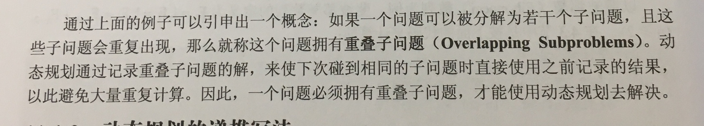 </div>
<div align="center"> 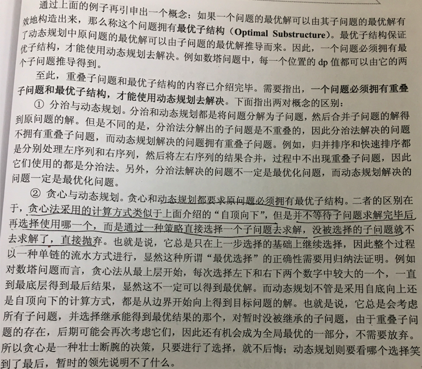 </div>

### 2.递归与动态规划
换钱的方法数
【题目】 给定数组arr，arr中所有的值都为正数且不重复。每个值代表 一种面值的货币，每种面值的货币可以使用任意张，再给定一 个整数aim代表要找的钱数，求换钱有多少种方法。
【举例】
arr=[5,10,25,1]，aim=0。 组成0元的方法有1种，就是所有面值的货币都不用。所以返回1。 arr=[5,10,25,1]，aim=15。 组成15元的方法有6种，分别为3张5元、1张10元+1张5元、1张 10元+5张1元、10张1元+1张5元、2张5元+5张1元和15张1元。所 以返回6。
arr=[3,5]，aim=2。
任何方法都无法组成2元。所以返回0。

#### 递归写法
```java
	public static int coinsOther(int[] arr, int aim) {
		if (arr == null || arr.length == 0 || aim < 0) {
			return 0;
		}
		return processOther(arr, arr.length - 1, aim);
	}
	//递归函数的功能是求arr[0..index]组成aim的方法数
	public static int processOther(int[] arr, int index, int aim) {
		int res = 0;
		if (index == -1) {
			res = aim == 0 ? 1 : 0;
		} else {
			for (int i = 0; arr[index] * i <= aim; i++) {
			 //用0,1,2..i张arr[index],
			 //递归求以arr[0..index-1]组成aim - arr[index] * i的方法数
				res += processOther(arr, index - 1, aim - arr[index] * i);
			}
		}
		return res;
	}
```
#### 记忆化搜索
```java
	public static int coins2(int[] arr, int aim) {
		if (arr == null || arr.length == 0 || aim < 0) {
			return 0;
		}
		int[][] map = new int[arr.length + 1][aim + 1];
		return process2(arr, arr.length - 1, aim, map);
	}
  //map[i][j]的含义是任意使用arr[0..i]组成币值j的方法数
	public static int process2(int[] arr, int index, int aim, int[][] map) {
		int res = 0;
		if (index == 0) {
			res = aim == 0 ? 1 : 0;
		} else {
			int mapValue = 0;
			for (int i = 0; arr[index] * i <= aim; i++) {
				mapValue = map[index - 1][aim - arr[index] * i];
				//已经求解过的子问题直接使用其结果
				if (mapValue != 0) {
					res += mapValue == -1 ? 0 : mapValue;
				} else {
					res += process2(arr, index - 1, aim - arr[index] * i, map);
				}
			}
		}
		map[index][aim] = res == 0 ? -1 : res;
		return res;
	}
```
#### 动态规划
```java
	public static int coins4(int[] arr, int aim) {
		if (arr == null || arr.length == 0 || aim < 0) {
			return 0;
		}
		//dp[i][j]的含义是任意使用arr[0..i]组成j币值的方法
		int[][] dp = new int[arr.length][aim + 1];
		//Base Case 目标金额为0和只使用arr[0]的情况
		for (int i = 0; i < arr.length; i++) {
			dp[i][0] = 1;
		}
		for (int j = 1; arr[0] * j <= aim; j++) {
			dp[0][arr[0] * j] = 1;
		}
		//一般情况
		/*
		int num = 0;
		for (int i = 1; i < arr.length; i++) {
			for (int j = 1; j <= aim; j++) {
				num = 0;
				for (int k = 0; j - arr[i] * k >= 0; k++) {
					num += dp[i - 1][j - arr[i] * k];
				}
				dp[i][j] = num;
			}
		}
		*/
		for (int i = 1; i < arr.length; i++) {
			for (int j = 1; j <= aim; j++) {
				//上方的值
				dp[i][j] = dp[i - 1][j];
				//dp[i][j - arr[i]]就是dp[i - 1][j - arr[i] * k](k>0)的累加和
				dp[i][j] += j - arr[i] >= 0 ? dp[i][j - arr[i]] : 0;
			}
		}
		return dp[arr.length - 1][aim];
	}
```
可以将for循环省略的原因
<div align="center"> 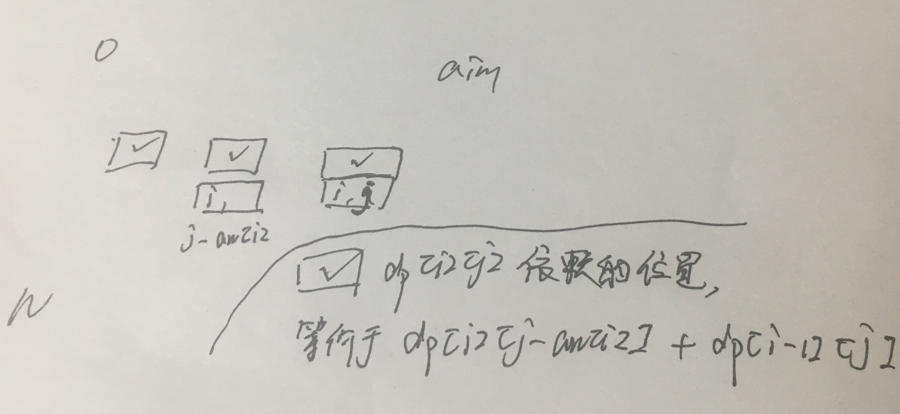 </div>

#### 带空间压缩的动态规划
```java
	public static int coins5(int[] arr, int aim) {
		if (arr == null || arr.length == 0 || aim < 0) {
			return 0;
		}
		int[] dp = new int[aim + 1];
		for (int j = 0; arr[0] * j <= aim; j++) {
			dp[arr[0] * j] = 1;
		}
		for (int i = 1; i < arr.length; i++) {
			for (int j = 1; j <= aim; j++) {
				dp[j] += j - arr[i] >= 0 ? dp[j - arr[i]] : 0;
			}
		}
		return dp[aim];
	}
```
### 3.简单DP问题
#### 最大连续子序和

dp[i]表示以i结尾的最大连续子序和，则
- dp[0] = arr[i]
- dp[i] = max(0,dp[i-1])+arr[i]

```java
	public static int maxum(int[] arr) {
		int[] dp = new int[arr.length];
		dp[0] = arr[0];
		int max = dp[0];
		for (int i = 1; i < arr.length; i++) {
			dp[i] = Math.max(0, dp[i - 1]) + arr[i];
			max = Math.max(dp[i], max);
		}
		return max;
	}
```
在这顺便介绍**状态无后效性**概念。状态无后效性概念是指记录了历史信息，一旦当前状态确定，就不会在改变，且未来的决策只能在已有的一个或多个状态的基础上进行。
对本题来说，每次计算dp[i]时，只会用到dp[i-1]，而不会用到dp[i-1]蕴含的历史信息。

#### 最长上升子序列
例：a = {1,2,3,-1,-2,7,9} => {1,2,3,7,9}
dp[i]的含义是以arr[i]结尾的LIS长度

- dp[i] = 1 (i之前所有元素都比arr[i]大)
- dp[i] = dp[j] + 1 (存在arr[j]，让arr[i] 跟在arr[j]后面能让当前以arr[i]结尾的序列更长)0<= j< i
```java
class Solution {
    public int lengthOfLIS(int[] arr) {
        if(arr==null || arr.length ==0){
            return 0;
        }
    int[] dp = new int[arr.length];
		int max = -1;
		for (int i = 0; i < arr.length; i++) {
			//每次认为arr[i]单独组成LIS 所以长度为1
            dp[i] = 1;
			for (int j = 0; j < i; j++) {
			//如果arr[i] > arr[j] 并且能使当前以arr[i]结尾的序列更长
			//则把arr[i] 根在以arr[j] 结尾的序列后面
				if (arr[i] > arr[j] && dp[i]<=dp[j]) {
						dp[i] = dp[j]+1;
				}
			}
			max = Math.max(max, dp[i]);
		}
		return max;
	}
}
```
#### 最长公共子序列
`c[i][j]`表示A[0..i]与B[0..j]的最长公共子序列值，其状态方程为：
<div align="center">  </div>
由于A[i]!=B[j] 则LCS将由`A[0..i-1]与B[0..j]`或`A[0..i]与B[0..j-1]`产生

```java
	public static int LCS(char[] A, char[] B) {
		int n = A.length;
		int m = B.length;
		int[][] dp = new int[n + 1][m + 1];
		// Base Case
		Arrays.fill(dp[0], 0);
		// 一般情况
		for (int i = 1; i <= n; i++) {
			dp[i][0] = 0;
			for (int j = 1; j <= m; j++) {
				dp[i][j] = A[i - 1] == B[j - 1] 
				? dp[i - 1][j - 1] + 1 
				: Math.max(dp[i - 1][j], dp[i][j - 1]);
			}
		}
		return dp[n][m];
	}
```

#### 最长回文子串
`dp[i][j]`表示s[i..j]是否回文 是则为true，否则为false
- `s[i]=s[j]` 则 `dp[i][j]`取决于s[i+1..j-1]是否是回文串
- `s[i]!=s[j]` 则`dp[i][j]`=false

  基本情况
- `dp[i][i]=true`
- `dp[i][i+1]=s[i]==s[i+1]`

<div align="center"> 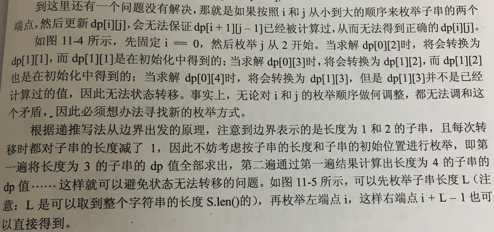 </div>
```python
class Solution(object):
    def longestPalindrome(self, s):
        length = len(s)
        if length < 2:
            return '' if length==0 else s
        dp = [[0] * length for i in range(length)]
        start = 0
        end = 0
        # 枚举子串的长度
        for l in range(1,length+1):
            low = 0
            while low+l-1 < length:
                high = low + l -1         # high-low<=1为BaseCase
                if s[low] == s[high] and (high-low<=1 or dp[low+1][high-1]):
                    dp[low][high] = 1
                    start = low
                    end = high
                low+=1
        return s[start:end+1]
```
#### 背包问题

##### 0-1背包
<div align="center"> 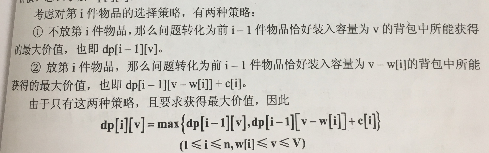 </div>
```java
	private static int knapsack(int[] w, int[] v, int W) {
		// dp[i][j]表示可将w[0..i]装入容量为j的背包中能获得的最大价值
		int[][] dp = new int[v.length][W + 1];
		// BaseCase 只装第0件物品
		for (int j = w[0]; j <= W; j++) {
			dp[0][j] = v[0];
		}
		// 一般情况
		for (int i = 1; i < v.length; i++) {
			for (int j = w[i]; j <= W; j++) {
				dp[i][j] = Math.max(dp[i - 1][j], dp[i - 1][j - w[i]] + v[i]);
			}
		}
		return dp[v.length - 1][W];
	}
```
**空间压缩：**
<div align="center"> 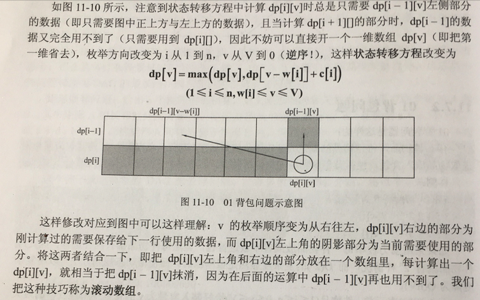 </div>
<div align="center"> 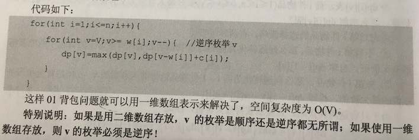 </div>

```java
	private static int knapsack(int[] w, int[] v, int W) {
		int dp[] = new int[W + 1];
		for (int i = w[0]; i <= W; i++) {
			dp[i] = v[0];
		}
		for (int i = 1; i < w.length; i++) {
			for (int j = W; j >= w[i]; j--) {
				//当前的dp[j]和dp[j-w[i]]相当于dp[i - 1][j], dp[i - 1][j - w[i]]
				//j从W..w[i]保证用到的都是上一阶段的信息
				dp[j] = Math.max(dp[j], dp[j - w[i]] + v[i]);
			}
		}
		return dp[W];
	}
```
##### 完全背包
<div align="center"> 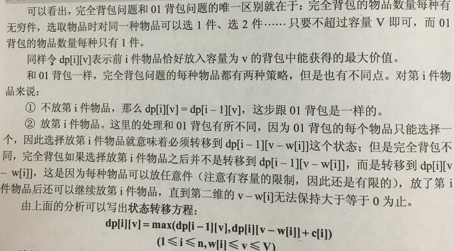 </div>

```java
private static int knapsack(int[] w, int[] v, int W) {
		// dp[i][j]表示可将w[0..i]装入容量为j的背包中能获得的最大价值
		int[][] dp = new int[v.length][W + 1];
		// BaseCase 只装第0件物品
		for (int j = w[0]; j <= W; j++) {
			dp[0][j] = v[0];
		}
		// 一般情况
		for (int i = 1; i < v.length; i++) {
			for (int j = w[i]; j <= W; j++) {
				//dp[i-1][j - w[i]] + v[i] ->dp[i][j - w[i]]
				dp[i][j] = Math.max(dp[i - 1][j], dp[i][j - w[i]] + v[i]);
			}
		}
		return dp[v.length - 1][W];
	}
```
**空间压缩：**
<div align="center"> 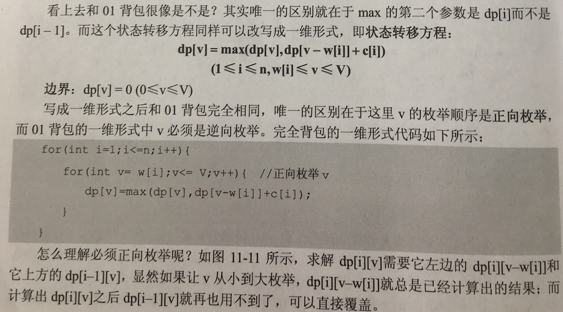 </div>
<div align="center"> 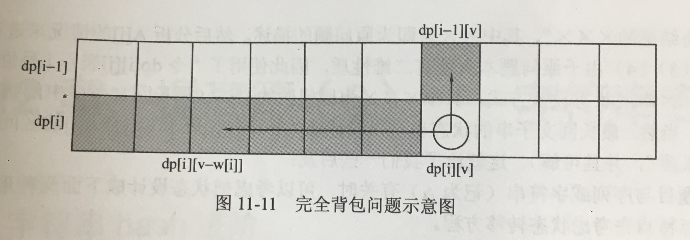 </div>

```java
	private static int knapsack(int[] w, int[] v, int W) {
		int dp[] = new int[W + 1];
		for (int i = w[0]; i <= W; i++) {
			dp[i] = v[0];
		}
		for (int i = 1; i < w.length; i++) {
			for (int j = w[i]; j <= W; j++) {
			  //在选择不物品时，不断加大背包容量看所能
			  //获得的最大价值，不是特别好理解
				dp[j] = Math.max(dp[j], dp[j - w[i]] + v[i]);
			}
		}
		return dp[W];
	}
```
#### 总结
<div align="center"> 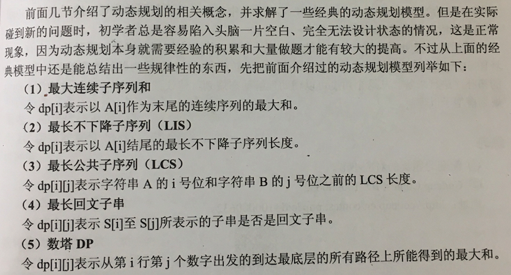 </div>
<div align="center"> 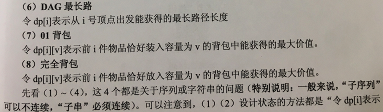 </div>

<div align="center"> 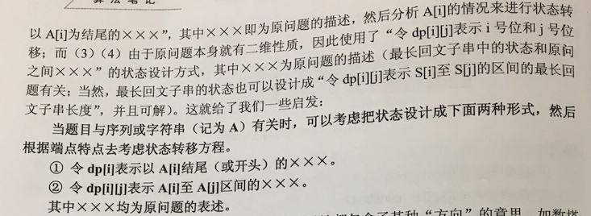 </div>
<div align="center"> 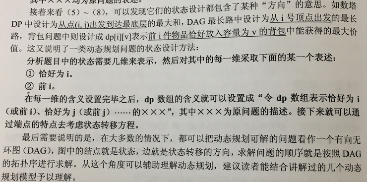 </div>

### 4.面试DP问题

#### *矩阵最小路径和(64)
`dp[i][j]代表从(0,0)走到(i,j)的最小路径和则`

- `dp[0][i]来自第一行的累加`
- `dp[i][0]来自第一列的累加`
- `dp[i][j] = min(dp[i-1][j],dp[i][j-1])+c[i][j]`(来自当前位置的走法无非向下或向右，选两者中代价最小的)
代码实现
```python
class Solution(object):
    def minPathSum(self, grid):
        row = len(grid)
        col = len(grid[0])
        if grid==None or row==0:
            return 0
        dp = [ [0]*col for _ in range(row)]
        #Base Case
        dp[0][0] = grid[0][0]
        for i in range(1,row):
            dp[i][0] = dp[i-1][0] + grid[i][0]
        for i in range(1,col):
            dp[0][i] = dp[0][i-1] + grid[0][i]
        #一般情况
        for i in range(1,row):
            for j in range(1,col):
                dp[i][j] = min(dp[i-1][j],dp[i][j-1])+grid[i][j]
        return dp[-1][-1]
```
空间压缩
`[[1,3,5,9],[8,1,3,4],[5,0,6,1],[8,8,4,0]]`

<div align="center"> 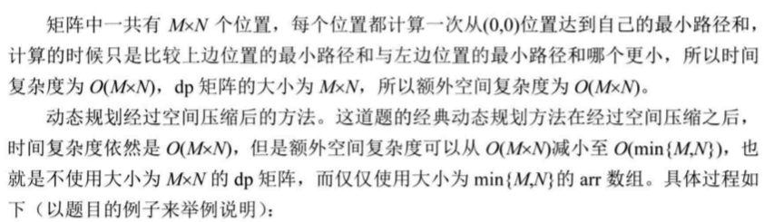 </div>
<div align="center"> 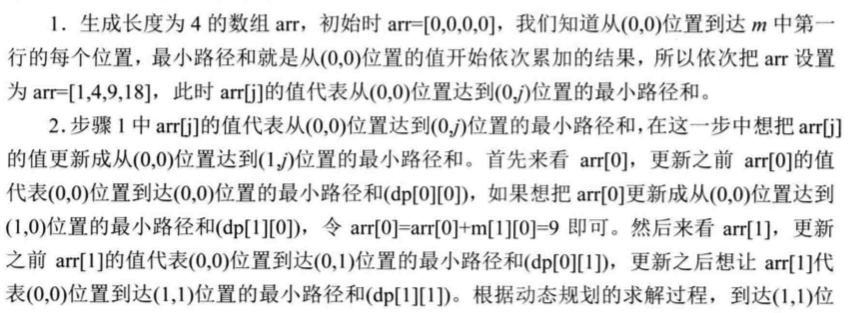 </div>
<div align="center"> 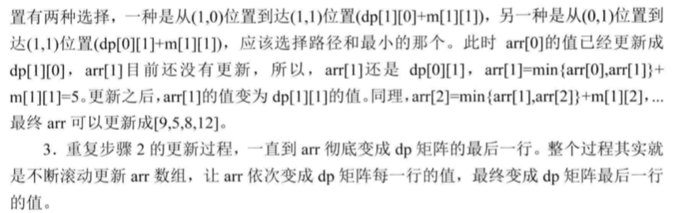 </div>
<div align="center"> 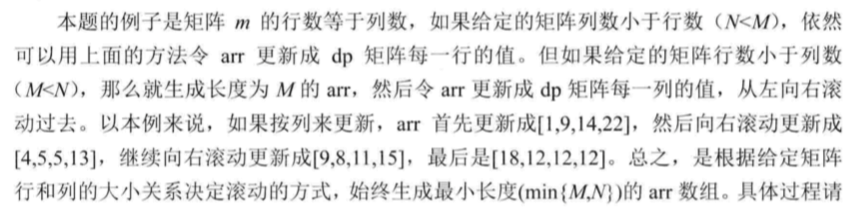 </div>

调试截图：
<div align="center"> 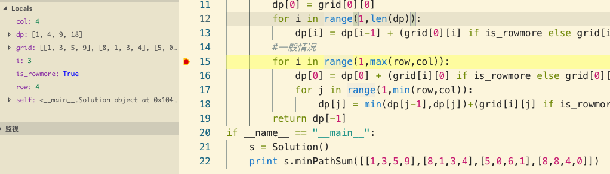 </div>

<div align="center"> 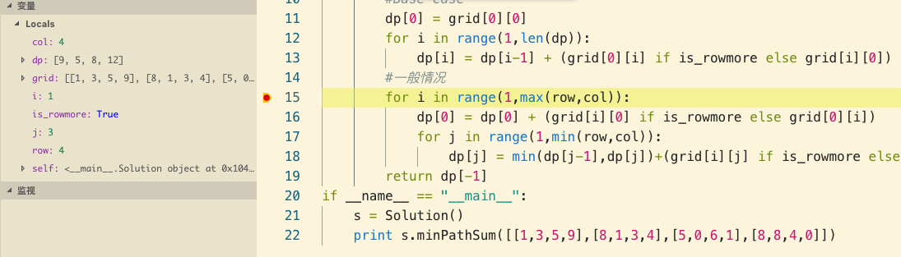 </div>

`dp[j-1]`是已经更新过的，`dp[j]`是上阶段未更新的。两者等价于二维的`dp[i][j-1]`和`dp[i-1][j]`

```python
class Solution(object):
    def minPathSum(self, grid):
        row = len(grid)
        col = len(grid[0])
        if grid == None or row==0:
            return 0
        is_rowmore = row >= col
        dp = [0] * (col if is_rowmore else row)
        
        #Base Case
        dp[0] = grid[0][0]
        for i in range(1,len(dp)):
            dp[i] = dp[i-1] + (grid[0][i] if is_rowmore else grid[i][0])
        #一般情况
        for i in range(1,max(row,col)):
            dp[0] = dp[0] + (grid[i][0] if is_rowmore else grid[0][i])
            for j in range(1,min(row,col)):
                dp[j] = min(dp[j-1],dp[j])+(grid[i][j] if is_rowmore else grid[j][i])
        return dp[-1]
```

#### *换钱的最少货币数(322)
给定不同面额的硬币 coins 和一个总金额 amount。编写一个函数来计算可以凑成总金额所需的最少的硬币个数。如果没有任何一种硬币组合能组成总金额，返回 -1。

**示例 1:**

输入: coins = [1, 2, 5], amount = 11
输出: 3 

解释: 11 = 5 + 5 + 1

`dp[i][j]`表示做任意使用coins[0..i]以组成j元的方法数，则
- `dp[i][0]`=0
- `dp[0][i*coins[0]]`=i
- `dp[i][j]` = `min(dp[i-1][j],dp[i][j-coins[i]+1)`
其含义为完全不使用coins[i]组成j和在使用`coins[0..i]`组`成j-coins[i]`的情况下，再使用一张coins[i]以组成j的张数，两者取最小值
```java
public static int coinChange(int[] coins, int amount) {
		// dp[i][j]表示可使用w[0..i]组成j的的最小张数
		int[][] dp = new int[coins.length][amount + 1];
		// BaseCase 组成0元
		int max = Integer.MAX_VALUE;
		Arrays.fill(dp[0], max);
		// 只使用coins[0]
		for (int i = 0; coins[0] * i <= amount; i++) {
			dp[0][i * coins[0]] = i;
		}
		// 一般情况
		for (int i = 1; i < dp.length; i++) {
			for (int j = 1; j <= amount; j++) {
				int left = max;
				// 左边推j - coins[i]个位置，包含了所以使用1..n张货币组成
				// j - coins[i]的方法数，+1 即加coins[i]即可组成j元
				if (j - coins[i] >= 0 && dp[i][j - coins[i]] != max) {
					left = dp[i][j - coins[i]] + 1;
				}
				dp[i][j] = Math.min(dp[i - 1][j], left);
			}
		}
		return dp[coins.length - 1][amount] == max ? -1 : dp[coins.length - 1][amount];
	}
```

#### *最小编辑代价(72)

`dp[i][j]表示A[0..i-1]转成B[0..j-1]需要的代价`
基本情况：

- 第一行，不使用A的任何字符，则`dp[0][i]` = i * ic
- 第一列，不使用B的任何字符，则`dp[0][i]` = i * dc

一般情况：选插入删除替换中代价最小的方法
- 插入`dp[i][j-1]+ic` `已经得到B[0..j-2]插入B[j-1]使整体成为B[0..j-1]`
- 删除`dp[i-1][j]+dc` `通过A[0..i-2]编辑成B[0..j]，也就是删除A[i-1]`
- 替换 `dp[i-1][j-1]+rc`
```java
class Solution {
    public int minDistance(String word1, String word2) {
        return findMinCost(word1,word1.length(),word2,word2.length(),1,1,1);
    }
    public static int findMinCost(String A, int n, String B, int m, int ic, int dc, int rc) {
        int dp[][] = new int[n + 1][m + 1];
        for (int i = 1; i <= n; i++) {
            dp[i][0] = dc * i;
        }
        for (int i = 1; i <= m; i++) {
            dp[0][i] = ic * i;
        }
        for (int i = 1; i <= n; i++) {
            for (int j = 1; j <= m; j++) {
                // replace 相等时可以直接转换
                dp[i][j] = dp[i - 1][j - 1] + (A.charAt(i - 1) == B.charAt(j - 1) ? 0 : rc);
                // delete
                dp[i][j] = Math.min(dp[i][j], dp[i - 1][j] + dc);
                // insert
                dp[i][j] = Math.min(dp[i][j], dp[i][j - 1] + ic);
            }
        }
        return dp[n][m];
    }
}
```
#### *字符串的交错组成(97)
`dp[i][j]的含义是s1[0..i)和s2[0..j)能否交错组成s3[0..i+j)`
- i=0,则表示s3全部来自s2 
- j=0,则表示s3全部来自s1
- 一般情况，若有`dp[i-1][j]`，且`s1[i-1]==s3[i+j-1]` 或者若有`dp[i][j-1]`，且`s2[j-1]==s3[i+j-1]`，则`dp[i][j]=1`
```python
class Solution(object):
    def isInterleave(self, s1, s2, s3):
        len_s1 = len(s1)
        len_s2 = len(s2)
        if len(s3) != len_s1+len_s2:
            return False
        if "" == s3:
            return True
        n = len_s1 + 1
        m = len_s2 + 1
        #dp[i][j]的含义是s1[0..i)和s2[0..j)能否交错组成s3[0..i+j)
        dp = [[0]*(m) for _ in range(n)]
        dp[0][0] = 1
        for i in range(1,m):
            if s2[i-1] != s3[i-1]:
                break
            dp[0][i] = 1
        for i in range(1,n):
            if s1[i-1] != s3[i-1]:
                break
            dp[i][0] = 1
        for i in range(1,n):
            for j in range(1,m):
                if (dp[i-1][j] and s1[i-1]==s3[i+j-1]) 
                or (dp[i][j-1] and s2[j-1]==s3[i+j-1]):
                    dp[i][j] = 1
        return dp[-1][-1]
```
#### *地下城游戏(174)
`dp[i][j]` 的含义是从`(i,j)`到达终点所需要的血量
- 最后一行：只能往右走
- 最后一例：只能往下走
- 其它位置： 从右往左，从下往上的计算 选择右和下中所需血量最小的
```java
	public static int calculateMinimumHP2(int[][] map) {
		int m = map.length;
		int n = map[0].length;
		int dp[][] = new int[m][n];
		// 最后一格
		dp[m - 1][n - 1] = Math.max(-map[m - 1][n - 1] + 1, 1);
		// 最后一行
		for (int i = n - 2; i >= 0; i--) {
			dp[m - 1][i] = Math.max(dp[m - 1][i + 1] - map[m - 1][i], 1);
		}
		for (int i = m - 2; i >= 0; i--) {
			// 最后一列
			dp[i][n - 1] = Math.max(dp[i + 1][n - 1] - map[i][n - 1], 1);
			for (int j = n - 2; j >= 0; j--) {
				int need = Math.min(dp[i + 1][j], dp[i][j + 1]) - map[i][j];
				dp[i][j] = need <= 0 ? 1 : need;
			}
		}
		return dp[0][0];
	}

	// 添加一个冗余行和列可以让代码更简洁
	public static int calculateMinimumHP(int[][] map) {
		int m = map.length;
		int n = map[0].length;
		int dp[][] = new int[m + 1][n + 1];
		for (int i = 0; i < dp.length; i++) {
			Arrays.fill(dp[i], Integer.MAX_VALUE);
		}
		// 就是一个边界为了计算dp[m-1][n-1]方便
		dp[m][n - 1] = 1;
		dp[m - 1][n] = 1;
		for (int i = m - 1; i >= 0; i--) {
			for (int j = n - 1; j >= 0; j--) {
				int need = Math.min(dp[i + 1][j], dp[i][j + 1]) - map[i][j];
				dp[i][j] = need <= 0 ? 1 : need;
			}
		}
		return dp[0][0];
	}
```
#### *添加最少使字符串回文(214)

给定一个字符串 s，你可以通过在字符串中添加字符将其转换为回文串。找到并返回可以用这种方式转换的最短回文串。

只能加在开头

简单解法：

先逆序，然后截取逆序后的前i个字符拼接到原串上，取满足回文条件最小的i

```python
class Solution:
    def shortestPalindrome(self, s: str) -> str:
        length=len(s)
        if length==0:
            return ""
        rs = s[::-1]
        i = 0
        while True:
            if rs[i:]==s[:length-i]:
                break
            i+=1
        return rs[:i]+s
```

可以先获得原字符串的最长前缀回文字符串长度，可以使用朴素算法，这里重点介绍kmp的next数组和manacher算法

借助next数组:
找从头开始第一个不回文的位置，将其后面的字符逆序添加到开头即可

```java
	public static String shortestPalindrome(String s) {
		StringBuilder r = new StringBuilder(s).reverse();
		String str = s + "#" + r;
		int[] next = next(str);
		String prefix = r.substring(0, r.length() - next[str.length()]);
		return prefix + s;
	}
	// next数组
	private static int[] next(String P) {
		int[] next = new int[P.length() + 1];
		next[0] = -1;
		int k = -1;
		int i = 1;
		while (i < next.length) {
			if (k == -1 || P.charAt(k) == P.charAt(i - 1)) {
				next[i++] = ++k;
			} else {
				k = next[k];
			}
		}
		return next;
	}
```
Manacher算法：
先将s逆序成r，manacher得到r的最长回文后缀之前的字符，拼到s前面
ABAE - > EABE -> manacher('EABE') -> E + ABAE

```java
	public static String shortestPalindrome(String s) {
		String r = new StringBuilder(s).reverse().toString();
		return manacher(r) + s;
	}

	// 求str最长后缀回文之前的字符
	public static String manacher(String str) {
		if (str == null || str.length() == 0) {
			return "";
		}
		char[] charArr = manacherString(str);
		int[] radius = new int[charArr.length];
		int C = -1;
		int R = -1;
		for (int i = 0; i != charArr.length; i++) {
			// 区分了当i在回文半径里外时
			radius[i] = R > i ? Math.min(radius[2 * C - i], R - i) : 1;
			while (i + radius[i] < charArr.length && i - radius[i] > -1) {
				// 以点i为中心往外扩
				if (charArr[i + radius[i]] == charArr[i - radius[i]])
					radius[i]++;
				else {
					break;
				}
			}
			// 更新最右回文边界
			if (i + radius[i] > R) {
				R = i + radius[i];
				C = i;
			}
			// 当R到达末尾时，求出最长的后缀回文串
			if (R == charArr.length) {
				break;
			}

		}
		// 此时C为回文中心点，radius[C]为回文半径
		// 需要的是这个回文串之前的字符
		return String.valueOf(charArr).substring(0, C - radius[C] + 2).replace("#", "");
	}

	// #A#B#C#C#E#
	public static char[] manacherString(String str) {
		StringBuilder sb = new StringBuilder();
		for (int i = 0; i < str.length(); i++) {
			sb.append("#");
			sb.append(str.charAt(i));
		}
		sb.append("#");
		return sb.toString().toCharArray();
	}
```


可以在任意位置添加：
动态规划：
`dp[i][j]`的含义是可以str[i..j]最少添加几个字符可以回文。

- `dp[i][j]==0 if i==j` 一个字符

- `dp[i][j]= s[i]==s[j]?0:1`  if j-1 = 1 两个字符

- `dp[i][j]= s[i]==s[j]?dp[i+1][j-1]:(min(dp[i][j-1],dp[i+1][j])+1)`  if j-1 > 1 多于两个字符

括号中的含义中如果`s[i]!=s[j]`，`让s[i..j]`回文有两种方式

- 先让s[i..j-1]回文，开头再加上s[j]

- 先让s[i+1..j]回文，结尾再加上s[i]

两种方式中取代价最小的
```java
	public static String getPalindrome1(String str) {
		if (str == null || str.length() < 2) {
			return str;
		}
		char[] chas = str.toCharArray();
		int[][] dp = getDP(chas);
		char[] res = new char[chas.length + dp[0][chas.length - 1]];
		int i = 0;
		int j = chas.length - 1;
		int resl = 0;
		int resr = res.length - 1;
		while (i <= j) {
  		//相等，直接copy
			if (chas[i] == chas[j]) {
				res[resl++] = chas[i++];
				res[resr--] = chas[j--];
			}
      //代价最小的方案
      else if (dp[i][j - 1] < dp[i + 1][j]) {
      //开头多加s[j]
				res[resl++] = chas[j];
				res[resr--] = chas[j--];
			} else {
			//结尾多加s[i]
				res[resl++] = chas[i];
				res[resr--] = chas[i++];
			}
		}
		return String.valueOf(res);
	}

	public static int[][] getDP(char[] str) {
		int[][] dp = new int[str.length][str.length];
		for (int j = 1; j < str.length; j++) {
		//Base Case
			dp[j - 1][j] = str[j - 1] == str[j] ? 0 : 1;
			for (int i = j - 2; i > -1; i--) {
				if (str[i] == str[j]) {
					dp[i][j] = dp[i + 1][j - 1];
				} else {
					dp[i][j] = Math.min(dp[i + 1][j], dp[i][j - 1]) + 1;
				}
			}
		}
		return dp;
	}
```
#### *括号的有效长度(32)
dp[i]表示必须以i结尾的最长有效括号长度
```python
class Solution(object):
    def longestValidParentheses(self, s):
        length = len(s)
        if length == 0:
            return 0
        dp = [0] * length
        for i in range(1,length):
        		#当遇到右括号时，尝试向前匹配左括号
            if s[i] == ')':
                pre = i - dp[i-1] -1;
                #如果是左括号，则更新匹配长度
                if pre>=0 and s[pre] == '(':
                    dp[i] = dp[i-1] + 2
                    #处理独立的括号对的情形 类似()()、()(())
                    if pre>0:
                        dp[i] += dp[pre-1]
        return max(dp);
```
#### *回文最少分割数(132)
dp[i]表示s[0..i]需要的划分次数：
- 初始时 dp[i]=i 假定必须全部切割才能得到回文串
- 对于dp[i]的计算，让j在[0..i]之间变化，
- 如果s[j..i]回文，则s[0..j-1]和s[j..i]之间可以再做一次切割
- `dp[i] = min(dp[i],dp[j-1]+1)`
```python
class Solution:
    def minCut(self, s):
        if s == s[::-1]:  # 整体回文
            return 0
        dp = [_ for _ in range(len(s))]
        p = [[0]*len(s) for _ in range(len(s))]
        for i in range(1, len(s)):
            for j in range(i+1):
                #s[j..i]回文
                if s[j] == s[i] and (i-j<2 or p[j+1][i-1]):
                # if s[j:i+1] == s[j:i+1][::-1]:
                    p[j][i] = 1
                    #s[0..j]回文，根本不需要切割
                    if j == 0:
                        dp[i] = 0
                        break
                    else:
                        dp[i] = min(dp[i], dp[j-1] + 1)
        return dp[-1]
```
----------------------来自他人的笔记-------------------------
#### *跳跃游戏(55)
给定一个非负整数数组，你最初位于数组的第一个位置。数组中的每个元素代表你在该位置可以跳跃的最大长度。判断你是否能够到达最后一个位置。
**示例 1:**
输入: [2,3,1,1,4]输出: true

解释: 从位置 0 到 1 跳 1 步, 然后跳 3 步到达最后一个位置。
dp[i]表示i点是否可达

- dp[0] = true
- dp[i] 是否可达 取决于0..j..i路径上 j点是否可达且nums[j] >= i-1
```java
class Solution {
    public boolean canJump(int[] nums) {
        if (nums == null || nums.length == 0) {
            return false;
        }
        int len = nums.length;
        boolean[] dp = new boolean[len];
        dp[0] = true;// 初始化
        for (int i = 1; i < len; i++) {
            for (int j = 0; j < i && dp[j]; j++) {
                //j可达，且j位置可走的步数大于等于i,j之间的距离
                //则i是可从j到达的
                if (nums[j] >= i - j) {
                    dp[i] = true;
                    break;
                }
            }
        }
        return dp[len - 1];
    }
}
```

#### *最长回文子序列(516)
给定一个字符串s，找到其中最长的回文子序列。可以假设s的最大长度为1000。
**示例 1:**
输入:"bbbab"输出:4
一个可能的最长回文子序列为 "bbbb"。
**示例 2:**
输入:"cbbd"输出:2
一个可能的最长回文子序列为 "bb"。
**思路：**
`dp[i][j]`表示s[i..j]代表的字符串的最长回文子序列
- `d[i][i]=1`
- `dp[i][j] = dp[i+1][j-1]+2` 当s[i]=s[j]
- `dp[i][j]=max(dp[i+1][j],dp[i][j-1])` 当s[i]!=s[j] 取s[i+1..j] 和s[i..j-1]中最长的
由于`dp[i][j]`需要`dp[i+1][j]`所以需要逆序枚举s的长度，而又因为j是递增的，所以在求解`dp[i][j]`时,`dp[i][j-1]`肯定已经求解过了
```python
class Solution(object):
    def longestPalindromeSubseq(self, s):
        len_s = len(s)
        dp = [[0] * len_s for _ in range(len_s)]
        # base case 每个字符可以是一个回文串
        for i in range(len_s):
            dp[i][i]=1
        for i in range(len_s-2,-1,-1):
            for j in range(i+1,len_s):
                #长度加2
                if s[i]==s[j]:
                    dp[i][j] = dp[i+1][j-1]+2
                else:
                    dp[i][j]=max(dp[i+1][j],dp[i][j-1])
        return dp[0][-1]
```
#### *回文子串(647)
`dp[i][j]` 的含义是 `s[i..j]` 是否回文

- `dp[i][i]` = true， `dp[i][i+1]` = `s[i] == s[i+1]`
- `dp[i][i]` = true，if  `dp[i+1][j-1]`
- `dp[i][j]` = false if  `s[i]!=s[j]`

主对角线全为true，主对角线往下全为false(j>i)
```java
public static int countSubstrings(String s) {
	char[] charArr = s.toCharArray();
	int n = charArr.length;
	int count = 0;
	boolean dp[][] = new boolean[n][n];
	for (int i = n - 1; i >= 0; i--) {
		for (int j = i; j < n; j++) {
			// j-i = {0,1,2}代表一个,两个,三个,字符时 此时可以根据charArr[i] ==charArr[j]
			// 得到s[i..j]必定回文
			if (charArr[i] == charArr[j] && (j - i <= 2 || dp[i + 1][j - 1])) {
				dp[i][j] = true;
				count++;
			}
		}
	}
	return count;
}
```
#### *单词拆分(139)
dp[i]表示s前i-1个字符能否被wordDict拆分
- dp[0] = true
- dp[i] = dp[j] & s[j:i) in wordDict(j in [0,i) )任意一个j满足即可
```python
class Solution(object):
    def wordBreak(self, s, wordDict):
        len_s = len(s)
        dp = [0] * (len_s+1)
        dp[0] = 1
        for i in range(1,len_s+1):
            for j in range(i):
                if dp[j] and s[j:i] in wordDict:
                    dp[i] = 1
                    break
        return dp[-1]
```

#### *最大正方形(221)
`dp[i][j]`代表从(0,0)到(i,j)的最大正方形大小，

- 初始 `dp[i][j]= matrix[i][j] == '1'?1:0`
- 一般情况：`dp[i][j] = min(dp[i - 1][j], dp[i][j - 1]), dp[i - 1][j - 1]) + 1`也就是当前位置是1且上边，左边，左上位置都是1，就能构成更大的矩形

```java
	public static int maximalSquare(char[][] matrix) {
		if (matrix == null || matrix.length == 0 || matrix[0] == null || matrix[0].length == 0) {
			return 0;
		}
		int m = matrix.length, n = matrix[0].length;
		int[][] dp = new int[m][n];
		// BaseCase
		int max = 0;
		for (int i = 0; i < m; i++) {
			for (int j = 0; j < n; j++) {
				if (matrix[i][j] == '1') {
					dp[i][j] = 1;
					max = 1;
				}
			}
		}
		// 一般情况
		for (int i = 1; i < m; i++) {
			for (int j = 1; j < n; j++) {
				if (matrix[i][j] == '1') {
					dp[i][j] = Math.min(Math.min(dp[i - 1][j], dp[i][j - 1]), dp[i - 1][j - 1]) + 1;
					max = Math.max(max, dp[i][j]);
				}
			}
		}
		return max * max;
	}
```
#### *不同的子序列(115)

`dp[i+1][j+1]` 的含义是 T[0..i] 在 S[0..j] 出现的次数
两种基本情况:
- `dp[0][0..i]`=1 空串是被任意⻓长度的串包含
- `dp[1..i][0]`=0 空串不不能包含任何⼦子串

对于其它的(i+1,j+1)，起码有 `dp[i+1][j+1]` = `dp[i+1][j]` 如果有 T[i]=S[j] ，则在加上一个 `dp[i][j]` 思考图中的 `dp[-1][-2]`

<div align="center"> 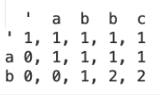 </div>

```java
public static int numDistinct(String s, String t) {
	int m = s.length();
	int n = t.length();
	int dp[][] = new int[n + 1][m + 1];
	Arrays.fill(dp[0], 1);
	for (int i = 0; i < n; i++) {
		for (int j = 0; j < m; j++) {
			dp[i + 1][j + 1] = dp[i + 1][j] 
			+ (t.charAt(i) == s.charAt(j) ? dp[i][j] : 0);
		}
	}
	return dp[n][m];
}
```
