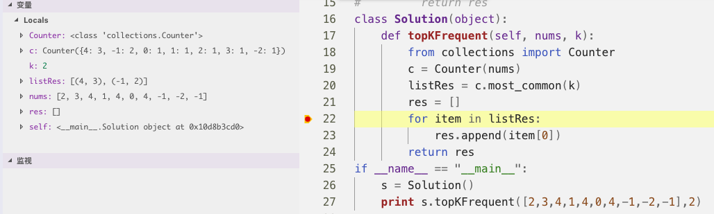

###### 1. [两数之和](https://leetcode-cn.com/problems/two-sum/)

给定一个整数数组 nums 和一个目标值 target，请你在该数组中找出和为目标值的那 两个 整数，并返回他们的数组下标。
你可以假设每种输入只会对应一个答案。但是，你不能重复利用这个数组中同样的元素。

**示例:**
>给定 nums = [2, 7, 11, 15], target = 9
>因为 nums[0] + nums[1] = 2 + 7 = 9
>所以返回 [0, 1]

**思路：**

>使用hash表,KV对为值-下标，遍历到nums[i]时边放入hash表并检查是否存在
>target-nums[i]

```java
class Solution {
    public int[] twoSum(int[] nums, int target) {
        HashMap<Integer,Integer> map = new HashMap<>();
        for(int i=0;i<nums.length;i++){
            Integer idx = map.get(target - nums[i]);
            if(idx != null)
                return new int[]{idx,i};
            map.put(nums[i],i);
        }
        return null;
    }
}
```


###### 2. [两数相加](https://leetcode-cn.com/problems/add-two-numbers/comments/)

给出两个 非空 的链表用来表示两个非负的整数。其中，它们各自的位数是按照逆序的方式存储的，并且它们的每个节点只能存储一位数字。如果，我们将这两个数相加起来，则会返回一个新的链表来表示它们的和。您可以假设除了数字 0 之外，这两个数都不会以 0 开头。

**示例：**
>输入：(2 -> 4 -> 3) + (5 -> 6 -> 4)
>输出：7 -> 0 -> 8
>原因：342 + 465 = 807

**思路：**
>参考CodeInterView一书

```java
class Solution {
    public ListNode addTwoNumbers(ListNode l1, ListNode l2) {
        int n1,n2;
        int s,ca;
        ca = 0;
        s = 0;
        ListNode node = null;
        ListNode pre = new ListNode(-1);
        ListNode head = pre;
        while(l1 != null || l2 !=null){
            n1 = n2 = 0;
            if(l1 != null){
                n1 =  l1.val;
                l1 = l1.next;
            }
            if(l2 != null){
                n2 = l2.val;
                l2 = l2.next;
            }
            
            s = n1 + n2 + ca;
            //进位和 和
            if((ca = s/10)==1 && (s=s-10) > 0);
                      
            node = new ListNode(s);
            pre.next = node;
            pre = node;
        }
        //处理最后有进位的情况
        if(ca == 1){
            node = new ListNode(1);
            node.next = null;
            pre.next = node;
        }
        return head.next;
    }
}
```
###### 11.[盛最多水的容器](https://leetcode-cn.com/problems/container-with-most-water/)

给定 n 个非负整数 a1，a2，...，an，每个数代表坐标中的一个点 (i,ai) 。在坐标内画 n 条垂直线，垂直线i的两个端点分别为 (i, ai) 和 (i, 0)。找出其中的两条线，使得它们与x 轴共同构成的容器可以容纳最多的水。


图中垂直线代表输入数组[1,8,6,2,5,4,8,3,7]。在此情况下，容器能够容纳水（表示为蓝色部分）的最大值为 49。

**示例:**

>输入: [1,8,6,2,5,4,8,3,7]
>输出: 49

说明：你不能倾斜容器，且 n 的值至少为 2。
```java
class Solution {
    public int maxArea(int[] height) {
        int i=0;
        int j = height.length-1;
        int ans = 0;
        for(;i<j;){
            int minHeight =  height[i] < height[j] ? height[i++] : height[j--];
            ans = Math.max(ans,minHeight * (j - i + 1));
        }
        return ans;
    }
}
```
###### 15.[三数之和](https://leetcode-cn.com/problems/3sum/)

给定一个包含n个整数的数组nums，判断nums中是否存在三个元素a，b，c，使得a+b+c=0？找出所有满足条件且不重复的三元组。
注意：答案中不可以包含重复的三元组。

例如, 给定数组 nums = [-1, 0, 1, 2, -1, -4]，
满足要求的三元组集合为：
[[-1, 0, 1],[-1, -1, 2]]

**思路：**
>每次选定一个数nums[i]后往后使用双指针查找-nums[i]，转化的二元组的问题

```java
class Solution {
    public List<List<Integer>> threeSum(int[] nums) {
        Arrays.sort(nums);
        List<List<Integer>> ans = new ArrayList<List<Integer>>();
        int l,r;
        for(int i = 0;i<nums.length -2;i++){
            if(i == 0 || nums[i -1] != nums[i]){
                l = i + 1;
                r = nums.length -1;
                while(l < r){
                    if(nums[l] + nums[r] < -nums[i]){
                        l++;    
                    }else if(nums[l] + nums[r] > -nums[i]){
                        r--;
                    }else{
                        ans.add(Arrays.asList(nums[i],nums[l],nums[r]));
                         while (l < r && nums[l] == nums[l + 1]) ++l;
                         while (l < r && nums[r] == nums[r - 1]) --r;
                         ++l;
                         --r;
                        //下面这种写法会超时??优化程度有多少
                        // if(l==i+1 || nums[l-1] != nums[l]){
                        //     ans.add(Arrays.asList(nums[i],nums[l],nums[r]));
                        //     l++;
                        //     r--;
                        // }
                    }
                }
            }
        }
        return ans;
    }
}
```
###### 17. [电话号码的字母组合](https://leetcode-cn.com/problems/letter-combinations-of-a-phone-number/submissions/)

给定一个仅包含数字 2-9 的字符串，返回所有它能表示的字母组合。给出数字到字母的映射如下（与电话按键相同）。注意 1 不对应任何字母。


**示例:**

>输入："23"
>输出：["ad", "ae", "af", "bd", "be", "bf", "cd", "ce", "cf"].

**说明:**

>尽管上面的答案是按字典序排列的，但是你可以任意选择答案输出的顺序。
```java
class Solution {
    public List<String> letterCombinations(String digits) {
		List<String> ans = new ArrayList<String>();
		if (digits == null || digits.equals("")) {
			return ans;
		}
		String[] map = { "", "abc", "def", "ghi", "jkl", "mno", "pqrs", "tuv", "wxyz" };
	    //用来保存数字代表的字符串
		String[] str = new String[digits.length()];
		for (int i = 0; i < digits.length(); i++) {
			str[i] = map[digits.charAt(i) - 48 - 1];
		}
		collect(ans, str, "", 0);
		return ans;
	}

	private void collect(List<String> ans, String[] str, String tmpAns, int i) {
		if (tmpAns.length() == str.length) {
			ans.add(tmpAns);
			return;
		}
		for (char c : str[i].toCharArray()) {
			tmpAns += c;
			collect(ans, str, tmpAns, i + 1);
			//back
			tmpAns = tmpAns.substring(0, tmpAns.length() - 1);
		}
	}
}
```

19.[删除链表的倒数第N个节点](https://leetcode-cn.com/problems/remove-nth-node-from-end-of-list/)

给定一个链表，删除链表的倒数第 n 个节点，并且返回链表的头结点。

**示例：**

>给定一个链表: 1->2->3->4->5, 和 n = 2.
>当删除了倒数第二个节点后，链表变为 1->2->3->5.

说明：
给定的 n 保证是有效的。

进阶：
你能尝试使用一趟扫描实现吗？
**思路**:
>一个指针先走n-1步，然后两个指针一起走
>走到要删除结点前面，删除即可
```java
class Solution {
    public ListNode removeNthFromEnd(ListNode head, int n) {
        ListNode p = head;
        ListNode q = head;
        if(head == null || n < 1){
            return head;
        }
        //向前走n-1步
        while(--n > 0 && p.next != null){
            p = p.next;
        }
        //如果删除头结点
        if(p.next == null && n==0){
            return head.next;
        }
        //如果n过大
        else if(n > 0){
            return head;
        }
        //一般情况
        while(p.next.next!=null){
            p = p.next;
            q = q.next;
        }
        q.next = q.next.next;
        return head;
    }
}
```

20. [有效的括号](https://leetcode-cn.com/problems/valid-parentheses/)

给定一个只包括 '('，')'，'{'，'}'，'['，']' 的字符串，判断字符串是否有效。

有效字符串需满足：
>左括号必须用相同类型的右括号闭合。
>左括号必须以正确的顺序闭合。
>注意空字符串可被认为是有效字符串。

示例：
>输入: "()"
>输出: true
>输入: "()[]{}"
>输出: true
>输入: "(]"
>输出: false
>输入: "([)]"
>输出: false
>输入: "{[]}"
>输出: true

备注：
>参考CodeInterview上的解法，但是过不了([)]这样的情况

```
class Solution {
    public boolean isValid(String s) {
        if(s == null || s.equals("")){
            return true;
        }
        Stack<Character> stack = new Stack<>();
        char[] strArr = s.toCharArray();
        for(int i = 0;i < strArr.length; i++){
            //如果不是这三种有效字符
            if(strArr[i] !='[' && strArr[i] !=']'
              && strArr[i] !='{' && strArr[i] !='}'
              && strArr[i] !='(' && strArr[i] !=')'){
                return false;
            }
            
            if(stack.size() == 0){
                stack.push(strArr[i]);
            }else if(isMatch(stack.peek(),strArr[i])){
                stack.pop();
            }else{
                stack.push(strArr[i]);
            }
        }
        return stack.size() == 0;
    }
    public boolean isMatch(char c1,char c2){
        return (c1 == '(' && c2 == ')') 
            || (c1 == '[' && c2 == ']') 
            || (c1 == '{' && c2 == '}');
    }
}
```
讨论区看到的解法
```python
class Solution:
    def isValid(self, s):
        while '{}' in s or '()' in s or '[]' in s:
            s = s.replace('{}', '')
            s = s.replace('[]', '')
            s = s.replace('()', '')
        return s == ''
```


21. [合并两个有序链表](https://leetcode-cn.com/problems/merge-two-sorted-lists/)

将两个有序链表合并为一个新的有序链表并返回。新链表是通过拼接给定的两个链表的所有节点组成的。 

**示例：**

>输入：1->2->4, 1->3->4
>输出：1->1->2->3->4->4

**备注：**
>这种增加头结点的方法可以方便对链表的操作

```
class Solution {
    public ListNode mergeTwoLists(ListNode l1, ListNode l2) {
        //如果有一个为null
        if(l1 == null || l2 == null){
            return l1 == null ? l2 : l1;
        }
        ListNode head = new ListNode(-1);
        ListNode cur = head;
        while(l1!=null && l2 !=null){
            cur.next = l1.val <= l2.val ? l1 : l2;
            if(cur.next == l1){
                l1 = l1.next;   
            }else{
                l2 = l2.next;
            }
            cur = cur.next;
        }
        cur.next = l1 == null ? l2 : l1;
        return head.next;
    }
}
```
22. [括号生成](https://leetcode-cn.com/problems/generate-parentheses/)

给出 n 代表生成括号的对数，请你写出一个函数，使其能够生成所有可能的并且有效的括号组合。

例如，给出 n = 3，生成结果为：

>[
>  "((()))",
>  "(()())",
>  "(())()",
>  "()(())",
>  "()()()"
>]
```java
class Solution {
    public List<String> generateParenthesis(int n) {
        List<String> ans = new ArrayList<>();
        generateCore(ans, "", 0, 0, n);
        return ans;
    }

    private void generateCore(List<String> ans, String tmsAns, int left, int right, int len) {

        // 如果长度超过2*len 或者右括号比左括号多 则返回
        if (left + right > (len << 1) || right > left) {
            return;
        }
        // 左括号和右括号的长度相等且都达到了len
        if ((left ^ right) == 0 && (left ^ len) == 0)
            ans.add(tmsAns);

        // 右括号大于左括号时，不是合法的括号
        if (right <= left) {
            generateCore(ans, tmsAns + "(", left + 1, right, len);
            generateCore(ans, tmsAns + ")", left, right + 1, len);
        }

    }
}
```

23.[合并K个有序链表](https://leetcode-cn.com/problems/merge-k-sorted-lists/submissions/)

合并 k 个排序链表，返回合并后的排序链表。请分析和描述算法的复杂度。

**示例:**
>输入:
>[
>  1->4->5,
>  1->3->4,
>  2->6
>]
>输出: 1->1->2->3->4->4->5->6

**思路：**
>分治，两两归并

```java
class Solution {
    public ListNode mergeKLists(ListNode[] lists) {

        if (lists.length == 0) {
            return null;
        } else if (lists.length == 1) {
            return lists[0];
        } else if (lists.length == 2) {
            return mergeTwoLists(lists[0], lists[1]);
        }
        int mid = lists.length >> 1;
        int high = lists.length;
        ListNode[] l1 = new ListNode[mid];
        for (int i = 0; i < mid; i++) {
            l1[i] = lists[i];
        }

        ListNode[] l2 = new ListNode[high - mid];
        for (int i = mid; i < high; i++) {
            l2[i - mid] = lists[i];
        }

        return mergeTwoLists(mergeKLists(l1), mergeKLists(l2));
    }

    public ListNode mergeTwoLists(ListNode l1, ListNode l2) {
        // 如果有一个为null
        if (l1 == null || l2 == null) {
            return l1 == null ? l2 : l1;
        }
        ListNode head = new ListNode(-1);
        ListNode cur = head;
        while (l1 != null && l2 != null) {
            cur.next = l1.val <= l2.val ? l1 : l2;
            if (cur.next == l1) {
                l1 = l1.next;
            } else {
                l2 = l2.next;
            }
            cur = cur.next;
        }
        cur.next = l1 == null ? l2 : l1;
        return head.next;
    }
}
```

33. [搜索旋转排序数组](https://leetcode-cn.com/problems/search-in-rotated-sorted-array/)

假设按照升序排序的数组在预先未知的某个点上进行了旋转。( 例如，数组 [0,1,2,4,5,6,7] 可能变为 [4,5,6,7,0,1,2] )。
搜索一个给定的目标值，如果数组中存在这个目标值，则返回它的索引，否则返回-1。你可以假设数组中不存在重复的元素。
你的算法时间复杂度必须是 O(log n) 级别。

**示例 1:**
>输入: nums = [4,5,6,7,0,1,2], target = 0
>输出: 4

**示例 2:**
>输入: nums = [4,5,6,7,0,1,2], target = 3
>输出: -1

**备注**：
>做了好久，感觉代码写的也不是很好。
```java
class Solution {
    public int search(int[] nums, int target) {
        if(nums == null || nums.length == 0)
            return -1;
        int ans = searchCore(nums,0,nums.length -1 ,target);   
        return ans;
    }
    public int searchCore(int[] arr,int low,int high,int target){
        int mid;
        int ans = -1;
        mid = (low + high) >> 1;
        if(low > high){
            return -1;
        }
        if(arr[mid] == target){
            return mid;
        }
        //左半边有序 且target在这个范围之内
        else if(arr[low] < arr[mid] && target < arr[mid] && target >= arr[low]){
            ans =  searchCore(arr,low,mid-1,target);
        }
        //右半边有序 且target在这个范围之内
        else if(arr[mid] < arr[high] && target <= arr[high] && target > arr[mid]){
            ans = searchCore(arr,mid+1,high,target);
        }
        if(ans == -1){
            ans =  searchCore(arr,low,mid-1,target);
        }
        return ans!=-1? ans : searchCore(arr,mid+1,high,target);
    }
}
```

34. [在排序数组中查找元素的第一个和最后一个位置](https://leetcode-cn.com/problems/find-first-and-last-position-of-element-in-sorted-array/submissions/)

给定一个按照升序排列的整数数组 nums，和一个目标值 target。找出给定目标值在数组中的开始位置和结束位置。

你的算法时间复杂度必须是 O(log n) 级别。如果数组中不存在目标值，返回 [-1, -1]。

**示例 1:**

>输入: nums = [5,7,7,8,8,10], target = 8
>输出: [3,4]

**示例 2:**

>输入: nums = [5,7,7,8,8,10], target = 6
>输出: [-1,-1]

```java
class Solution {
    public int[] searchRange(int[] nums, int target) {
        
        int[] ans = new int[]{-1,-1}; 
        //讨论区看到的解法，可以不用写两个二分
        int start = binarySearch(nums,target - 0.5);
        int stop = binarySearch(nums,target + 0.5);
        
        if(stop == -1 || nums[stop] != target){
            return ans;
        }
        ans[0] = start + 1;
        ans[1] = stop;
        return ans;
    }
    public int binarySearch(int [] nums ,double k){
        int low = 0;
        int high = nums.length -1;
        
        while(low <= high){ // = 是必须的[5 7 7 8 8 10] t = 8
            int mid = (low + high) >> 1;
            if(nums[mid] < k)
                low = mid + 1;
            else
                high = mid -1;
        }
        return high;
    }
}

```

42. [接雨水](https://leetcode-cn.com/problems/trapping-rain-water/)

给定 n 个非负整数表示每个宽度为1的柱子的高度图，计算按此排列的柱子，下雨之后能接多少雨水。


上面是由数组 [0,1,0,2,1,0,1,3,2,1,2,1] 表示的高度图，在这种情况下，可以接 6 个单位的雨水
>抄的讨论区的代码，还有另一种思路是找出最高点分别从两边往最高点遍历：如果下一个数比当前数小，说明可以接到水。

**示例:**
>输入: [0,1,0,2,1,0,1,3,2,1,2,1]
>输出: 6

**备注：**
>生成的left和right数组分别为
>[0, 0, 1, 1, 2, 2, 2, 2, 3, 3, 3, 3]
>[3, 3, 3, 3, 3, 3, 3, 2, 2, 2, 1, 0]

```java
class Solution {
    public int trap(int[] height) {
        if(height == null || height.length == 0)
            return 0;
        int n = height.length;
        int left[] = new int[n];
        int right[] = new int[n];
        // left[i]表示i左边的最大值，right[i]表示i右边的最大值
        for(int i = 1;i<n;i++){
            left[i] = Math.max(left[i-1],height[i-1]);
            right[n - i - 1] = Math.max(right[n-i],height[n-i]);
        }
        int ans = 0;
        int level = 0;
        //只要从1..n-2
        for(int i=1;i<n-1;i++){
            level = Math.min(left[i],right[i]);
            ans += level > height[i] ? level - height[i] : 0;
        }
        return ans;
    }
}
```


46. [全排列](https://leetcode-cn.com/problems/permutations/)

给定一个没有重复数字的序列，返回其所有可能的全排列。

**示例:**

>输入: [1,2,3]
>输出:
>[
>  [1,2,3],
>  [1,3,2],
>  [2,1,3],
>  [2,3,1],
>  [3,1,2],
>  [3,2,1]
>]

```java
    public List<List<Integer>> permute(int[] nums) {
        if (nums == null || nums.length == 0)
            return Collections.EMPTY_LIST;
        List<List<Integer>> ret = new ArrayList<List<Integer>>();
        List<Integer> ans = new ArrayList<>();
        collect(ret, ans, nums);
        return ret;
    }

    public void collect(List<List<Integer>> ret, List<Integer> ans, int[] nums) {
        if (ans.size() == nums.length) {
            ret.add(new ArrayList<Integer>(ans));
            return;
        }
        for (int i = 0; i < nums.length; i++) {
            // 保证没有重复的元素
            if (ans.contains(Integer.valueOf(nums[i])))
                continue;
            ans.add(nums[i]);
            collect(ret, ans, nums);
            ans.remove(Integer.valueOf(nums[i]));
        }
    }
```


48. [旋转图像](https://leetcode-cn.com/problems/rotate-image/comments/)

给定一个 n × n 的二维矩阵表示一个图像。将图像顺时针旋转 90 度。

**说明：**

>你必须在原地旋转图像，这意味着你需要直接修改输入的二维矩阵。请不要使用另一个矩阵来旋转图像。

**示例 :**
>给定 matrix = 
>[
>  [1,2,3],
>  [4,5,6],
>  [7,8,9]
>],
>原地旋转输入矩阵，使其变为:
>[
>  [7,4,1],
>  [8,5,2],
>  [9,6,3]
>]

**备注:**
>参考CodeInterView，交换的过程有点复杂，不是很清楚
```java
    class Solution {
        public void rotate(int[][] matrix) {
            if (matrix == null || matrix.length == 0 || matrix[0].length == 0) {
                return;
            }
            int tr = 0;
            int tc = 0;
            int dr = matrix.length - 1;
            int dc = matrix[0].length - 1;
            while (tr < dr) {
                rotateCore(matrix, tr++, tc++, dr--, dc--);
            }
        }

        public void rotateCore(int[][] m, int tr, int tc, int dr, int dc) {
            int times = dc - tc;
            int tmp = 0;
            for (int i = 0; i < times; i++) {
                tmp = m[tr][tc + i];
                m[tr][tc + i] = m[dr - i][tc];
                m[dr - i][tc] = m[dr][dc - i];
                m[dr][dc - i] = m[tr + i][dc];
                m[tr + i][dc] = tmp;
            }
        }
    }
```

**讨论区解法：**

旋转前：1 2 3 / 4 5 6 / 7 8 9

旋转后：7 4 1 / 8 5 2 / 9 6 3

可以看到旋转后第一行的元素为原来数组从下往上数每行的第一个元素，所以设 i 为行号，j 为列号，n 为行数。 则若将二维数组看成一维数组，则matrix[i][j]转换后里面的元素的下标为 `n * (n - j - 1) + i`

```java
    public void rotate(int[][] matrix) {
        int n = matrix.length;
        Map<Integer, Integer> map = new HashMap<>();
        //将二维数组中的元素值放入哈希表，key为将二维数组看成一维数组时的数组下标(即0, 1, 2, 3 ...)
        for (int i = 0, k = 0; i < matrix.length; i++){
            for (int j = 0; j < matrix[i].length; j++, k++){
                map.put(k, matrix[i][j]);
            }
        }
        //将二维数组每个元素的值置换为运算后的看作一维数组时的数组下标
        for (int i = 0; i < matrix.length; i++){
            for (int j = 0; j < matrix[i].length; j++){
                matrix[i][j] = n * (n - j - 1) + i;
            }
        }
        //再用置换后的二维数组的元素值作为键，取出哈希表中的值，并将此值放入二维数组
        for (int i = 0, k = 0; i < matrix.length; i++){
            for (int j = 0; j < matrix[i].length; j++, k++){
                matrix[i][j] = map.get(matrix[i][j]);
            }
        }
    }
```

49. [字母异位词分组](https://leetcode-cn.com/problems/group-anagrams/)

给定一个字符串数组，将字母异位词组合在一起。字母异位词指字母相同，但排列不同的字符串。

**示例:**

>输入: ["eat", "tea", "tan", "ate", "nat", "bat"],
输出:
[
  ["ate","eat","tea"],
  ["nat","tan"],
  ["bat"]
]

**说明：**
>所有输入均为小写字母。
不考虑答案输出的顺序。

**备注：**
>思路就是对异位词进行hash计算，使它们能计算出一个相同的key来

```java
    public static List<List<String>> groupAnagrams(String[] strs) {

        if (strs == null || strs.length == 0) {
            return null;
        }
        HashMap<String, List<String>> map = new HashMap<>();
        int count[] = new int[26];
        for (String str : strs) {
            Arrays.fill(count, 0);
            for (char c : str.toCharArray()) {
                count[c - 97]++;
            }
            // 替换所有非数字字符，非必须
            String key = Arrays.toString(count).replaceAll("\\D", "");
            if (!map.containsKey(key)) {
                map.put(key, new ArrayList<>());
            }
            map.get(key).add(str);
        }

        return new ArrayList<>(map.values());
    }
```
**讨论区**

在美版leet code上看到大神的思路，用质数表示26个字母，把字符串的各个字母相乘，这样可保证字母异位词的乘积必定是相等的。其余步骤就是用map存储。

53. [最大子序和](https://leetcode-cn.com/problems/maximum-subarray/)

给定一个整数数组nums，找到一个具有最大和的连续子数组（子数组最少包含一个元素），返回其最大和。

**示例:**
>输入: [-2,1,-3,4,-1,2,1,-5,4],
输出: 6
解释: 连续子数组 [4,-1,2,1] 的和最大，为 6。
进阶:
```java
class Solution {
    public int maxSubArray(int[] nums) {
        if (nums == null || nums.length == 0) {
            return 0;
        }
        int ans = nums[0];
        for (int i = 1; i < nums.length; i++) {
            nums[i] += Math.max(nums[i - 1], 0);
            ans = Math.max(ans, nums[i]);
        }
        return ans;
    }
}
```
```java
class Solution {
    public int maxSubArray(int[] nums) {
        if (nums == null || nums.length == 0) {
            return 0;
        }
        int sum, tmpSum;
        tmpSum = nums[0];
        sum = nums[0];
        for (int i = 1; i < nums.length; i++) {
            tmpSum = tmpSum > 0 ? tmpSum + nums[i] : nums[i];
            sum = Math.max(sum, tmpSum);
        }
        return sum;
    }
}
```

56. [合并区间](https://leetcode-cn.com/problems/merge-intervals/)

给出一个区间的集合，请合并所有重叠的区间。

**示例 1:**
>输入: [[1,3],[2,6],[8,10],[15,18]]
输出: [[1,6],[8,10],[15,18]]
解释: 区间 [1,3] 和 [2,6] 重叠, 将它们合并为 [1,6].

**备注：**
>耗时比较久，68ms
```java
public static List<Interval> merge(List<Interval> intervals) {
    if (intervals == null || intervals.size() == 0) {
        return intervals;
    }
    // 先按start排序
    intervals.sort((la, lb) -> la.start - lb.start);
    Interval pre = intervals.get(0);
    Interval cur = null;
    for (int i = 1; i < intervals.size();) {
        cur = intervals.get(i);
        // 不能合并
        if (cur.start > pre.end) {
            pre = cur;
            // 重要
            i++;
        } else {
            pre.end = Math.max(pre.end, cur.end);
            intervals.remove(i);
        }
    }
    return intervals;
}
```
62. [不同路径](https://leetcode-cn.com/problems/unique-paths/)

一个机器人位于一个m x n 网格的左上角。机器人每次只能向下或者向右移动一步。机器人试图达到网格的右下角，问总共有多少条不同的路径？

**备注：**
>...没看出来这是组合数

带空间压缩版本
```java
class Solution {
        public int uniquePaths(int m, int n) {
            int[] dp = new int[n];
            for (int i = 0; i < m; i++) {
                for (int j = 0; j < n; j++) {
                    dp[j] = (i == 0 || j == 0) ? 1 : dp[j - 1] + dp[j];
                }
            }
            return dp[n - 1];
        }
    }
```
二维数组版本

```java
public static int uniquePaths(int m, int n) {
    // dp[i][j]代表从0,0到i,j的方法数
    int dp[][] = new int[m][n];
    for (int i = 0; i < m; i++) {
        for (int j = 0; j < n; j++) {
            dp[i][j] = (i == 0 || j == 0) ? 1 : dp[i - 1][j] + dp[i][j - 1];
        }
    }
    return dp[m - 1][n - 1];
}
```

70. [爬楼梯](https://leetcode-cn.com/problems/climbing-stairs/)

假设你正在爬楼梯。需要 n 阶你才能到达楼顶。
每次你可以爬 1或2个台阶。你有多少种不同的方法可以爬到楼顶呢？
注意：给定 n 是一个正整数。

**示例 1：**

>输入： 2
输出： 2解释： 有两种方法可以爬到楼顶。

1.  1 阶 + 1 阶
2.  2 阶

**示例 2：**

>输入： 3
输出： 3
解释： 有三种方法可以爬到楼顶。
1.  1 阶 + 1 阶 + 1 阶
2.  1 阶 + 2 阶
3.  2 阶 + 1 阶

```java
class Solution {
    public int climbStairs(int n) {
        int f1,f2;
        f1 = f2 = 1;
        int ans = 1;
        for(int i = 2;i<=n;i++){
            ans = f1 + f2;
            f1 = f2;
            f2 = ans;
        }
        return ans;
    }
}
```

75. [颜色分类](https://leetcode-cn.com/problems/sort-colors/)

给定一个包含红色、白色和蓝色，一共n个元素的数组，原地对它们进行排序，使得相同颜色的元素相邻，并按照红色、白色、蓝色顺序排列。此题中，我们使用整数 0、 1 和 2 分别表示红色、白色和蓝色。

**注意:**
不能使用代码库中的排序函数来解决这道题。

**示例:**

>输入: [2,0,2,1,1,0]
>输出: [0,0,1,1,2,2]

**进阶：**

>一个直观的解决方案是使用计数排序的两趟扫描算法。
>首先，迭代计算出0、1 和 2 元素的个数，然后按照0、1、2的排序，重写当前数组。
>你能想出一个仅使用常数空间的一趟扫描算法吗？

**思路：**

>扫描数组，将0移动到前面，2移动到后面，1会自动排到中间

```java
class Solution {
    public void sortColors(int[] nums) {
        if(nums == null || nums.length == 0){
            return ;
        }
        int left=0,right=nums.length-1;
        //<=,因为right是后减
        for(int i = 0;i<=right;){
            if(nums[i] == 0){
                //i可以且必须自增，因为是将前面的交换到后面去，接下来会处理到
                swap(nums,left++,i++);
            }else if(nums[i] == 2){
                //i不能增,还要考察交换过来的是什么数
                swap(nums,right--,i);
            }else{
                i++;
            }
        }
    }
    public void swap(int[] nums,int a,int b){
        int tmp;
        tmp = nums[a];
        nums[a] = nums[b];
        nums[b] = tmp;
    }
}
```
78. [子集](https://leetcode-cn.com/problems/subsets/)

给定一组不含重复元素的整数数组nums，返回该数组所有可能的子集（幂集）。

**说明：**
>解集不能包含重复的子集。

**思路：**
>通过2^n二进制0和1的情况来表示是否加对应的元素
```java
class Solution {
public List<List<Integer>> subsets(int[] nums) {

    if(nums == null || nums.length == 0){
        return null;
    } 
    int n = 1 << nums.length;
    List<List<Integer>> ans = new ArrayList<>();
    for (int i = 0; i < n; i++) {
        char[] bits = Integer.toBinaryString(i).toCharArray();
        List<Integer> tmp = new ArrayList<>();
        for (int k = 0; k < bits.length; k++) {
            if (bits[k] == '1') {
                //注意对应关系
                tmp.add(nums[nums.length - bits.length + k]);
            }
        }
        ans.add(tmp);
    }
    return ans;
  }
}
```
讨论区版本

```go
func subsets(nums []int) [][]int {
	sort.Ints(nums)

	size := int(math.Pow(2,float64(len(nums))))
	ans := make([][]int,size)
	for n:=0;n<size;n+=1{
		tmp := []int{}
		bit := n
		i := 0
		for bit>0 {
			if bit&1 == 1 {
				tmp = append(tmp, nums[i])
			}
			i += 1
			bit >>= 1
		}
		ans = append(ans,tmp)
	}
	return ans
}
```

讨论区版本2
```java
public List<List<Integer>> subsets(int[] nums) {
    List<List<Integer>> result = new ArrayList<>();
    result.add(new ArrayList<>());
    for(int n : nums){
        int size = result.size();
        for(int i=0; i<size; i++){
            List<Integer> subset = new ArrayList<>(result.get(i));
            subset.add(n);
            result.add(subset);
        }
    }
    return result;
}
```

79. [单词搜索](https://leetcode-cn.com/problems/word-search/)

给定一个二维网格和一个单词，找出该单词是否存在于网格中。单词必须按照字母顺序，通过相邻的单元格内的字母构成，其中“相邻”单元格是那些水平相邻或垂直相邻的单元格。同一个单元格内的字母不允许被重复使用。

**示例:**

>board =
>[
>  ['A','B','C','E'],
>  ['S','F','C','S'],
>  ['A','D','E','E']
>]

>给定 word = "ABCCED", 返回 true.
>给定 word = "SEE", 返回 true.
>给定 word = "ABCB", 返回 false.

```java
class Solution {
    public boolean exist(char[][] board, String word) {
        // 首先找到首字母相同的位置，然后深搜。
        boolean visited[][] = new boolean[board.length][board[0].length];
        for (int i = 0; i < board.length; i++) {
            for (int j = 0; j < board[0].length; j++) {
                if (board[i][j] == word.charAt(0)) {
                    if (isExist(visited, board, word, i, j, 0)) {
                        return true;
                    }
                }
            }
        }
        return false;
    }

    public boolean isExist(boolean visited[][], char[][] board, String word, int x, int y, int index) {
        // 如果已经比较完，返回true
        if (index == word.length()) {
            return true;
        }
        // 如果越界|点已访问|比较的位置不相等,返回false
        else if (x < 0 || x >= board.length || y < 0 || y >= board[0].length || visited[x][y]
                || board[x][y] != word.charAt(index)) {
            return false;
        } else {
            // 标记当前点为访问
            visited[x][y] = true;
            // 往上下左右四个方向尝试
            boolean exist = (isExist(visited, board, word, x + 1, y, index + 1)
                    || isExist(visited, board, word, x, y + 1, index + 1)
                    || isExist(visited, board, word, x - 1, y, index + 1)
                    || isExist(visited, board, word, x, y - 1, index + 1)) ? true : false;

            visited[x][y] = false;
            return exist;

        }
    }
}
```
90.[子集 II](https://leetcode-cn.com/problems/subsets-ii/)

给定一个可能包含重复元素的整数数组 nums，返回该数组所有可能的子集（幂集）。
说明：解集不能包含重复的子集。
**示例:**

>输入: [1,2,2]
输出:[[2],[1],[1,2,2],[2,2],[1,2],[]]

```go
func subsetsWithDup(nums []int) [][]int {
	sort.Ints(nums)
	res := [][]int{}
	res = append(res,[]int{})
	begin := 0
	for i:=0;i<len(nums);i++{
		size := len(res)
		if i==0 || nums[i] != nums[i-1]{
			begin = 0
		}
		for j:= begin;j<size;j++{
			cur := make([]int,len(res[j]))
			copy(cur,res[j])
			cur = append(cur,nums[i])
			res = append(res,cur)
		}
		begin = size
	}
	return res
}
```

94.[二叉树的中序遍历](https://leetcode-cn.com/problems/binary-tree-inorder-traversal/)

进阶: 递归算法很简单，你可以通过迭代算法完成吗？
**思路：**
>将左边界不断压栈，直到为null，这时从栈中弹出一个元素，令cur = node.right 继续这一过程

```java
class Solution {
    public List<Integer> inorderTraversal(TreeNode root) {
        List<Integer> ans = new ArrayList<Integer>();
        if(root == null){
            return ans;
        }
        TreeNode cur = root;
        Stack<TreeNode> stack = new Stack<TreeNode>();
        while(stack.size() != 0 || cur != null){
            while(cur!=null){
                stack.push(cur);
                cur = cur.left;
            }
            TreeNode node = stack.pop();
            ans.add(node.val);
            cur = node.right;
        }
        return ans;
    }
}
```

98. [验证二叉搜索树](https://leetcode-cn.com/problems/validate-binary-search-tree/)

给定一个二叉树，判断其是否是一个有效的二叉搜索树。假设一个二叉搜索树具有如下特征：

- 节点的左子树只包含小于当前节点的数。
- 节点的右子树只包含大于当前节点的数。
- 所有左子树和右子树自身必须也是二叉搜索树。

**思路：**
>中序遍历的结果一定是升序的
```java
class Solution {
    public boolean isValidBST(TreeNode root) {
        List<Integer> inorder = inorderTraversal(root);
        if(inorder.size() == 0){
            return true;
        }
        for(int i = 1;i < inorder.size();i++){
            if(inorder.get(i) <= inorder.get(i-1)){
                return false;
            }
        }
        return true;
    }
}
```
讨论区答案：
>也是中序遍历，判断左子树是不是搜索二叉树，左子树的最右结点是不是小于根结点，然后再判断右子树是不是搜索二叉树。
```java
class Solution {
    double last = -Double.MAX_VALUE;
    public boolean isValidBST(TreeNode root) {
        if (root == null) {
            return true;
        }
        if (isValidBST(root.left)) {
            if (last < root.val) {
                last = root.val;
                return isValidBST(root.right);
            }
        }
        return false;
    }
}
```

101. [对称二叉树](https://leetcode-cn.com/problems/symmetric-tree/)

给定一个二叉树，检查它是否是镜像对称的。
如果你可以运用递归和迭代两种方法解决这个问题，会很加分。

```java
class Solution {
    public static boolean isSymmetric(TreeNode root) {
        if (root == null)
            return true;
        return isSymmetric(root.left, root.right);
    }

    public static boolean isSymmetric(TreeNode left, TreeNode right) {

        if (left == right) { // 都为null
            return true;
        }
        if ((left == null || right == null)) { // 有一个不为null
            return false;
        }
        // 一般情况
        if (left.val == right.val && isSymmetric(left.left, right.right) && isSymmetric(left.right, right.left)) {
            return true;
        }
        return false;
    }
}
```

迭代写法
```java
    public boolean isSymmetric(TreeNode root) {
        if (root == null) {
            return true;
        }
        if (root.left == null && root.right == null) {
            return true;
        }
        if (root.left == null && root.right != null || root.right == null && root.left != null) {
            return false;
        }
        TreeNode leftroot = root.left;
        TreeNode rightroot = root.right;
        LinkedList<TreeNode> queue = new LinkedList<TreeNode>();
        queue.add(leftroot);
        queue.add(rightroot);
        while (!queue.isEmpty()) {
            TreeNode le = queue.poll();
            TreeNode ri = queue.poll();
            if (le == null && ri == null) {
                continue;
            }
            if (le == null || ri == null || le.val != ri.val) {
                return false;
            }
            queue.add(le.left);
            queue.add(ri.right);
            queue.add(le.right);
            queue.add(ri.left);

        }
        return true;
    }
```

102. [二叉树的层次遍历](https://leetcode-cn.com/problems/binary-tree-level-order-traversal/)

给定一个二叉树，返回其按层次遍历的节点值。（即逐层地，从左到右访问所有节点）。

```java
class Solution {
    public List<List<Integer>> levelOrder(TreeNode root) {

        List<List<Integer>> ans = new ArrayList<>();
        if (root == null) {
            return ans;
        }
        Queue<TreeNode> queue = new LinkedList<>();
        queue.add(root);
        while (queue.size() > 0) {
            int size = queue.size();
            List<Integer> list = new ArrayList<>();
            //将上层所有结点出队以后，下层的结点数也就确定了
            while (size-- > 0) {
                TreeNode node = queue.poll();
                if (node.left != null) {
                    queue.add(node.left);
                }
                if (node.right != null) {
                    queue.add(node.right);
                }
                list.add(node.val);
            }
            ans.add(list);
        }
        return ans;
    }
}
```
一重循环版本
```java
    public static List<List<Integer>> levelOrder(TreeNode root) {

        List<List<Integer>> ans = new ArrayList<>();
        if (root == null) {
            return ans;
        }
        Queue<TreeNode> queue = new LinkedList<>();
        queue.add(root);
        int preSize = 1;
        int curSize = 0;
        List<Integer> list = new ArrayList<>();
        while (queue.size() > 0) {
            TreeNode node = queue.poll();
            if (node.left != null) {
                queue.add(node.left);
                curSize++;
            }
            if (node.right != null) {
                queue.add(node.right);
                curSize++;
            }
            // 必须在后面
            preSize--;
            if (preSize >= 0) {
                list.add(node.val);
            }
            if (preSize == 0) {
                ans.add(list);
                list = new ArrayList<>();
                preSize = curSize;
                curSize = 0;
            }
        }
        return ans;
    }
```

104. [二叉树的最大深度](https://leetcode-cn.com/problems/maximum-depth-of-binary-tree/)

给定一个二叉树，找出其最大深度。二叉树的深度为根节点到最远叶子节点的最长路径上的节点数。

**说明:**
>叶子节点是指没有子节点的节点。

```java
class Solution {
    public int maxDepth(TreeNode root) {
        return root == null ?0:Math.max(maxDepth(root.left),maxDepth(root.right)) + 1;
    }
}
```

两种非递归实现
>思路都差不多，访问完每一层的结点数之后层数加一

```java
public static int maxDepth1(TreeNode root) {
        if (root == null) {
            return 0;
        }
        Queue<TreeNode> q = new LinkedList<>();
        q.offer(root);
        int preCount = 1;
        int curCount = 0;
        int level = 0;
        while (!q.isEmpty()) {
            TreeNode temp = q.poll();
            preCount--;

            if (temp.left != null) {
                q.offer(temp.left);
                curCount++;
            }
            if (temp.right != null) {
                q.offer(temp.right);
                curCount++;
            }
            if (preCount == 0) {
                preCount = curCount;
                curCount = 0;
                level++;
            }
        }
        return level;
    }

    public int maxDepth2(TreeNode root) {
        if (root == null) {
            return 0;
        }
        int level = 0;
        Queue<TreeNode> queue = new LinkedList<>();
        queue.add(root);
        while (!queue.isEmpty()) {
            level++;
            int n = queue.size();
            while (n > 0) {
                TreeNode node = queue.poll();
                if (node.left != null) {
                    queue.add(node.left);
                }
                if (node.right != null) {
                    queue.add(node.right);
                }
                n--;
            }
        }
        return level;
    }
```
105. [从前序与中序遍历序列构造二叉树](https://leetcode-cn.com/problems/construct-binary-tree-from-preorder-and-inorder-traversal/)

根据一棵树的前序遍历与中序遍历构造二叉树。注意:
你可以假设树中没有重复的元素。
例如，给出
前序遍历 preorder = [3,9,20,15,7]
中序遍历 inorder = [9,3,15,20,7]

```java
public static TreeNode buinLeftdTree(int[] preorder, int[] inorder) {
        if (preorder == null || preorder == null) {
            return null;
        }
        // 用map记录中序序列的位置
        for (int i = 0; i < inorder.length; i++) {
            map.put(inorder[i], i);
        }
        return buinLeftdTree(preorder, 0, preorder.length - 1, inorder, 0, inorder.length - 1);
    }

    public static TreeNode buinLeftdTree(int[] preorder, int preLeft, int preRight, int[] inorder, int inLeft,
            int inRight) {

        // return
        if (preLeft > preRight || inLeft > inRight) {
            return null;
        }

        TreeNode head = new TreeNode(preorder[preLeft]);
        int s = map.get(preorder[preLeft]);
        // -il是为了去掉已经构建的部分
        head.left = buinLeftdTree(preorder, preLeft + 1, preLeft + s - inLeft, inorder, inLeft, s - 1); 
        head.right = buinLeftdTree(preorder, preLeft + s + 1 - inLeft, preRight, inorder, s + 1, inRight); 
        return head;
    }
```

121. [买卖股票的最佳时机](https://leetcode-cn.com/problems/best-time-to-buy-and-sell-stock/)

给定一个数组，它的第 i 个元素是一支给定股票第 i 天的价格。如果你最多只允许完成一笔交易（即买入和卖出一支股票），设计一个算法来计算你所能获取的最大利润。注意你不能在买入股票前卖出股票。

**示例 1:**

>输入: [7,1,5,3,6,4]
>输出: 5

解释: 在第 2 天（股票价格 = 1）的时候买入，在第 5 天（股票价格 = 6）的时候卖出，最大利润 = 6-1 = 5 。

注意利润不能是7-1=6,因为卖出价格需要大于买入价格。

**示例 2:**

>输入: [7,6,4,3,1]
>输出: 0

解释: 在这种情况下, 没有交易完成, 所以最大利润为 0。

将原问题转换成最大子数组和问题

```java
class Solution {
    public int maxProfit(int[] prices) {
        if(prices == null || prices.length == 0){
            return 0;
        }
        int dp[] = new int[prices.length];
        int ans = 0;
        int tmpSum = 0;
        for(int i=1;i<dp.length;i++){
            dp[i] = prices[i] - prices[i-1];
            tmpSum = tmpSum < 0 ? dp[i] : tmpSum + dp[i];
            ans = Math.max(ans,tmpSum);
        }
        return ans;
    }
}
```
省略dp数组的解法
```java
    public static int maxProfit2(int[] prices) {
        if (prices == null || prices.length == 0) {
            return 0;
        }
        int ans = 0;
        int tmpSum = 0;
        for (int i = 1; i < prices.length; i++) {
            tmpSum = tmpSum < 0 ? prices[i] - prices[i - 1] : tmpSum + prices[i] - prices[i - 1];
            ans = Math.max(ans, tmpSum);
        }
        return ans;
    }
```

124. [二叉树中的最大路径和](https://leetcode-cn.com/problems/binary-tree-maximum-path-sum/)

给定一个非空二叉树，返回其最大路径和。本题中，路径被定义为一条从树中任意节点出发，达到任意节点的序列。该路径至少包含一个节点，且不一定经过根节点。

**示例 1:**
>输入: [1,2,3]
>输出: 6

**示例 2:**

>输入: [-10,9,20,null,null,15,7]
>输出: 42
```java
class Solution {
       /**
        对于任意一个节点, 如果最大和路径包含该节点, 那么只可能是两种情况:
        1. 其左右子树中所构成的和路径值较大的那个加上该节点的值后向父节点回溯构成最大路径
        2. 左右子树都在最大路径中, 加上该节点的值构成了最终的最大路径
        **/
    private int res = Integer.MIN_VALUE;
    public int maxPathSum(TreeNode root) {
        if(root == null){
            return 0;
        }
        getMax(root);
        return res;
    }
    public int getMax(TreeNode root) {
        if(root == null){
            return 0;
        }
        //左子树
        int leftMax = Math.max(0,getMax(root.left));
        //右子树
        int rightMax = Math.max(0,getMax(root.right));
        // 判断在该节点包含左右子树的路径和是否大于当前最大路径和
        res = Math.max(leftMax+rightMax+root.val,res); 
        
        return Math.max(leftMax,rightMax)+root.val;
    }
}
```

136. [只出现一次的数字](https://leetcode-cn.com/problems/single-number/)

给定一个非空整数数组，除了某个元素只出现一次以外，其余每个元素均出现两次。找出那个只出现了一次的元素。

说明：
你的算法应该具有线性时间复杂度。 你可以不使用额外空间来实现吗？
```java
class Solution {
    public int singleNumber(int[] nums) {
        int ans = 0;
        for(int i=0;i<nums.length;i++){
            ans^=nums[i];
        }
        return ans;   
    }
}
```

141. [环形链表](https://leetcode-cn.com/problems/linked-list-cycle/description/)

给定一个链表，判断链表中是否有环。
```java
public class Solution {
    public boolean hasCycle(ListNode head) {
        ListNode fast = null;
        ListNode low = null;
        low = fast = head;
        while(fast != null && fast.next != null){
            low = low.next;
            fast = fast.next.next;
            if(fast == low){
                return true;
            }
        }
        return false;
    }
}
```

146. [LRU缓存机制](https://leetcode-cn.com/problems/lru-cache/)

运用你所掌握的数据结构，设计和实现一个  LRU (最近最少使用) 缓存机制。它应该支持以下操作： 获取数据 get 和 写入数据 put 。获取数据 get(key) - 如果密钥 (key) 存在于缓存中，则获取密钥的值（总是正数），否则返回 -1。写入数据 put(key, value) - 如果密钥不存在，则写入其数据值。当缓存容量达到上限时，它应该在写入新数据之前删除最近最少使用的数据值，从而为新的数据值留出空间。

**进阶:**
你是否可以在 O(1) 时间复杂度内完成这两种操作？

```java
class LRUCache {

    private Map<Integer, Integer> values = new HashMap<>();
    private LinkedList<Integer> list = new LinkedList<>();
    private final int capacity;

    public LRUCache(int capacity) {
        this.capacity = capacity;
    }

    public int get(int key) {
        return values.containsKey(key) ? getValueAndmoveToHead(key) : -1;
    }

    public void put(int key, int value) {
        // 如果是修改则要将其移到首部
        if (values.containsKey(key)) {
            getValueAndmoveToHead(key);
        }
        // 直接移到首部
        else
            list.addFirst(key);
        // 超过容量要删除末尾
        values.put(key, value);
        if (values.size() > capacity) {
            removeLast();
        }
    }

    private void removeLast() {
        values.remove(list.removeLast());
    }

    private int getValueAndmoveToHead(int key) {
        int value = values.get(key);
        list.remove(Integer.valueOf(key));
        list.addFirst(Integer.valueOf(key));
        return value;
    }

}
```


155. [最小栈](https://leetcode-cn.com/problems/min-stack/)

设计一个支持 push，pop，top 操作，并能在常数时间内检索到最小元素的栈。

- push(x) -- 将元素 x 推入栈中。
- pop() -- 删除栈顶的元素。
- top() -- 获取栈顶元素。
- getMin() -- 检索栈中的最小元素。

方案一：
```java
class MinStack {
    private Stack<Integer> data;
    private Stack<Integer> min;
    public MinStack() {
        data = new Stack<Integer>();
        min = new Stack<Integer>();
    }
    
    public void push(int x) {
        data.push(x);
        if(min.isEmpty() || x <= min.peek()){
            min.push(x);
        }
    }
    
    public void pop() {
        int e = data.pop();
        if(e == min.peek()){
            min.pop();
        }
    }
    
    public int top() {
        return data.peek();
    }
    
    public int getMin() {
        return min.peek();
    }
}
```
方案二：
```java
public class MinStack {
    private Stack<Integer> data;
    private Stack<Integer> min;

    public MinStack() {
        data = new Stack<Integer>();
        min = new Stack<Integer>();
    }

    public void push(int x) {
        data.push(x);
        //当栈顶元素更小时重复压入
        if ((min.isEmpty() || x <= min.peek() ? min.push(x) : min.push(min.peek())) == 0);
    }

    public void pop() {
        data.pop();
        min.pop();
    }

    public int top() {
        return data.peek();
    }

    public int getMin() {
        return min.peek();
    }
}
```

160. [相交链表](https://leetcode-cn.com/problems/intersection-of-two-linked-lists/)

编写一个程序，找到两个单链表相交的起始节点。

**思路：**

>求出每个链表的长度，长的那个先走几步，然后一起走，遇到相等就停步
```python
class Solution(object):
    def getIntersectionNode(self, headA, headB):
        node = headA
        len_a = 0
        len_b = 0
        while node:
            node = node.next
            len_a +=1
        node = headB
        while node:
            node = node.next
            len_b +=1
        gap = abs(len_a-len_b)
        if len_a > len_b:
            while gap !=0:
                headA = headA.next
                gap-=1
        if len_b > len_a:
            while gap !=0:
                headB = headB.next
                gap-=1
        while headA != headB:
            headA = headA.next
            headB = headB.next
        return headA
```

简化版：

>调试了好久，还是要想清楚阿...

```java
class Solution(object):
    @classmethod
    def getIntersectionNode(self, headA, headB):
        if(headA == None or headB == None):
            return None
        nodeA = headA
        nodeB = headB
        len_a, len_b = 0, 0
        while nodeA != None or nodeB != None:
            nodeA = nodeA if nodeA == None else nodeA.next
            nodeB = nodeB if nodeB == None else nodeB.next
            len_a = len_a + 1 if nodeA != None else len_a
            len_b = len_b + 1 if nodeB != None else len_b
        gap = abs(len_a-len_b)
        while gap > 0:
            headA = headA if len_a < len_b else headA.next
            headB = headB if len_a > len_b else headB.next
            gap -= 1
        while headA != headB:
            headA = headA.next
            headB = headB.next
        return headA
```
讨论区：
```java
public class Solution {
    public ListNode getIntersectionNode(ListNode headA, ListNode headB) {
        /**
        定义两个指针, 第一轮让两个到达末尾的节点指向另一个链表的头部, 最后如果相遇则为交点(在第一轮移动中恰好抹除了长度差)
        两个指针等于移动了相同的距离, 有交点就返回, 无交点就是各走了两条指针的长度
        **/
        if(headA == null || headB == null) return null;
        ListNode pA = headA, pB = headB;
        // 在这里第一轮体现在pA和pB第一次到达尾部会移向另一链表的表头, 而第二轮体现在如果pA或pB相交就返回交点, 不相交最后就是null==null
        while(pA != pB) {
            pA = pA == null ? headB : pA.next;
            pB = pB == null ? headA : pB.next;
        }
        return pA;
    }
}
```

169. [求众数](https://leetcode-cn.com/problems/majority-element/)

给定一个大小为n的数组，找到其中的众数。众数是指在数组中出现次数大于 ⌊ n/2 ⌋的元素。
你可以假设数组是非空的，并且给定的数组总是存在众数。

**示例 1:**

>输入: [3,2,3]
>输出: 3

**示例 2:**

>输入: [2,2,1,1,1,2,2]
>输出: 2

```python
class Solution(object):
    def majorityElement(self, nums):
        #摩尔投票算法 不是很懂
        ans = nums[0]
        count = 0
        for num in nums[1:]:
            if num == ans:
                count +=1
            elif count > 0:
                count -=1
            else:
                ans = num
        return ans
```
198. [打家劫舍](https://leetcode-cn.com/problems/house-robber/)

你是一个专业的小偷，计划偷窃沿街的房屋。每间房内都藏有一定的现金，影响你偷窃的唯一制约因素就是相邻的房屋装有相互连通的防盗系统，如果两间相邻的房屋在同一晚上被小偷闯入，系统会自动报警。
给定一个代表每个房屋存放金额的非负整数数组，计算你在不触动警报装置的情况下，能够偷窃到的最高金额。

**示例 1:**

>输入: [1,2,3,1]
>输出: 4

解释: 偷窃 1 号房屋 (金额 = 1) ，然后偷窃 3 号房屋 (金额 = 3)。偷窃到的最高金额 = 1 + 3 = 4 。
     
**示例 2:**

>输入: [2,7,9,3,1]
>输出: 12

解释: 偷窃 1 号房屋 (金额 = 2), 偷窃 3 号房屋 (金额 = 9)，接着偷窃 5 号房屋 (金额 = 1)。
偷窃到的最高金额 = 2 + 9 + 1 = 12 。

**备注：**
>递归必须使用记忆化搜索，不然会超时

```python
class Solution(object):
    map = []
    def rob(self, nums):
        self.map = [-1 for x in range(len(nums))]
        return self.robCore(nums,0)
    def robCore(self,nums,k):
        if k>=len(nums):
            return 0
        if self.map[k] != -1:
            return self.map[k]
        #当只剩两个元素时，可以直接求解
        n = len(nums[k:])
        if n<=2:
            return max(nums[k:])
        a = max(self.robCore(nums,k+2),self.robCore(nums,k+1))
        b = self.robCore(nums,k+2)+nums[k]
        self.map[k] = max(a,b)
        return self.map[k]
```

讨论区动态规划解法：
```java
public int rob2(int[] nums) {
    int n = nums.length;
    if (n == 0) {
        return 0;
    }
    // memo[i] 表示考虑抢劫 nums[i...n-1] 所能获得最大收益（不是说一定从 i 开始抢劫）
    int[] memo = new int[n];
    // 先考虑最简单的情况
    memo[n - 1] = nums[n - 1];
    for (int i = n - 2; i >= 0; i--) {
        // memo[i] 的取值在考虑抢劫 i 号房子和不考虑抢劫之间取最大值
        memo[i] = Math.max(nums[i] + (i + 2 >= n ? 0 : memo[i + 2]), nums[i + 1] + (i + 3 >= n ? 0 : memo[i + 3]));
    }
    return memo[0];
}

public int rob3(int[] nums) {
    int n = nums.length;
    if (n <= 1) return n == 0 ? 0 : nums[0];
    int[] memo = new int[n];
    memo[0] = nums[0];
    memo[1] = Math.max(nums[0], nums[1]);
    for (int i = 2; i < n; i++)
        memo[i] = Math.max(memo[i - 1], nums[i] + memo[i - 2]);
    return memo[n - 1];
}
```

200. [岛屿的个数](https://leetcode-cn.com/problems/number-of-islands/)

给定一个由 '1'（陆地）和 '0'（水）组成的的二维网格，计算岛屿的数量。一个岛被水包围，并且它是通过水平方向或垂直方向上相邻的陆地连接而成的。你可以假设网格的四个边均被水包围。

**示例 1:**

输入:

11110
11010
11000
00000

输出: 1

**示例 2:**

输入:
11000
11000
00100
00011

输出: 3
**思路：**
>遇到1时将所有可达的为1的点合并

```python
class Solution(object):
    dx = [1,0,-1,0]
    dy = [0,-1,0,1]
    def numIslands(self, grid):
        ans = 0
        for i in range(len(grid)):
            for j in range(len(grid[0])):
                if grid[i][j] == '1':
                    self.dfs(grid,i,j)
                    ans +=1
        return ans
    def dfs(self,grid,i,j):
        grid[i][j] = '.'
        for k in range(4):
            m = i+self.dx[k]
            n = j+self.dy[k]
            if m>-1 and m<len(grid) and n >-1 and n<len(grid[0]) and grid[m][n] == '1':
                self.dfs(grid,m,n)
        return
```

206. [反转链表](https://leetcode-cn.com/problems/reverse-linked-list/)

示例:

>输入: 1->2->3->4->5->NULL
>输出: 5->4->3->2->1->NULL

**进阶:**

>你可以迭代或递归地反转链表。你能否用两种方法解决这道题？

迭代式：

```python
class Solution(object):
    def reverseList(self, head):
        pre,cur = None,head
        while cur != None:
            next = cur.next
            cur.next = pre
            pre = cur
            cur = next
        return pre
```
递归：
```python
class Solution(object):
    def reverseList(self, head):
        if not head or not head.next:
            return head
        new_head = self.reverseList(head.next)
        head.next.next = head
        head.next = None
        return new_head
```
讨论区：
```python
class Solution(object):
    def reverseList(self, head):
        pre,cur = None,head
        while cur:
            pre,pre.next,cur = cur, pre, cur.next
        return pre
```

215. [数组中的第K个最大元素](
    https://leetcode-cn.com/problems/kth-largest-element-in-an-array/)

在未排序的数组中找到第 k 个最大的元素。请注意，你需要找的是数组排序后的第k个最大的元素，而不是第k个不同的元素。

示例 1:

>输入: [3,2,1,5,6,4] 和 k = 2
>输出: 5

示例 2:

>输入: [3,2,3,1,2,4,5,5,6] 和 k = 4
>输出: 4

说明:

>你可以假设 k 总是有效的，且 1 ≤ k ≤ 数组的长度。

备注：

>使用PriorityQueue来构造最小堆，始终让堆中保存着遍历到当前的最小k个元素，遍历完成后，取出堆顶即可。也可以使用快排的partition函数
```java
class Solution {
public int findKthLargest(int[] nums, int k) {
            PriorityQueue<Integer> queue = new PriorityQueue<>((a, b) -> a - b);
            for (int num : nums) {
                if (queue.size() < k) {
                    queue.add(num);
                } else {
                    if (num > queue.peek()) {
                        queue.poll();
                        queue.add(num);
                    }
                }
            }
            return queue.peek();
        }
}
```

234. [回文链表](https://leetcode-cn.com/problems/palindrome-linked-list/)

请判断一个链表是否为回文链表。

**示例 1:**

>输入: 1->2
>输出: false

**示例 2:**

>输入: 1->2->2->1
>输出: true

**进阶：**

>你能否用O(n)时间复杂度和O(1)空间复杂度解决此题？
```python
class Solution(object):
    def isPalindrome(self, head):
        if head == None or head.next == None:
            return True
        fast = head
        mid = head.next
        stack = []
        while mid:
            #找中点
            if fast.next and fast.next.next:
                mid = mid.next
                fast = fast.next.next
            #右半区间入栈
            else:
                stack.append(mid.val)
                mid = mid.next        
        while len(stack)!=0:
            if stack.pop() != head.val:
                return False
            head = head.next
        return True
```

236. [二叉树的最近公共祖先](https://leetcode-cn.com/problems/lowest-common-ancestor-of-a-binary-tree/)

给定一个二叉树, 找到该树中两个指定节点的最近公共祖先。百度百科中最近公共祖先的定义为：“对于有根树 T 的两个结点 p、q，最近公共祖先表示为一个结点 x，满足 x 是 p、q 的祖先且 x 的深度尽可能大（一个节点也可以是它自己的祖先）。”


备注：

>参考Code Interview，不太懂这样为什么可以

```python
class Solution(object):
    def lowestCommonAncestor(self, root, p, q):
        if root == None or root == p or root == q:
            return root
        left = self.lowestCommonAncestor(root.left, p, q)
        right = self.lowestCommonAncestor(root.right, p, q)
        return root if left and right else (left if left else right)
```

238. [除自身以外数组的乘积](https://leetcode-cn.com/problems/product-of-array-except-self/)

给定长度为 n 的整数数组 nums，其中 n > 1，返回输出数组 output ，其中 output[i] 等于 nums 中除 nums[i] 之外其余各元素的乘积。

**示例:**

>输入: [1,2,3,4]
>输出: [24,12,8,6]

**说明:** 请不要使用除法，且在 O(n) 时间复杂度内完成此题。

**进阶：**

>你可以在常数空间复杂度内完成这个题目吗？（ 出于对空间复杂度分析的目的，输出数组不被视为额外空间。）

使用两个数组记录从左的累乘和从右的累乘

```python
class Solution(object):
    def productExceptSelf(self, nums):
        l = [nums[0]] * len(nums)
        r = [nums[-1]] * len(nums)
        for i in range(1,len(nums)):
            l[i] = nums[i] * l[i-1]
            r[-i-1] = nums[-i-1]*r[-i]
        res = [0] * len(nums)
        for i in range(1,len(nums)-1):
            res[i] = l[i-1] * r[i+1]
        res[0] = r[1]
        res[-1] = l[-2]
        return res
```

常数时间复杂度：
```
    # int left = 1;
    # int right = 1;
    # int len = nums.length;
    # int[] output = new int[len];
    # for(int i=0;i<len;i++){
    #     output[i] = left;
    #     left *= nums[i];
    # }
    # for(int j=len-1;j>=0;j--){
    #     output[j] *= right;
    #     right *= nums[j];
    # }
    # return output;


    # class Solution {
    # // 从左至右乘一遍，从右到左乘一遍
    # public int[] productExceptSelf(int[] nums) {
    #     int len = nums.length;
    #     int[] re = new int[len];
    #     if(len == 0) return new int[]{0};
    #     int help = 1;
    #     for(int i = 0; i < len; i++){
    #       re[i] = help;
    #       help *= nums[i];
    #     }
    #     help = 1;
    #     for(int i = len-1; i >= 0; i--){
    #       re[i] *= help;
    #       help *= nums[i];
    #     }
    #       return re;
    # }

    # class Solution:
    # def productExceptSelf(self, nums: List[int]) -> List[int]:
    #     res = []
    #     for i in range(len(nums)):
    #         tmp = 1
    #         for x in nums[:i] + nums[i+1:]:
    #             tmp *= x
    #         res.append(tmp)
            
    #     return res
```


283.[移动零](https://leetcode-cn.com/problems/move-zeroes/)

给定一个数组 nums，编写一个函数将所有 0 移动到数组的末尾，同时保持非零元素的相对顺序。

**示例:**

>输入: [0,1,0,3,12]
>输出: [1,3,12,0,0]
>说明:

必须在原数组上操作，不能拷贝额外的数组。尽量减少操作次数。

**备注：**

也可以非零元素直接填充，剩余元素直接置0

```python
class Solution(object):
    def moveZeroes(self, nums):
        count = 0
        for i in range(len(nums)):
            if nums[i] == 0:
                count +=1
            else:
                nums[i-count] = nums[i]
                if count > 0:
                    nums[i] = 0
```

239. [滑动窗口最大值](https://leetcode-cn.com/problems/sliding-window-maximum/)

给定一个数组 nums，有一个大小为k的滑动窗口从数组的最左侧移动到数组的最右侧。你只可以看到在滑动窗口 k 内的数字。滑动窗口每次只向右移动一位。返回滑动窗口最大值。

**示例:**

>输入: nums = [1,3,-1,-3,5,3,6,7], 和 k = 3
>输出: [3,3,5,5,6,7] 

```python
class Solution(object):
    def maxSlidingWindow(self, nums, k):
        queue,res = [],[]
        for i in range(len(nums)):
            #当前元素比队尾元素大时 弹出
            while queue and nums[i] > nums[queue[-1]]:
                queue.pop()
            # i - queue[0] == k 意味着已经被加入结果列表中
            if queue and i - queue[0] == k:
                queue.pop(0)
            queue.append(i)
            if i >= k-1:
                res.append(nums[queue[0]])
        return res
```

240. [搜索二维矩阵 II](https://leetcode-cn.com/problems/search-a-2d-matrix-ii/)

编写一个高效的算法来搜索 m x n 矩阵 matrix 中的一个目标值 target。该矩阵具有以下特性：
- 每行的元素从左到右升序排列。
- 每列的元素从上到下升序排列。
```python
class Solution(object):
    def searchMatrix(self, matrix, target):
        if not matrix:
            return False
        row,col = 0,len(matrix[0])-1
        while row < len(matrix) and col > -1:
            if target > matrix[row][col]:
                row +=1
            elif target < matrix[row][col]:
                col -=1
            else:
                return True
        return False
```

297. [二叉树的序列化与反序列化](https://leetcode-cn.com/problems/serialize-and-deserialize-binary-tree/)

序列化是将一个数据结构或者对象转换为连续的比特位的操作，进而可以将转换后的数据存储在一个文件或者内存中，同时也可以通过网络传输到另一个计算机环境，采取相反方式重构得到原数据。请设计一个算法来实现二叉树的序列化与反序列化。这里不限定你的序列/反序列化算法执行逻辑，你只需要保证一个二叉树可以被序列化为一个字符串并且将这个字符串反序列化为原始的树结构。
```python
class Codec:
    def serialize(self, root):
        if root == None:
            return '*!'
        pre_str = ''
        pre_str +=str(root.val)+'!'
        pre_str +=self.serialize(root.left)
        pre_str +=self.serialize(root.right)
        return pre_str
    def deserialize(self, data):
        values = data.split('!')
        return self.deserialize_pre_str(values)
    
    def deserialize_pre_str(self,values):
        value = values.pop(0)
        if value == '*':
            return None
        root = TreeNode(value)
        root.left = self.deserialize_pre_str(values)
        root.right = self.deserialize_pre_str(values)
        return root
```

322. [零钱兑换](https://leetcode-cn.com/problems/coin-change/)

给定不同面额的硬币 coins和一个总金额amount。编写一个函数来计算可以凑成总金额所需的最少的硬币个数。如果没有任何一种硬币组合能组成总金额，返回 -1。

**示例 1:**

>输入: coins = [1, 2, 5], amount = 11
输出: 3 
<br>解释: 11 = 5 + 5 + 1

**示例 2:**

>输入: coins = [2], amount = 3
输出: -1

**备注：**
>dp[i]表示金额为i需要最少的金额多少,
对于任意金额i,dp[i] = min(dp[i],dp[i-coin]+1),i-coin>=0.

```python
class Solution(object):
    def coinChange(self, coins, amount):
        dp = [0] * (amount+1)
        for i in range(1,amount+1):
            dp[i] = float('inf')
            for coin in coins:
                if i-coin >=0 and dp[i-coin] !=-1:
                    dp[i] = min(dp[i],dp[i-coin]+1)
            #代表不可兑换
            if(dp[i] == float('inf')):
                dp[i] = -1
        return dp[-1]
```


347. [前K个高频元素](https://leetcode-cn.com/problems/top-k-frequent-elements/)

给定一个非空的整数数组，返回其中出现频率前 k 高的元素。

**示例 1:**

>输入: nums = [1,1,1,2,2,3], k = 2
>输出: [1,2]

**示例 2:**

>输入: nums = [1], k = 1
>输出: [1]

```java
public static List<Integer> topKFrequent(int[] nums, int k) {
        HashMap<Integer, Integer> map = new HashMap<>();
        // 用map统计各个元素都有多少个
        for (int num : nums) {
            if (map.containsKey(num)) {
                map.put(num, map.get(num) + 1);
            } else {
                map.put(num, 1);
            }
        }
        // 用优先队列获得最多的前K个
        PriorityQueue<Integer> queue = new PriorityQueue<>((a, b) -> map.get(b) - map.get(a));
        for (int key : map.keySet()) {
            if (queue.size() < k) {
                queue.add(key);
            } else if (map.get(key) > map.get(queue.peek())) {
                queue.remove();
                queue.add(key);
            }
        }
        LinkedList<Integer> res = new LinkedList<>();
        while (!queue.isEmpty()) {
            res.add(queue.poll());
        }
        return res;
    }

```
Python
```python
class Solution(object):
    def topKFrequent(self, nums, k):
        count = {}
        for num in nums:
            count[num] = count.get(num,0)+1
        heap = []
        for key,v in count.items():
            heap.append((-v,key))
        heapq.heapify(heap)
        res = []
        for i in range(k):
            #必须用heappop函数，底层用的是列表存的堆结构
            res.append(heapq.heappop(heap)[1])        
        return res
```

```python
class Solution(object):
    def topKFrequent(self, nums, k):
        from collections import Counter
        c = Counter(nums)
        listRes = c.most_common(k)
        res = []
        for item in listRes:
            res.append(item[0])
        return res
```



