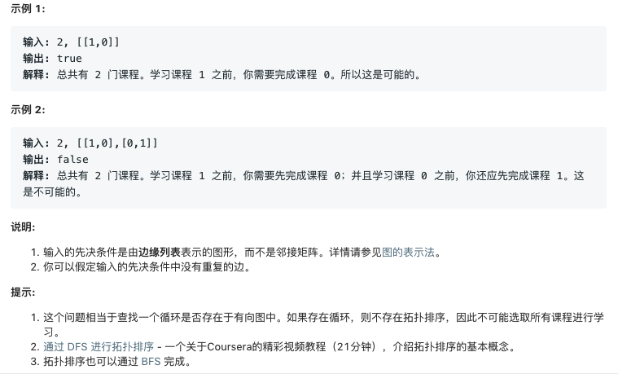

3. [无重复字符的最长子串](https://leetcode-cn.com/problems/longest-substring-without-repeating-characters/)

给定一个字符串，请你找出其中不含有重复字符的 最长子串 的长度。

**示例 1:**

>输入: "abcabcbb"
输出: 3 
解释: 因为无重复字符的最长子串是 "abc"，所以其长度为 3。

**示例 2:**

>输入: "bbbbb"
输出: 1
解释: 因为无重复字符的最长子串是 "b"，所以其长度为 1。

**示例 3:**

>输入: "pwwkew"
输出: 3
解释: 因为无重复字符的最长子串是 "wke"，所以其长度为 3。
     请注意，你的答案必须是 子串 的长度，"pwke" 是一个子序列，不是子串。

**备注:**

>4.18税友笔试遇到这题
```python
class Solution(object):
    def lengthOfLongestSubstring(self, s):
        length = len(s)
        if length ==0:
            return length
        i,j=0,0
        w = []
        res = 0
        while i<length and j<length:
            if s[j] in w:
                w.remove(s[i])
                i+=1
            else:
                w.append(s[j])
                j+=1
                res = max(res,j-i)
        return res
```


4.[寻找两个有序数组的中位数](https://leetcode-cn.com/problems/median-of-two-sorted-arrays/)

给定两个大小为 m 和 n 的有序数组nums1 和nums2。
请你找出这两个有序数组的中位数，并且要求算法的时间复杂度为O(log(m + n))。
你可以假设nums1和nums2不会同时为空。

**思路：**
对A数组和B数组，分别找一个划分点。(这题不是很懂)


**思路：**
对A数组和B数组，分别找一个划分点。

```java
public static double findMedianSortedArrays(Integer A[], Integer B[]) {
	int n = A.length;
	int m = B.length;
	if (n > m)
		return findMedianSortedArrays(B, A);

	int k = (n + m - 1) / 2; // k表示的是划分后的left_part最后的下标
	int l = 0, r = Math.min(k, n);
	while (l < r) {
		int ma = (l + r) / 2;
		int mb = k - ma;
		if (A[ma] < B[mb])
			l = ma + 1;
		else
			r = ma;
	}
	// 将A和B通过l和r分成了left_part和right_part
	int a = Math.max(l > 0 ? A[l - 1] : Integer.MIN_VALUE, k - l >= 0 ? B[k - l] : Integer.MIN_VALUE);
	if (((n + m) & 1) == 1)
		return (double) a;
	int b = Math.min(l < n ? A[l] : Integer.MAX_VALUE, k - l + 1 < m ? B[k - l + 1] : Integer.MAX_VALUE);
	return (a + b) / 2.0;
}
```

```python
class Solution(object):
    def findMedianSortedArrays(self, A, B):
        m, n = len(A), len(B)
        if m > n:
            A, B, m, n = B, A, n, m
        imin, imax, half_len = 0, m, (m + n + 1) / 2
        MAX = 0x3fffffff
        while imin <= imax:
            i = (imin + imax) / 2
            j = half_len - i
            if i < m and B[j-1] > A[i]:
                # i is too small, must increase it
                imin = i + 1
            elif i > 0 and A[i-1] > B[j]:
                # i is too big, must decrease it
                imax = i - 1
            else:
                max_of_left = max(-MAX if i==0 else A[i-1], -MAX if j==0 else B[j-1])
                if (m + n) % 2 == 1:
                    return max_of_left
                min_of_right = min(MAX if i==m else A[i],MAX if j==n else B[j])
                return (max_of_left + min_of_right) / 2.0
```


5. [最长回文子串](https://leetcode-cn.com/problems/longest-palindromic-substring/)

给定一个字符串 s，找到 s 中最长的回文子串。你可以假设 s 的最大长度为 1000。

**示例 1：**

>输入: "babad"
输出: "bab"

注意: "aba" 也是一个有效答案。

**示例 2：**

>输入: "cbbd"
输出: "bb"

**思路：**

`dp[i][j]`表示s[i..j]是否回文 是则为true，否则为false
- `s[i]=s[j]` 则 `dp[i][j]`取决于s[i+1..j-1]是否是回文串
- `s[i]!=s[j]` 则`dp[i][j]`=false

基本情况
- `dp[i][i]=true`
- `dp[i][i+1]=s[i]==s[i+1]`

```python
class Solution(object):
    def longestPalindrome(self, s):
        length = len(s)
        if length < 2:
            return '' if length==0 else s
        dp = [[0] * length for i in range(length)]
        start = 0
        end = 0
        #Base Case 长度为1和长度为2
        for i in range(length-1):
            dp[i][i] = 1
            if s[i]==s[i+1]:
                dp[i][i+1] = 1
                start = i
                end = i+1
        # 枚举子串的长度
        for l in range(3,length+1):
            low = 0
            while low+l-1 < length:
                high = low + l -1
                if s[low] == s[high] and dp[low+1][high-1]:
                    dp[low][high] = 1
                    start = low
                    end = high
                low+=1
        return s[start:end+1]
        
```

10. [正则表达式匹配](https://leetcode-cn.com/problems/regular-expression-matching/)

给定一个字符串 (s) 和一个字符模式 (p)。实现支持 '.' 和 '*' 的正则表达式匹配。

- '.' 匹配任意单个字符。
- '*' 匹配零个或多个前面的元素。
- 匹配应该覆盖整个字符串 (s) ，而不是部分字符串。

**说明:**

>s 可能为空，且只包含从 a-z 的小写字母。
p 可能为空，且只包含从 a-z 的小写字母，以及字符 . 和 *。

**示例 1:**

>输入:
s = "aa"
p = "a"
输出: false
解释: "a" 无法匹配 "aa" 整个字符串。

**示例 2:**

>输入:
s = "aa"
p = "a*"
输出: true

解释: '*' 代表可匹配零个或多个前面的元素, 即可以匹配 'a' 。因此, 重复 'a' 一次, 字符串可变为 "aa"。

**思路：**

两种情况 ：
- 下一个字符不为`*`号
 当前字符要相等 或者e[i] = '.'

- 下一个字符为`*`号
尝试匹配..或者成功返回 或者略过*

```java
class Solution {
	public static boolean isMatch(String s, String p) {
		if (s == null || p == null) {
			return false;
		}
		return isMatchCore(s.toCharArray(), p.toCharArray(), 0, 0);
	}

	// 求s[i..n]和[j..n]是否匹配
	public static boolean isMatchCore(char[] str, char[] exp, int i, int j) {
		// 已经匹配完毕
		if (j == exp.length) {
			return i == str.length;
		}
		// p的下一个字符不是* 则需要当前字符相等 且后面全部匹配
		if (j + 1 == exp.length || exp[j + 1] != '*') {
			return i < str.length && (str[i] == exp[j] || exp[j] == '.') && isMatchCore(str, exp, i + 1, j + 1);
		}

		// p的下一个字符是* 且有s[i] == p[j] || p[j] == '.')
		// p匹配s的1,2,3..直到s[i] ！= p[j]
		while (i < str.length && (str[i] == exp[j] || exp[j] == '.')) {
			if (isMatchCore(str, exp, i, j + 2)) {
				return true;
			}
			i++;
		}
		// 不能用*匹配时略过*
		return isMatchCore(str, exp, i, j + 2);
	}
}
```

55. [跳跃游戏](https://leetcode-cn.com/problems/jump-game/)

给定一个非负整数数组，你最初位于数组的第一个位置。数组中的每个元素代表你在该位置可以跳跃的最大长度。判断你是否能够到达最后一个位置。

**示例 1:**
输入: [2,3,1,1,4]输出: true

解释: 从位置 0 到 1 跳 1 步, 然后跳 3 步到达最后一个位置。
dp[i]表示i点是否可达

**动态规划：**
- dp[0] = true
- dp[i] 是否可达 取决于0..j..i路径上 j点是否可达且nums[j] >= i-1

```java
class Solution {
    public boolean canJump(int[] nums) {
        if (nums == null || nums.length == 0) {
            return false;
        }
        int len = nums.length;
        boolean[] dp = new boolean[len];
        dp[0] = true;// 初始化
        for (int i = 1; i < len; i++) {
            for (int j = 0; j < i && dp[j]; j++) {
                //j可达，且j位置可走的步数大于等于i,j之间的距离
                //则i是可从j到达的
                if (nums[j] >= i - j) {
                    dp[i] = true;
                    break;
                }
            }
        }
        return dp[len - 1];
    }
}
```
**贪心：**
```python
class Solution(object):
    def canJump(self, nums):
        max_pos = 0
        i=0
        #最后一个位置不要考虑
        while i<len(nums)-1:
            #如果i位置都不能走到
            if max_pos<i:
                return False
            #当前可走的最大步数
            max_pos = max(max_pos,i+nums[i])
            i = i+1
        return max_pos>=len(nums)-1

```

76. [最小覆盖子串](https://leetcode-cn.com/problems/minimum-window-substring/)


给定一个字符串 S 和一个字符串 T，请在 S 中找出包含 T 所有字母的最小子串。

**示例：**

>输入: S = "ADOBECODEBANC", T = "ABC"
输出: "BANC"
```python
class Solution(object):
    def minWindow(self, s, t):
        ls = len(s)
        lt = len(t)
        if not s or not t or ls<lt:
            return ''
        min_size = ls + 1
        l = r = 0
        start=0
        end = ls-1
        map = {}
        #对t中的字符计数
        for c in t:
            map[c] = map.get(c,0)+1
        match = 0
        while r<ls:
            map[s[r]] = map.get(s[r],0)-1
            #如果当前遇到的字符在map中出现过，则匹配数+1
            match = match+1 if map[s[r]]>=0  else match
            #当匹配完成时窗口左滑
            if match==lt:
                #尝试左滑窗口 对之前遇到的字符出窗口
                while map[s[l]]<0:
                    map[s[l]]+=1
                    l+=1
                if min_size > r - l + 1:
                    min_size = r - l +1
                    start = l
                    end = r
            r+=1
        return '' if min_size>ls else s[start:end+1]
```

84. [柱状图中最大的矩形](https://leetcode-cn.com/problems/largest-rectangle-in-histogram/)

给定 n 个非负整数，用来表示柱状图中各个柱子的高度。每个柱子彼此相邻，且宽度为 1 。
求在该柱状图中，能够勾勒出来的矩形的最大面积。

```python
class Solution(object):
    def largestRectangleArea(self, heights):
        s = []
        res = 0
        # 可以保证在最后总会计算
        heights.append(0)
        for i in range(len(heights)):
            # 当前位置小于栈顶位置时计算
            while s and heights[s[-1]] > heights[i]:
                h = heights[s.pop()]
                # i-s[-1]-1 和 i 是底
                area = h * (i-s[-1]-1 if s else i)
                res = max(res,area)
            s.append(i)
        return res
```

128. [最长连续序列](https://leetcode-cn.com/problems/longest-consecutive-sequence/)

给定一个未排序的整数数组，找出最长连续序列的长度。要求算法的时间复杂度为 O(n)。

**示例:**

>输入: [100, 4, 200, 1, 3, 2]
输出: 4

解释: 最长连续序列是 [1, 2, 3, 4]。它的长度为 4。

**思路：**
>将num添加map中时考察map中是否有num-1或num+1，如果有则要更新`左右边界`在map中的长度

```python
class Solution(object):
    def longestConsecutive(self, nums):
        map = {}
        res = 0
        for num in nums:
            if num not in map:
                lb = num - map.get(num-1,0)
                rb = num + map.get(num+1,0)
                length = rb - lb + 1
                # k-v:num->length
                map[num] = length
                map[lb] = length
                map[rb] = length
                res = max(res,length)
        return res
```
139. [单词拆分](https://leetcode-cn.com/problems/word-break/)

给定一个非空字符串s和一个包含非空单词列表的字典 wordDict，判定s是否可以被空格拆分为一个或多个在字典中出现的单词。

**说明：**

拆分时可以重复使用字典中的单词。
你可以假设字典中没有重复的单词。

**示例 1：**

输入: s = "leetcode", wordDict = ["leet", "code"]
输出: true

解释: 返回 true因为"leetcode"可以被拆分成 "leet code"。

**思路：**

dp[i]表示s前i-1个字符能否被wordDict拆分
- dp[0] = true
- dp[i] = dp[j] & s[j:i) in wordDict(j in [0,i) ) 任意一个j满足即可

```python
class Solution(object):
    def wordBreak(self, s, wordDict):
        len_s = len(s)
        dp = [0] * (len_s+1)
        dp[0] = 1
        for i in range(1,len_s+1):
            for j in range(i):
                if dp[j] and s[j:i] in wordDict:
                    dp[i] = 1
                    break
        return dp[-1]
```

148. [排序链表](https://leetcode-cn.com/problems/sort-list/)

在O(nlogn) 时间复杂度和常数级空间复杂度下，对链表进行排序。

**示例 1:**

>输入: 4->2->1->3
输出: 1->2->3->4

**示例 2:**

>输入: -1->5->3->4->0
输出: -1->0->3->4->5

```java
	public static ListNode sortList(ListNode head) {
		if (head == null || head.next == null) {
			return head;
		}
		ListNode fast, slow, pre;
		fast = slow = pre = head;
		// 找中点
		while (fast != null && fast.next != null) {
			pre = slow;
			slow = slow.next;
			fast = fast.next.next;
		}
		// 截断
		pre.next = null;
		// 合并
		return mearge(sortList(head), sortList(slow));
	}

	public static ListNode mearge(ListNode h1, ListNode h2) {
		ListNode head = new ListNode(-1);
		ListNode cur = head;
		while (h1 != null || h2 != null) {
			if (h1 != null && h2 != null) {
				if (h1.val < h2.val) {
					cur.next = h1;
					h1 = h1.next;
				} else {
					cur.next = h2;
					h2 = h2.next;
				}
				cur = cur.next;
			} else {
				cur.next = h1 == null ? h2 : h1;
				break;
			}
		}
		return head.next;
	}
```

152. [乘积最大子序列](https://leetcode-cn.com/problems/maximum-product-subarray/)

给定一个整数数组 nums ，找出一个序列中乘积最大的连续子序列（该序列至少包含一个数）。

**示例 1:**

输入: [2,3,-2,4]
输出: 6
解释: 子数组 [2,3] 有最大乘积 6。

**示例 2:**

输入: [-2,0,-1]
输出: 0
解释: 结果不能为 2, 因为 [-2,-1] 不是子数组。
以nums[i]结尾的乘积最大值可能来自三种情况：
- nums[i]
- min * nums[i] `(当nums[i]<0)`
- max *nums
```python
class Solution(object):
    def maxProduct(self, nums):
        if not nums or len(nums) == 0:
            return 0
        _min = _max = res = nums[0]
        for num in nums[1:]:
            minEnd = _min*num
            maxEnd = _max*num
            _min = min(min(minEnd,maxEnd),num)
            _max = max(max(minEnd,maxEnd),num)
            res = max(res,_max)
        return res
```

207.[课程表](https://leetcode-cn.com/problems/course-schedule/)
现在你总共有 n 门课需要选，记为0到n-1。

在选修某些课程之前需要一些先修课程。例如，想要学习课程 0 ，你需要先完成课程 1 ，我们用一个匹配来表示他们: [0,1]

给定课程总量以及它们的先决条件，判断是否可能完成所有课程的学习？


DFS:
```python
class Solution(object):
    def canFinish(self, numCourses, prerequisites):
        graph = [[] for _ in range(numCourses)]
        finished = [0 for _ in range(numCourses)]
        # 创建图的邻接表形式
        [graph[pair[0]].append(pair[1]) for pair in prerequisites]
        # 访问每个结点,只要有一个不能完成，则整体不能完成
        if min([self.dfs(graph,finished,i) for i in range(numCourses)]) == 0:
            return False
        return True
    def dfs(self, graph, finished, i):
        if finished[i] != 0:
            return finished[i]==1  
        # 标记当前结点正在访问
        finished[i] = -1
        # 访问所有依赖的课程结点
        for j in graph[i]:
            if not self.dfs(graph, finished, j):
                return False
        # 如果能到这一步，说明所有依赖的课程都能完成
        finished[i] = 1
        return True
```

208、[实现前缀树](https://leetcode-cn.com/problems/implement-trie-prefix-tree/)

实现一个 Trie (前缀树)，包含insert,search, 和 startsWith 这三个操作。

**示例:**

Trie trie = new Trie();

trie.insert("apple");

trie.search("apple");   // 返回 true

trie.search("app");     // 返回 false

trie.startsWith("app"); // 返回 true

trie.insert("app");   

trie.search("app");     // 返回 true

**说明:**

你可以假设所有的输入都是由小写字母 a-z 构成的。

保证所有输入均为非空字符串。
```java
public class Trie {

	private TrieNode root;

	public static class TrieNode {
		public int end;
		public TrieNode[] next;

		public TrieNode() {
			end = 0;
			next = new TrieNode[26];
		}
	}

	public Trie() {
		root = new TrieNode();
	}

	public void insert(String word) {
		char[] chs = word.toCharArray();
		TrieNode node = root;
		int index = 0;
		for (int i = 0; i < chs.length; i++) {
			index = chs[i] - 'a';
			if (node.next[index] == null) {
				node.next[index] = new TrieNode();
			}
			node = node.next[index];
		}
		// 以当前结点结尾的单词数+1
		node.end++;
	}

	public boolean search(String word) {
		TrieNode node = traversal(word);
		if (node == null || node.end == 0) {
			return false;
		}
		return true;
	}

	public boolean startsWith(String pre) {
		return traversal(pre) != null;
	}

	// 返回word在树中的最后一个结点，或者null
	private TrieNode traversal(String word) {
		char[] chs = word.toCharArray();
		TrieNode node = root;
		int index = 0;
		for (int i = 0; i < chs.length; i++) {
			index = chs[i] - 'a';
			if (node.next[index] == null) {
				return null;
			}
			node = node.next[index];
		}
		return node;
	}
}
```

279.[完全平方数](https://leetcode-cn.com/problems/perfect-squares/)

给定正整数 n，找到若干个完全平方数（比如 1, 4, 9, 16, ...）使得它们的和等于 n。你需要让组成和的完全平方数的个数最少。

**示例 1:**

>输入: n = 12
输出: 3 
解释: 12 = 4 + 4 + 4.

**示例 2:**

>输入: n = 13
输出: 2
解释: 13 = 4 + 9.

**思路：**
完全背包问题，有一序列an=n^2(n[1..])，从中可重复选取使其组成n，求选的数最少需要多少个。
- 初始时可让dp[i] = i
- 从小到大更新dp[i],`dp[i] = min(dp[i],dp[i-j*j]) i-j*j>=0`
```python
class Solution(object):
    def numSquares(self, n):
        if n<=1:
            return n
        dp = [_ for _ in range(0,n+1)]
        for i in range(1,n+1):
            j = 1
            # 这里从j*j -> 1进行计算也是可以的
            while j*j<=i:
                dp[i] = min(dp[i],dp[i-j*j]+1)
                j+=1
        return dp[-1]
```

287.[寻找重复数](https://leetcode-cn.com/problems/find-the-duplicate-number/)

给定一个包含n + 1 个整数的数组nums，其数字都在 1 到 n之间（包括 1 和 n），可知至少存在一个重复的整数。假设只有一个重复的整数，找出这个重复的数。

**示例 1:**

>输入: [1,3,4,2,2]
输出: 2

**示例 2:**

>输入: [3,1,3,4,2]
输出: 3
**思路：**

*修改原数组*

将不重复的数交换到因该在的位置，最后重复的数会出现在nums[0]的位置

```python
class Solution:
    def findDuplicate(self, nums):
        n = -1
        while nums[0] != n:
            n = nums[0]
            self.swap(nums,n)
        return nums[0]
    def swap(self, nums,n):
        nums[0] = nums[n]
        nums[n] = n
```
*不修改原数组*

快慢指针思想, fast 和 slow 是指针, nums[slow] 表示取指针对应的元素注意 nums 数组中的数字都是在 1 到 n 之间的(在数组中进行游走不会越界),因为有重复数字的出现,所以这个游走必然是成环的,环的入口就是重复的元素,即按照寻找链表环入口的思路来做

```python
class Solution(object):
    def findDuplicate(self, nums):
        slow = 0
        fast = 0
        while True:
            slow = nums[slow]
            fast = nums[nums[fast]]
            if slow == fast:
                break
        finder = 0
        while True:
            slow   = nums[slow]
            finder = nums[finder]
            if slow == finder:
                return finder
```

300. [最长上升子序列](https://leetcode-cn.com/problems/longest-increasing-subsequence/)

给定一个无序的整数数组，找到其中最长上升子序列的长度。

**示例:**

>输入: [10,9,2,5,3,7,101,18]
输出: 4 

解释: 最长的上升子序列是 [2,3,7,101]，它的长度是 4。

```java
	class Solution {
		public int lengthOfLIS(int[] arr) {
			if (arr == null || arr.length == 0) {
				return 0;
			}
			int[] dp = new int[arr.length];
			int max = -1;
			for (int i = 0; i < arr.length; i++) {
				// 每次认为arr[i]单独组成LIS 所以长度为1
				dp[i] = 1;
				for (int j = 0; j < i; j++) {
					// 如果arr[i] > arr[j] 并且能使当前以arr[i]结尾的序列更长
					// 则把arr[i] 根在以arr[j] 结尾的序列后面
					if (arr[i] > arr[j] && dp[i] <= dp[j]) {
						dp[i] = dp[j] + 1;
					}
				}
				max = Math.max(max, dp[i]);
			}
			return max;
		}
	}
```
