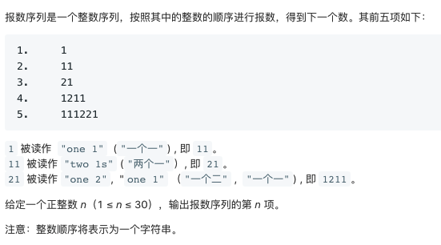
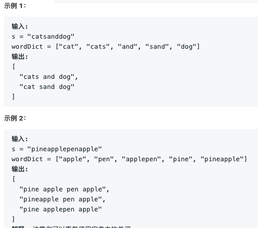
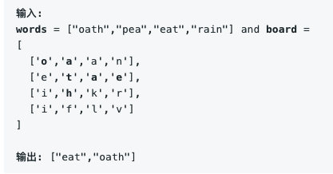
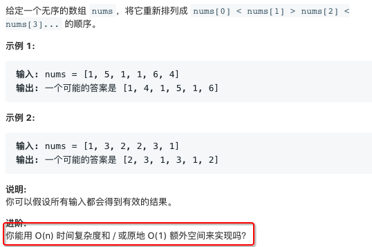

38. [报数](https://leetcode-cn.com/problems/count-and-say/)


```python
class Solution(object):
    def countAndSay(self, n):
        if n == 0:return ''
        res = '1'
        while n-1>0:
            cur = ''
            n-=1
            i=0
            while i<len(res):
            # for i in range(len(res)): 这种写法不行
                count=1
                while i+1<len(res) and res[i]==res[i+1]:
                    count+=1
                    i+=1
                cur+=str(count)+res[i]
                i+=1
            res=cur
        return res
```

44. [通配符匹配](https://leetcode-cn.com/problems/wildcard-matching/)

给定一个字符串(s) 和一个字符模式(p) ，实现一个支持'?'和'*'的通配符匹配。

'?' 可以匹配任何单个字符。
'*' 可以匹配任意字符串（包括空字符串）。

**示例1：**

>输入:
s = "adceb"
p = "*a*b"
输出: true

**示例2：**

>输入:
s = "cb"
p = "?a"
输出: false

**思路:**

`dp[i][j]`的含义是`s[0..i)到p[0..j)`是否匹配，则

基本情况：

`dp[0][0] = True`

`dp[0][i]` = 遇到非*全为False

`dp[i][0] = False`

一般情况：

if s[i-1]==`p[j] || p[j-1]=='?'`:
	`dp[i][j]` = `dp[i-1][j-1]`

if  p[j-1] = '*'
	`dp[i][j]` = `dp[i][j-1]` or `dp[i-1][j]`

`dp[i][j-1]`,表示*代表非空任意字符

`dp[i-1][j]`,表示*代表空字符,例如ab,ab*
```python
class Solution(object):
    def isMatch(self, s, p):
        m = len(s)+1
        n = len(p)+1
        dp = [[0]*n for _ in range(m)]
        dp[0][0]=1
        for i in range(1,n):
            if p[i-1]=='*':
                dp[0][i] = 1
            else:break
        for i in range(1,m):
            for j in range(1,n):
                if s[i-1]==p[j-1] or p[j-1]=='?':
                    dp[i][j] = dp[i-1][j-1]
                elif p[j-1]=='*':
                    dp[i][j] = dp[i-1][j] or dp[i][j-1]
        return dp[-1][-1]
```


54. [螺旋矩阵](https://leetcode-cn.com/problems/spiral-matrix/)

给定一个包含 m x n 个元素的矩阵（m 行, n 列），请按照顺时针螺旋顺序，返回矩阵中的所有元素。

**思路：**
很简单，没有什么好解释的


```java
	public static List<Integer> spiralOrder(int[][] matrix) {
        List<Integer> res = new ArrayList<>();
		if(matrix == null || matrix.length==0){
            return res;
        }
		int row = matrix.length;
		int col = matrix[0].length;
		boolean[][] visited = new boolean[row][col];
		int i = 0;
		int size = row * col;
		int x = 0, y = 0;
		int dx = 0, dy = 1;
		while (i < size) {
			res.add(matrix[x][y]);
			visited[x][y] = true;
			if (visited[(x + dx + row) % row][(y + dy + col) % col]) {
				int temp = -dx;
				dx = dy;
				dy = temp;
			}
			x += dx;
			y += dy;
			i++;
		}
		return res;
	}
```
与些相类似的蛇形填数
```java
	public static int[][] generateMatrix(int n) {
		int row = n;
		int col = n;
		int[][] matrix = new int[row][col];
		int i = 1;
		int size = row * col;
		int x = 0, y = 0;
		int dx = 0, dy = 1;
		while (i <= size) {
			matrix[x][y] = i;
			if (matrix[(x + dx + row) % row][(y + dy + col) % col] > 0) {
				int temp = -dx;
				dx = dy;
				dy = temp;
			}
			x += dx;
			y += dy;
			i++;
		}
		return matrix;
	}
```


140. [单词拆分 II](https://leetcode-cn.com/problems/word-break-ii/)

给定一个非空字符串 s 和一个包含非空单词列表的字典 wordDict，在字符串中增加空格来构建一个句子，使得句子中所有的单词都在词典中。返回所有这些可能的句子。

**说明：**

分隔时可以重复使用字典中的单词。
你可以假设字典中没有重复的单词。

**示例：**




```python
class Solution(object):
    def wordBreak(self, s, wordDict):
        return self.helper(s, wordDict, {})
        
    def helper(self, s, wordDict, memo):
        if s in memo: return memo[s]
        if not s: return []
        
        res = []
        for word in wordDict:
            if not s.startswith(word):
                continue
            #如果当前串的长度刚好和字典中的某个串相等
            if len(word) == len(s):
                res.append(word)
            #如果不等，则递归解决剩余的部分
            else:
                resultOfTheRest = self.helper(s[len(word):], wordDict, memo)
                print len(resultOfTheRest)
                #每一个item都是一种以word开头可能的拆分方案
                for item in resultOfTheRest:
                    item = word + ' ' + item
                    res.append(item)
        memo[s] = res
        return res
```


也可以这样：

```python
class Solution(object):
    def wordBreak(self, s, wordDict):
        return self.dfs(s, wordDict, {})
        
    def dfs(self, s, wordDict, map):
        if s in map: return map[s]
        if not s: return ['']
        
        res = []
        for word in wordDict:
            if not s.startswith(word):
                continue
            #递归解决剩余的部分
            #每一个item都是一种以word开头可能的拆分方案
            for item in self.dfs(s[len(word):], wordDict, map):
                item = word + ('' if item =='' else ' ') + item
                res.append(item)
        map[s] = res
        return res
```


Java版本

```java
	public static List<String> wordBreak(String s, List<String> wordDict) {
		return DFS(s, wordDict, new HashMap<String, LinkedList<String>>());
	}

	static List<String> DFS(String s, List<String> wordDict, HashMap<String, LinkedList<String>> map) {
		if (map.containsKey(s))
			return map.get(s);

		LinkedList<String> res = new LinkedList<String>();
		if (s.length() == 0) {
			res.add("");
			return res;
		}
		for (String word : wordDict) {
			if (s.startsWith(word)) {
				List<String> sublist = DFS(s.substring(word.length()), wordDict, map);
				for (String sub : sublist)
					res.add(word + (sub.isEmpty() ? "" : " ") + sub);
			}
		}
		map.put(s, res);
		return res;
	}
```

149. [直线上最多的点数](https://leetcode-cn.com/problems/max-points-on-a-line/)

给定一个二维平面，平面上有 n 个点，求最多有多少个点在同一条直线上。
```java
//两两之间求斜率，记录斜率出现最多的次数
class Solution {
    public int maxPoints(int[][] points) {
        int l = points.length;
        if (l <= 2)
            return l;
        int res = 0;
        for (int i = 0; i < l - 1; i++) {
            Map<String, Integer> map = new HashMap<>();
            int overlap = 0;
            int currMax = 0;
            for (int j = i + 1; j < l; j++) {
                int dx = points[i][0] - points[j][0];
                int dy = points[i][1] - points[j][1];
                if (dx == 0 && dy == 0) {
                    overlap++;
                    continue;
                }
                int gcd = generateGcd(dx, dy);
                dx /= gcd;
                dy /= gcd;
                // 用string来存储斜率
                String slope = String.valueOf(dy) + '/' + String.valueOf(dx);
                int count = map.getOrDefault(slope, 0);
                count++;
                map.put(slope, count);
                currMax = Math.max(currMax, count);
            }
            res = Math.max(res, currMax + overlap + 1);
        }
        return res;
    }

    public int generateGcd(int x, int y) {
        if (y == 0)
            return x;
        return generateGcd(y, x % y);
    }
}
```


166. [分数到小数](https://leetcode-cn.com/problems/fraction-to-recurring-decimal/)

给定两个整数，分别表示分数的分子numerator 和分母 denominator，以字符串形式返回小数。

如果小数部分为循环小数，则将循环的部分括在括号内。

**示例 1:**

>输入: numerator = 1, denominator = 2
输出: "0.5"

**示例2:**

>输入: numerator = 2, denominator = 1
输出: "2"

**示例3:**

>输入: numerator = 2, denominator = 3
输出: "0.(6)"


```python
class Solution(object):
    def fractionToDecimal(self, numerator, denominator):
        if numerator == 0:
            return '0'
        res = []
        res.append('-' if (numerator > 0) ^ (denominator > 0) else '')
        num = abs(numerator)
        den = abs(denominator)

        res.append(num / den)
        num%=den
        if num ==0:
            return ''.join(map(str,res))
        
        res.append('.')
        pos = {}
        #pos记录出现的位置
        pos[num] = len(res)
        #这里的num是余数
        while num:
            num *=10
            res.append(num / den)
            num %= den
            #如果出现了相同的余数 则一定可以会产生循环小数
            if pos.get(num,-1) != -1:
                index = pos.get(num)
                res.insert(index,'(')
                res.append(')')
                break
            else:
                pos[num] = len(res)
        return ''.join(map(str,res))
```


212. [单词搜索 II](https://leetcode-cn.com/problems/word-search-ii/)

给定一个二维网格board和一个字典中的单词列表 words，找出所有同时在二维网格和字典中出现的单词。

单词必须按照字母顺序，通过相邻的单元格内的字母构成，其中“相邻”单元格是那些水平相邻或垂直相邻的单元格。同一个单元格内的字母在一个单词中不允许被重复使用。

**示例：**




```java
	private static int[][] dir = { { 0, 1 }, { 1, 0 }, { -1, 0 }, { 0, -1 } };

	public static List<String> findWords(char[][] board, String[] words) {
		List<String> res = new ArrayList<>();
		TrieNode root = buildTrie(words);
		for (int i = 0; i < board.length; i++) {
			for (int j = 0; j < board[0].length; j++) {
				dfs(board, i, j, root, res);
			}
		}
		return res;
	}

	public static void dfs(char[][] board, int i, int j, TrieNode node, List<String> res) {
		// 边界检查
		if (i < 0 || i >= board.length || j < 0 || j >= board[0].length) {
			return;
		}
		char c = board[i][j];
		if (c == '#' || node.next[c - 'a'] == null)
			return;
		node = node.next[c - 'a'];
		if (node.word != null) {
			res.add(node.word);
			node.word = null;
		}

		board[i][j] = '#';
		for (int k = 0; k < dir.length; k++) {
			int dx = i + dir[k][0];
			int dy = j + dir[k][1];
			dfs(board, dx, dy, node, res);
		}

		board[i][j] = c;
	}

	// 单词保存在叶子结点
	public static TrieNode buildTrie(String[] words) {
		TrieNode root = new TrieNode();
		for (String w : words) {
			TrieNode node = root;
			for (char c : w.toCharArray()) {
				int i = c - 'a';
				if (node.next[i] == null)
					node.next[i] = new TrieNode();
				node = node.next[i];
			}
			node.word = w;
		}
		return root;
	}

	static class TrieNode {
		TrieNode[] next = new TrieNode[26];
		String word;
	}
```


324.[摆动排序 II](https://leetcode-cn.com/problems/wiggle-sort-ii/)



**思路：** 先排序，然后填充回原数组

```python
class Solution(object):
    def wiggleSort(self, nums):
        tmp = [_ for _ in nums]
        tmp.sort()
        l = (len(tmp)-1)/2
        h = len(tmp)-1  #从最大的开始取，可以应对这种用例{1，1，1，2，2}
        for i in range(len(tmp)):
            if i%2:
                nums[i] = tmp[h]
                h-=1
            else:
                nums[i] = tmp[l]
                l-=1

    def wiggleSort2(self, nums):
            tmp = [_ for _ in nums]
            tmp.sort()
            n = len(tmp)
            l = (n-1)/2
            h = n-1
            # k用来判断前半部分的边界
            k = l
            i = 0
            while i<n:
                if l>-1:
                    nums[i] = tmp[l]
                    i,l = i+1,l-1
                if h>k:
                    nums[i] = tmp[h]
                    i,h = i+1,h-1
```

原地交换法：

```java
	public void wiggleSort(int[] nums) {
		for (int i = 0; i < (nums.length - 1) / 2; i++) {
			if (2 * i + 1 < nums.length && nums[2 * i] > nums[2 * i + 1]) {
				swap(2 * i + 1, 2 * i, nums);
			}
			if (2 * i + 2 < nums.length && nums[2 * i + 1] < nums[2 * i + 2]) {
				swap(2 * i + 2, 2 * i + 1, nums);
			}
		}
	}
```


341. [扁平化嵌套列表迭代器](https://leetcode-cn.com/problems/flatten-nested-list-iterator/)

给定一个嵌套的整型列表。设计一个迭代器，使其能够遍历这个整型列表中的所有整数。列表中的项或者为一个整数，或者是另一个列表。

**示例 1:**

输入: [[1,1],2,[1,1]]
输出: [1,1,2,1,1]
解释: 通过重复调用 next 直到 hasNext 返回false，next 返回的元素的顺序应该是: [1,1,2,1,1]。

**示例 2:**

输入: [1,[4,[6]]]
输出: [1,4,6]
解释: 通过重复调用 next 直到 hasNext 返回false，next 返回的元素的顺序应该是: [1,4,6]。

```java
interface NestedInteger {
	public boolean isInteger();

	public Integer getInteger();

	public List<NestedInteger> getList();
}
```

在迭代过程中展开：

```java
public class NestedIterator implements Iterator<Integer> {

	Stack<NestedInteger> stack = new Stack<>();

	public NestedIterator(List<NestedInteger> nestedList) {
		for (int i = nestedList.size() - 1; i > -1; i--) {
			stack.push(nestedList.get(i));
		}
	}

	@Override
	public Integer next() {
		return stack.pop().getInteger();
	}

	@Override
	public boolean hasNext() {

		while (!stack.isEmpty()) {
			NestedInteger curr = stack.peek();
			if (curr.isInteger()) {
				return true;
			}
			stack.pop(); //如果是list则弹出并用整数代替之
			List<NestedInteger> list = curr.getList();
			for (int i = list.size() - 1; i > -1; i--) {
				stack.push(list.get(i));
			}
		}
		return false;
	}
}
```


在创建迭代器时展开：

```java
class NestedIterator implements Iterator<Integer> {
	Queue<NestedInteger> queue = new LinkedList<>();

	public NestedIterator(List<NestedInteger> nestedList) {
		unfold(nestedList);
	}

	private void unfold(List<NestedInteger> nestedList) {
		for (NestedInteger nest : nestedList) {
			if (nest.isInteger()) {
				queue.offer(nest);
			} else {
				unfold(nest.getList());
			}
		}
	}

	@Override
	public Integer next() {
		return queue.remove().getInteger();
	}

	@Override
	public boolean hasNext() {
		return !queue.isEmpty();
	}
}
```

