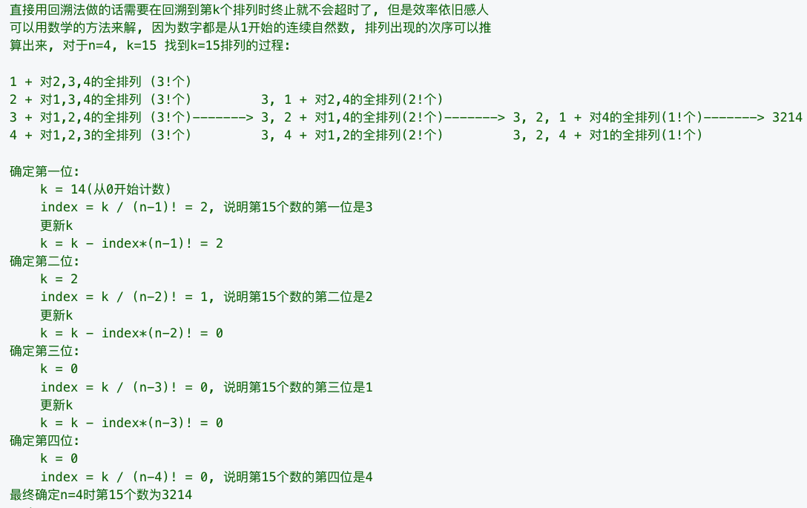

25. [K 个一组翻转链表](https://leetcode-cn.com/problems/reverse-nodes-in-k-group/)

```python
class Solution(object):
    stack = []
    def resign(self,pre,next):
        node = self.stack.pop()
        if pre:
            pre.next = node
        while self.stack:
            p = self.stack.pop()
            node.next = p
            node = node.next
        node.next = next
        return node

    def reverseKGroup(self, head, k):
        cur = head
        pre,new_head = None,None
        while cur:
            next = cur.next
            self.stack.append(cur)
            if len(self.stack)==k:
                pre = self.resign(pre,next)
                new_head = new_head if new_head else cur
            cur = next
        del self.stack[:] #必须要清空，不然会影响后续的case
        return new_head if new_head else head
```

60. [第k个排列](https://leetcode-cn.com/problems/permutation-sequence/)
给出集合[1,2,3,…,n]，其所有元素共有n! 种排列。

按大小顺序列出所有排列情况，并一一标记，当n = 3 时, 所有排列如下：

"123"
"132"
"213"
"231"
"312"
"321"

给定n 和k，返回第k个排列。

**说明：**

>给定 n的范围是 [1, 9]。
给定 k的范围是[1, n!]。

**思路：**


```java
class Solution {
	private static int[] fact = new int[17];
	// 计算阶乘，16!为int所能表示的最大值
	{
		int f = 1;
		for (int i = 1; i < 17; ++i) {
			f *= i;
			fact[i] = f;
		}
	}

	public static String getPermutation(int n, int k) {
		StringBuilder sb = new StringBuilder();
		// 候选数字
		List<Integer> nums = new ArrayList<>();
		for (int i = 1; i <= n; ++i) {
			nums.add(i);
		}
		k -= 1;
		for (int i = n - 1; i > 0; --i) {
			// 计算候选数字的index
			int index = k / fact[i];
			sb.append(nums.remove(index));
			k -= index * fact[i];
		}
		sb.append(nums.remove(0));
		return sb.toString();
	}
}
```

61. [旋转链表](https://leetcode-cn.com/problems/rotate-list/)

给定一个链表，旋转链表，将链表每个节点向右移动 k 个位置，其中 k 是非负数。

**示例 1:**

输入: 1->2->3->4->5->NULL, k = 2
输出: 4->5->1->2->3->NULL

解释:
向右旋转 1 步: 5->1->2->3->4->NULL
向右旋转 2 步: 4->5->1->2->3->NULL
```java
class Solution {
    public ListNode rotateRight(ListNode head, int k) {
        if(head==null || head.next==null || k ==0){
            return head;
        }
        //说是循环旋转，但其实本质上是将尾部向前数
        //第K个元素作为头，原来的头接到原来的尾上
        ListNode node = head;
        int length = 1;
        //求长度
        while(node.next!=null){
            length++;
            node = node.next;
        }
        
        k %= length;
        k = length - k;
        
        //改成循环链表
        node.next = head;
        
        //走n-k步到新的头结点
        node = head;
        ListNode pre = null;
        while(k-->0){
            pre = node;
            node = node.next;
        }
        pre.next = null;
        return node;
    }
}
```
63. [不同路径 II](https://leetcode-cn.com/problems/unique-paths-ii/)

一个机器人位于一个 m x n 网格的左上角 （起始点在下图中标记为“Start” ）。

机器人每次只能向下或者向右移动一步。机器人试图达到网格的右下角（在下图中标记为“Finish”）。

现在考虑网格中有障碍物。那么从左上角到右下角将会有多少条不同的路径？
```java
class Solution {
    public static int uniquePathsWithObstacles(int[][] map) {
		int m = map.length;
		int n = map[0].length;
		int[][] dp = new int[m][n];
        //对于第一行或第一列出现1后面的都为0
		for (int i = 0; i < m; i++) {
			if (map[i][0] == 1) {
				break;
			}
			dp[i][0] = 1;
		}
		for (int i = 0; i < n; i++) {
			if (map[0][i] == 1) {
				break;
			}
			dp[0][i] = 1;
		}
        //一般情况 map[i][j]=1，则dp[i][j]=0
		for (int i = 1; i < m; i++) {
			for (int j = 1; j < n; j++) {
				if (map[i][j] == 1) {
					dp[i][j] = 0;
				} else {
					dp[i][j] = dp[i - 1][j] + dp[i][j - 1];
				}
			}
		}
		return dp[m - 1][n - 1];
	}
}
```

67. [二进制求和](https://leetcode-cn.com/problems/add-binary/)

给定两个二进制字符串，返回他们的和（用二进制表示）。

输入为非空字符串且只包含数字1和0。

**示例1:**

>输入: a = "11", b = "1"
输出: "100"

**示例2:**

>输入: a = "1010", b = "1011"
输出: "10101"

```java
class Solution {
	public String addBinary(String a, String b) {
		int m = a.length() - 1;
		int n = b.length() - 1;
		int ca = 0;
		StringBuilder res = new StringBuilder();
		while (m > -1 || n > -1) {
			int sum = ca;
			sum += m > -1 ? a.charAt(m--) - '0' : 0;
			sum += n > -1 ? b.charAt(n--) - '0' : 0;
			res.append(sum % 2);
			ca = sum / 2;
		}
		res.append(ca == 0 ? "" : ca);
		return res.reverse().toString();
	}
}
```
69. [实现int sqrt(int x)函数](https://leetcode-cn.com/problems/sqrtx/)

计算并返回x的平方根，其中x是非负整数。由于返回类型是整数，结果只保留整数的部分，小数部分将被舍去。


```java
class Solution {
	public static int mySqrt(int x) {
		if (x <= 1) {
			return x;
		}
		int l = 1;
		int r = x / 2;
		while (true) {
			int m = l + (r - l) / 2;
			if (m > x / m) {
				r = m - 1;
			} else if (m + 1 > x / (m + 1)) {
				return m;
			} else {
				l = m + 1;
			}
		}
	}
}
```

85. [最大矩形面积](https://leetcode-cn.com/problems/maximal-rectangle/)

给定一个仅包含 0 和 1 的二维二进制矩阵，找出只包含 1 的最大**矩形**，并返回其面积。


```python
class Solution(object):
    def maximalRectangle(self,matrix):
        if not matrix or not matrix[0]:
            return 0
        res = 0
        n = len(matrix[0])
        heights = [0]*(n+1)
        for row in matrix:
            for i in range(n):
                heights[i] = heights[i]+1 if row[i]=='1' else 0
            s = []
            for i in range(len(heights)):
                # 当前位置小于栈顶位置时计算
                while s and heights[s[-1]] > heights[i]:
                    h = heights[s.pop()]
                    # i-s[-1]-1 和 i 是底
                    area = h * (i-s[-1]-1 if s else i)
                    res = max(res,area)
                s.append(i)
        return res
```


92. [反转链表 II](https://leetcode-cn.com/problems/reverse-linked-list-ii/)
反转从位置 m 到 n 的链表。请使用一趟扫描完成反转。
说明: 1 ≤ m ≤ n ≤ 链表长度。

```java
	public ListNode reverseBetween(ListNode head, int m, int n) {
		if (m == n) {
			return head;
		}
		ListNode newHead = new ListNode(-1);
		ListNode curr = newHead;
		ListNode tail = null;
		ListNode reNode = null;
		for (int i = 0; i < n; i++) {
			if (i < m - 1) { // 指向第m-1个结点
				curr = curr.next;
			} else if (i == m - 1) {
				tail = curr.next; // 指向第m个结点
			} else { // 每次将tail后面一个节点拿出来，放在curr后面
				reNode = tail.next;
				tail.next = reNode.next;
				reNode.next = curr.next;
				curr.next = reNode;
			}
		}
		return newHead.next;
	}
```

93. [复原IP地址](https://leetcode-cn.com/problems/restore-ip-addresses/submissions/)

给定一个只包含数字的字符串，复原它并返回所有可能的 IP 地址格式。

**示例:**

>输入: "25525511135"
输出: ["255.255.11.135", "255.255.111.35"]

**思路：**

使用1..3个字符作为当前的还原的数字，递归的解决剩余的部分。

```java
	public static List<String> restoreIpAddresses(String s) {
		List<String> result = new ArrayList<>();
		doRestore(result, "", s, 0);
		return result;
	}

	private static void doRestore(List<String> result, String path, String s, int k) {

		if (s.isEmpty() || k == 4) {
			if (s.isEmpty() && k == 4)
				result.add(path.substring(1));
			return;
		}
		// 以0开头的时候单作为一部分
		for (int i = 1; i <= (s.charAt(0) == '0' ? 1 : 3) && i <= s.length(); i++) {
			String part = s.substring(0, i);
			if (Integer.parseInt(part) <= 255)
				doRestore(result, path + "." + part, s.substring(i), k + 1);
		}
	}
```

