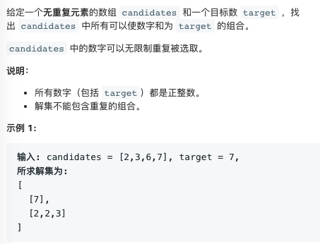
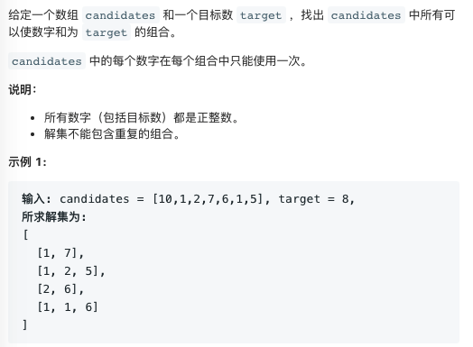
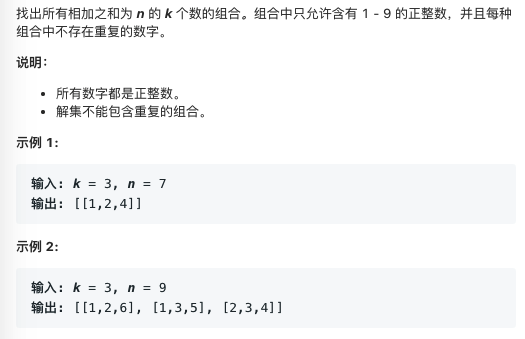
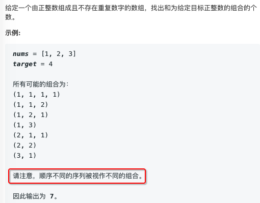

16. [最接近三数之和](https://leetcode-cn.com/problems/3sum-closest/)

给定一个包括 n 个整数的数组 nums 和 一个目标值 target。找出 nums 中的三个整数，使得它们的和与 target 最接近。返回这三个数的和。假定每组输入只存在唯一答案。

>例如，给定数组 nums = [-1，2，1，-4], 和 target = 1.与 target 最接近的三个数的和为 2. (-1 + 2 + 1 = 2).


```java
class Solution {
	public static int threeSumClosest(int[] nums, int k) {
		int l, r;
		Arrays.sort(nums);
		int res = nums[0] + nums[1] + nums[2];
		for (int i = 0; i < nums.length - 2; i++) {
			if (i == 0 || nums[i - 1] != nums[i]) {
				l = i + 1;
				r = nums.length - 1;
				while (l < r) {
                    int sum = nums[i] + nums[l] + nums[r];
					if (Math.abs(sum - k) < Math.abs(res - k)) {
						res = sum;
					}

					if (nums[l] + nums[r] < k - nums[i]) {
						l++;
					} else if (nums[l] + nums[r] > k - nums[i]) {
						r--;
					} else {
						return k;
					}
				}
			}
		}
		return res;
	}
}
```

24. [两两交换链表](https://leetcode-cn.com/problems/swap-nodes-in-pairs/)

```python
class Solution(object):
    def swapPairs(self, head):
        if head==None or head.next==None:
            return head
        next = head.next
        head.next = self.swapPairs(next.next)
        next.next = head
        return next
```

39. [组合总和](https://leetcode-cn.com/problems/combination-sum/)


```python
class Solution(object):
    def combinationSum(self, nums, target):
        res = []
        lst = []
        self.dfs(nums,target,0,res,lst)
        return res
    def dfs(self,nums,target,k,res,tmp_res):
        if target==0:
            # append a copy
            res.append(tmp_res[::])
        else:
            i=k
            while i<len(nums):
                if target-nums[i]>=0:
                    tmp_res.append(nums[i])
                    #可重复选取
                    self.dfs(nums,target-nums[i],i,res,tmp_res)
                    tmp_res.pop()
                i+=1
```


40. [组合总和2](https://leetcode-cn.com/problems/combination-sum-ii/)


```python
class Solution(object):
    def combinationSum2(self, nums, target):
        res = []
        lst = []
        nums.sort()
        self.dfs(nums,target,0,res,lst)
        return res
    def dfs(self,nums,target,k,res,tmp_res):
        if target==0:
            # append a copy
            res.append(tmp_res[::])
        else:
            i=k
            while i<len(nums):
                if i>k and nums[i]==nums[i-1]:
                    i+=1
                    continue
                if target-nums[i]>=0:
                    tmp_res.append(nums[i])
                    #不可重复选取
                    self.dfs(nums,target-nums[i],i+1,res,tmp_res)
                    tmp_res.pop()
                i+=1
```


47. [全排列2](https://leetcode-cn.com/problems/permutations-ii/)
包含重复元素，求全排列
```java
	public static List<List<Integer>> permuteUnique(int[] nums) {
		if (nums == null || nums.length == 0)
			return Collections.EMPTY_LIST;
		int map[] = new int[19];
		for (int num : nums) {
			map[num + 9]++;
		}
		List<List<Integer>> ret = new ArrayList<List<Integer>>();
		List<Integer> ans = new ArrayList<>();
		collect(ret, ans, nums, map);
		return ret;
	}

	public static void collect(List<List<Integer>> ret, List<Integer> ans, int[] nums, int[] map) {
		if (ans.size() == nums.length) {
			ret.add(new ArrayList<Integer>(ans));
			return;
		}
		for (int num = -9; num < 10; num++) {
			// 保证每个元素只使用一次
			if (map[num + 9] <= 0)
				continue;
			ans.add(num);
			map[num + 9]--;
			collect(ret, ans, nums, map);
			ans.remove(ans.size() - 1);
			map[num + 9]++;
		}
	}
```

77. [组合](https://leetcode-cn.com/problems/combinations/)
求1..n组成k个数的不同组合

```java
	public static List<List<Integer>> combine(int n, int k) {
		List<List<Integer>> res = new ArrayList<>();
		dfs(res, new ArrayList<>(), n, k, 1);
		return res;
	}

	public static void dfs(List<List<Integer>> res, List<Integer> tmp, int n, int k, int cur) {
		if (tmp.size() == k) {
			res.add(new ArrayList<Integer>(tmp));
			return;
		}
		for (; cur <= n; cur++) {
			tmp.add(cur);
			dfs(res, tmp, n, k, cur + 1);
			tmp.remove(tmp.size() - 1);
		}

	}
```

80. [删除排序数组的重复项2](https://leetcode-cn.com/problems/remove-duplicates-from-sorted-array-ii/)
给定一个排序数组，你需要在原地删除重复出现的元素，使得每个元素最多出现两次，返回移除后数组的新长度。不要使用额外的数组空间，你必须在原地修改输入数组并在使用 O(1) 额外空间的条件下完成。

**示例：**

>给定 nums = [0,0,1,1,1,1,2,3,3],
函数应返回新长度 length = 7, 并且原数组的前五个元素被修改为 0, 0, 1, 1, 2, 3, 3 。

```java
	public int removeDuplicates(int[] nums) {
		int j = 0;
		for (int i = 0; i < nums.length; i++) {
			if (i < 2 || nums[i] > nums[i - 2]) {
				nums[j++] = nums[i];
			}
		}
		return j;
	}
```


216. [组合总和3](https://leetcode-cn.com/problems/combination-sum-iii/)



```python
class Solution(object):
    def combinationSum3(self, k, n):
        res = []
        tmp_res = []
        self.dfs(n,1,k,res,tmp_res)
        return res
    def dfs(self,target,cur,k,res,tmp_res):
        if target==0 and k==0:
            res.append(tmp_res[::])
        else:
            i=cur
            while i<10:
                if target-i>=0 and k>0:
                    tmp_res.append(i)
                    self.dfs(target-i,i+1,k-1,res,tmp_res)
                    tmp_res.pop()
                i+=1
```


377. [组合总和4](https://leetcode-cn.com/problems/combination-sum-iii/)



```python
class Solution(object):
    #dp[i]的含义是组成和为i的种数
    def combinationSum4(self, nums, target):
        if target==0:
            return 1
        dp = [0]*(target+1)
        dp[0] = 1
        for i in range(1,len(dp)):
            for j in range(0,len(nums)):
                if i-nums[j]>=0:
                    dp[i]+=dp[i-nums[j]]
        return dp[target]

    def combinationSum4(self, nums, target):
        if target==0:
            return 1
        res = 0
        for num in nums:
            if target-num>=0:
                res+=self.combinationSum4(nums,target-num)
        return res
```

