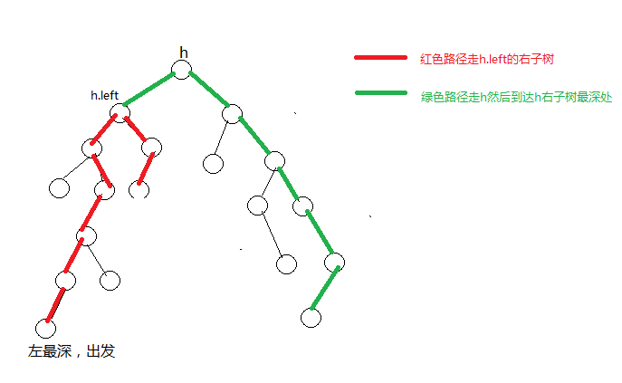
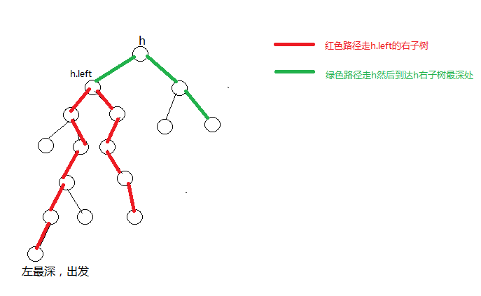
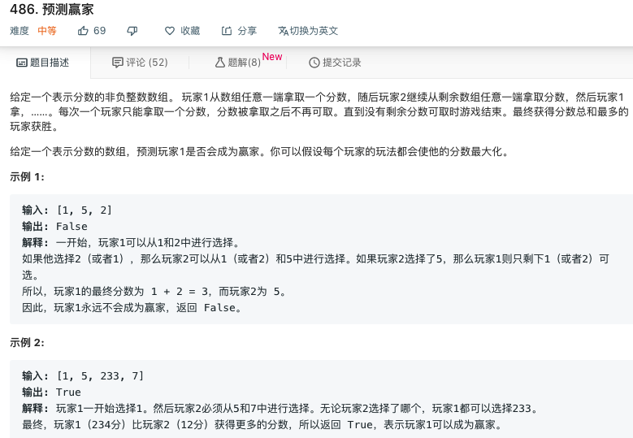
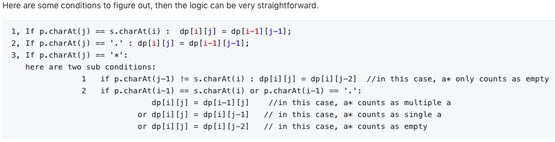

## 第一章 栈和队列

### 滑动窗口最大值

```python
class Solution(object):
    def maxSlidingWindow(self, nums, k):
        queue,res = [],[]
        for i in range(len(nums)):
            #当前元素比队尾元素大时 弹出
            while queue and nums[i] > nums[queue[-1]]:
                queue.pop()
            # i - queue[0] == k 最大值已经过期
            if queue and i - queue[0] == k:
                queue.pop(0)
            queue.append(i)
            if i >= k-1:
                res.append(nums[queue[0]])
        return res
```

### 全为1的最大矩形

转换为求柱状图的面积，从第一行开始，累加每一行的高度

```python
class Solution(object):
    def largestRectangleArea(self, heights):
        s = []
        res = 0
        # 可以保证在最后总会计算
        heights.append(0)
        for i in range(len(heights)):
            # 当前位置小于栈顶位置时计算
            while s and heights[s[-1]] >= heights[i]:
                h = heights[s.pop()]
                # i-s[-1]-1 和 i 是底
                area = h * (i-s[-1]-1 if s else i)
                res = max(res,area)
            s.append(i)
        return res
```


```python
class Solution(object):
    def maximalRectangle(self,matrix):
        if not matrix or not matrix[0]:
            return 0
        res = 0
        n = len(matrix[0])
        heights = [0]*(n+1)
        for row in matrix:
            for i in range(n):
                heights[i] = heights[i]+1 if row[i]=='1' else 0
            s = []
            for i in range(len(heights)):
                # 当前位置小于栈顶位置时计算
                while s and heights[s[-1]] > heights[i]:
                    h = heights[s.pop()]
                    # i-s[-1]-1 和 i 是底
                    area = h * (i-s[-1]-1 if s else i)
                    res = max(res,area)
                s.append(i)
        return res
```


## 第二章 链表问题

### 反转部分单向链表

```java
public ListNode reverseBetween(ListNode head, int m, int n) {
		if (m == n) {
			return head;
		}
		ListNode newHead = new ListNode(-1);
		ListNode curr = newHead;
		ListNode tail = null;
		ListNode reNode = null;
		for (int i = 0; i < n; i++) {
			if (i < m - 1) { // 指向第m-1个结点
				curr = curr.next;
			} else if (i == m - 1) {
				tail = curr.next; // 指向第m个结点
			} else { // 每次将tail后面一个节点拿出来，放在curr后面
				reNode = tail.next;
				tail.next = reNode.next;
				reNode.next = curr.next;
				curr.next = reNode;
			}
		}
		return newHead.next;
	}
```


### 复制含有随机结点的链表

方法一：用Hash表复制一份数据，然后通过Hash的映射关系指派next和random指针

```python
class Solution(object):
    def copyRandomList(self, head):
        if head==None:
            return None
        node = head
        map = {}
        while node:
        #先复制一遍数据
            map[node] = Node(node.val,None,None)
            node = node.next
        node = head
        while node:
        #复制next和random指针
            map[node].next = map[node.next] if node.next else None
            map[node].random = map[node.random] if node.random else None
            node = node.next
        return map[head]
```

方法二：原地复制，再分离

```java
public Node copyRandomList(Node head) {
    if(head == null){
        return head;
    }
    // 空间复杂度O(1)，将克隆结点放在原结点后面
    Node node = head;
    // 1->2->3  ==>  1->1'->2->2'->3->3'
    while(node != null){
        Node clone = new Node(node.val,node.next,null);
        Node temp = node.next;
        node.next = clone;
        node = temp;
    }
    // 处理random指针
    node = head;
    while(node != null){
        // ！！
        node.next.random = node.random == null ? null : node.random.next;
        node = node.next.next;
    }
    // 还原原始链表，即分离原链表和克隆链表
    node = head;
    Node cloneHead = head.next;
    while(node.next != null){
        Node temp = node.next;
        node.next = node.next.next;
        node = temp;
    }
    return cloneHead;
}
```


### K个一组反转链表

用栈保存元素，收集到K个以后就进行一次连接

```python
class Solution(object):
    stack = []
    def resign(self,pre,next):
        node = self.stack.pop()
        if pre:
            pre.next = node
        while self.stack:
            p = self.stack.pop()
            node.next = p
            node = node.next
        node.next = next
        return node

    def reverseKGroup(self, head, k):
        cur = head
        pre,new_head = None,None
        while cur:
            next = cur.next
            self.stack.append(cur)
            if len(self.stack)==k:
                pre = self.resign(pre,next)
                new_head = new_head if new_head else cur
            cur = next
        del self.stack[:] #必须要清空，不然会影响后续的case
        return new_head if new_head else head
```


### 搜索二叉树转换为双向链表

```java
public class ConvertBinarySearchTree {
	// 使用递归函数
	public TreeNode Convert1(TreeNode root) {

		if (root == null)
			return null;
		if (root.left == null && root.right == null)
			return root;
		TreeNode left = Convert1(root.left);
		TreeNode last = left;
		while (last != null && last.right != null) {
			last = last.right;
		}
		if (left != null) {
			last.right = root;
			root.left = last;
		}
		TreeNode right = Convert1(root.right);
		if (right != null) {
			root.right = right;
			right.left = root;
		}

		return left != null ? left : root;
	}

	// 使用递归函数 改进版
	protected TreeNode pre = null;

	public TreeNode Convert2(TreeNode root) {
		if (root == null)
			return null;
		if (root.left == null && root.right == null) {
			pre = root;// 最后的一个节点为最右侧的叶节点
			return root;
		}
		// 1.将左子树构造成双链表，并返回链表头节点
		TreeNode left = Convert2(root.left);
		// 3.如果左子树链表不为空的话，将当前root追加到左子树链表
		if (left != null) {
			pre.right = root;
			root.left = pre;
		}
		pre = root;// 当根节点只含左子树时，则该根节点为最后一个节点
		// 4.将右子树构造成双链表，并返回链表头节点
		TreeNode right = Convert2(root.right);
		// 5.如果右子树链表不为空的话，将该链表追加到root节点之后
		if (right != null) {
			right.left = root;
			root.right = right;
		}
		return left != null ? left : root;
	}

	// 使用递归函数 简洁版
	public class Convert3 {
		TreeNode pre = null;
		TreeNode lastLeft = null;// 最终返回的头结点

		public TreeNode Convert(TreeNode pRootOfTree) {
			if (pRootOfTree == null) {
				return null;
			}
			Convert(pRootOfTree.left);
			pRootOfTree.left = pre;
			if (pre != null)
				pre.right = pRootOfTree;
			pre = pRootOfTree;
			lastLeft = lastLeft == null ? pRootOfTree : lastLeft;
			Convert(pRootOfTree.right);
			return lastLeft;
		}
	}

	// 使用非递归版本的中序遍历
	public TreeNode Convert4(TreeNode pRootOfTree) {
		if (pRootOfTree == null) {
			return null;
		}
		Stack<TreeNode> stack = new Stack<>();
		TreeNode cur = pRootOfTree;
		TreeNode res = null;
		TreeNode pre = null;
		while (cur != null || !stack.isEmpty()) {
			if (cur != null) {
				stack.push(cur);
				cur = cur.left;
			} else {
				cur = stack.pop();
				if (pre == null) {
					pre = cur;
					res = pre;
				} else {
					pre.right = cur;
					cur.left = pre;
					pre = cur;
				}
				cur = cur.right;
			}
		}
		return res;
	}
}
```


## 第三章 二叉树问题

### 非递归遍历二叉树

```java
//先序
public List<Integer> preorderTraversal(TreeNode root) {
    List<Integer> list = new ArrayList<>();
    if (root != null) {
        Stack<TreeNode> stack = new Stack<>();
        //先压根结点
        stack.add(root);
        while (!stack.isEmpty()) {
            root = stack.pop();
            list.add(root.val);
            //在压右子树
            if (root.right != null) {
                stack.push(root.right);
            }
            //再压左子树
            if (root.left != null) {
                stack.push(root.left);
            }
            //这样出栈顺序就能做到根左右
        }
    }
    return list;           
}

//中序
public List<Integer> inorderTraversal(TreeNode root) {
    List<Integer> ans = new ArrayList<Integer>();
    if(root == null){
        return ans;
    }
    TreeNode cur = root;
    Stack<TreeNode> stack = new Stack<TreeNode>();
    while(!stack.isEmpty() || cur != null){
        //压左边界 直到为null
        while(cur!=null){
            stack.push(cur);
            cur = cur.left;
        }
        //弹出一个结点 收集val 并让cur = node.right;
        TreeNode node = stack.pop();
        ans.add(node.val);
        cur = node.right;
    }
    return ans;
}

//后序
public static List<Integer> postorderTraversal(TreeNode root) {
    LinkedList<Integer> list = new LinkedList<>();
    if (root != null) {
        Stack<TreeNode> stack = new Stack<TreeNode>();
        stack.push(root);
        TreeNode node = null;
        while (!stack.isEmpty()) {
            node = stack.pop();
            list.addFirst(node.val); //收集弹出的结点
            if (node.left != null) {   //再先后压左右子结点 就能弹出根右左顺序
                stack.push(node.left); 
            }
            if (node.right != null) {
                stack.push(node.right);
            }
        }
    }
    return list;
}
```

### 判断搜索二叉树和完全二叉树

**判断搜索二叉树**

要点：中序遍历的结果是升序的

```java
public class Probem98_isValidBST {
	long pre = Long.MIN_VALUE;

	public boolean isValidBST(TreeNode root) {
		if (root == null)
			return true;
		if (isValidBST(root.left) && pre < root.val) {
			pre = root.val;
			return isValidBST(root.right);
		}
		return false;
	}

	// 非递归中序遍历
	public boolean isValidBST2(TreeNode root) {
		if (root == null) {
			return true;
		}
		TreeNode cur = root;
		TreeNode pre = null;
		Stack<TreeNode> stack = new Stack<TreeNode>();
		while (!stack.isEmpty() || cur != null) {
			while (cur != null) {
				stack.push(cur);
				cur = cur.left;
			}
			TreeNode node = stack.pop();
			if (pre != null && node.val <= pre.val) {
				return false;
			} else {
				pre = node;
			}
			cur = node.right;
		}
		return true;
	}

}

```


**判断完全二叉树**

要点：

- 若当前结点有右孩子没有左孩子，返回false
- 若当前结点只有左孩子，则之后遇到的结点必须都是叶结点

```java
	public static boolean isCompleteTree(TreeNode head) {
		if (head == null) {
			return true;
		}
		Queue<TreeNode> queue = new LinkedList<TreeNode>();
		boolean foundLeaf = false;
		TreeNode l = null;
		TreeNode r = null;
		queue.offer(head);
		while (!queue.isEmpty()) {
			head = queue.poll();
			l = head.left;
			r = head.right;
			// 前面遇到了叶结点 且当前不是叶结点 或者只有右孩子 则都不可能是完全二叉树
			if ((l == null && r != null) || (foundLeaf && (l != null || r != null))) {
				return false;
			}
			if (l != null) {
				queue.offer(l);
			}
			if (r != null) {
				queue.offer(r);
			} else {
				foundLeaf = true;
			}
		}
		return true;
	}

	// 广度遍历二叉树，当出现 null 值时停止遍历，如果此时还有没有遍历到的结点，说明该树非完全二叉树
	public static boolean isCompleteTree1(TreeNode root) {
		Queue<TreeNode> queue = new LinkedList<>();
		TreeNode node = null;
		// 进行广度优先遍历（层次遍历），并把NULL节点也放入队列
		queue.offer(root);
		while ((node = queue.poll()) != null) {
			queue.offer(node.left);
			queue.offer(node.right);
		}

		// 判断是否还有未被访问到的节点
		while (!queue.isEmpty()) {
			// 有未访问到的的非NULL节点，则树存在空洞，为非完全二叉树
			if (queue.poll() != null) {
				return false;
			}
		}
		return true;
	}
```

### 二叉树的后继结点

情况1:如果node有右子树，后继就是右子树上最左的结点

情况2:向父节点移动，直到当前结点是父结点的左孩子

```java
public static Node getNextNode(Node node) {
	if (node == null) {
		return node;
	}
	if (node.right != null) {
		return getLeftMost(node.right);
	} else {
		Node parent = node.parent;
		while (parent != null && parent.left != node) {
			node = parent;
			parent = node.parent;
		}
		return parent;
	}
}

public static Node getLeftMost(Node node) {
	if (node == null) {
		return node;
	}
	while (node.left != null) {
		node = node.left;
	}
	return node;
}
```


### 两个结点的最近公共祖先

**二叉搜索树**

```java
public TreeNode lowestCommonAncestor(TreeNode root, TreeNode p, TreeNode q) {
  //都比跟结点小，往左子树上找
  if(p.val<root.val && q.val < root.val){
    return lowestCommonAncestor(root.left,p,q);
  }
  //都比跟结点大，往右子树上找
  else if(p.val>root.val && q.val>root.val){
    return lowestCommonAncestor(root.right,p,q);
  }
  return root;
}
```


**普通树**

要点：

- 如果树走完 或者遇到任意一个相等的结点(结点总是存在，一个结点可以是自己的祖先) ，则可以返回
- 否则递归查找左右子树，如果查找结果都不为空，则返回root
- 如果有一个为null则，返回不为null的结点
- 都为null，则返回null

```java
public TreeNode lowestCommonAncestor(TreeNode root, TreeNode p, TreeNode q) {
		if (root == null || root == p || root == q) {
			return root;
		}
		TreeNode left = lowestCommonAncestor(root.left, p, q);
		TreeNode right = lowestCommonAncestor(root.right, p, q);
		if (left != null && right != null) {
			return root;
		} else if (left != null) {
			return left;
		} else if (right != null) {
			return right;
		}
		return null;
	}
```


### 二叉树结点间最大距离

经过根的情况：


不经过根的情况：



```java
public class Problem543_diameterOfBinaryTree {
	private int result = 0;

	public int diameterOfBinaryTree(TreeNode root) {
		diameterOfBinaryTree1(root);
		return result;
	}

	// 函数的返回值是求root为根的子树最大深度
	// 在求深度的过程中 同时记录结点间的最大距离
	// 可能经过根结点,也可能不经过
	public int diameterOfBinaryTree1(TreeNode root) {
		if (root == null) {
			return -1;
		}
		int left = diameterOfBinaryTree1(root.left) + 1;
		int right = diameterOfBinaryTree1(root.right) + 1;
		result = Math.max(left + right, result);
		return Math.max(left, right);
	}

}
```


### 先序中序后序两两结合重构二叉树

**先序、中序：**

```python
class Solution(object):
    def buildTree(self, preorder, inorder):
        if not preorder:
            return None
        val = preorder.pop(0)
        root = TreeNode(val)
        i = inorder.index(val)
        root.left = self.buildTree(preorder[:i],inorder[:i])
        root.right = self.buildTree(preorder[i:],inorder[i+1:])
        return root
```


**中序、后序：**

```python
class Solution(object):
    def buildTree(self, inorder, postorder):
        if not postorder:
            return None
        val = postorder.pop()
        root = TreeNode(val)
        i = inorder.index(val)
        root.left = self.buildTree(inorder[:i],postorder[:i])
        root.right = self.buildTree(inorder[i+1:],postorder[i:])
        return root
```


**先序、后序**

构造的树不唯一，只有除叶结点外，其他结点都有左右孩子，这样的结构才可以重建出来。


### 不同的二叉搜索树

结题思路：假设n个节点存在二叉排序树的个数是G(n)，1为根节点，2为根节点，...，n为根节点，当1为根节点时，其左子树节点个数为0，右子树节点个数为n-1，同理当2为根节点时，其左子树节点个数为1，右子树节点为n-2，所以可得G(n) = G(0)*G(n-1)+G(1)*(n-2)+...+G(n-1)*G(0)

```python
class Solution(object):
    def numTrees(self, n):
        dp = [0] * (n+1)
        dp[0] = 1
        for i in range(1,n+1):
            for j in range(1,i+1):
                dp[i] += dp[j-1] * dp[i-j]
        return dp[-1]
```


### 统计完全二叉树的结点数

```java
public int countNodes(TreeNode root) {
	if (root == null)
		return 0;
	int height = mostLeftHeight(root, 1);
	return countNodes(root, 1, height);
}

private int countNodes(TreeNode root, int curHeight, int height) {
	// 到了叶结点，个数是1
	if (curHeight == height) {
		return 1;
	}
	if (mostLeftHeight(root.right, curHeight + 1) == height) {
		return (1 << (height - curHeight)) + countNodes(root.right, curHeight + 1, height);
	}
	return (1 << (height - curHeight - 1)) + countNodes(root.left, curHeight + 1, height);
}

// 得到左子树能达到的最大高度
private int mostLeftHeight(TreeNode root, int level) {
	while (root != null) {
		root = root.left;
		level++;
	}
	return level - 1;
}
```


## 第四章 递归和动态规划

### 排成一条线的纸牌博弈问题



```java
// 如果是偶数堆,那么必定为true,
// 因为先手可以决定取到所有奇数位置或是偶数位置的数,
// 而奇数位置的所有数之和与偶数位置的所有数之和必定存在大小关系或是相等
public boolean PredictTheWinner(int[] nums) {
    if ((nums.length & 1) == 0) {
      return true;
    }
    int sum = 0;
    for (int i = 0; i < nums.length; i++) {
      sum += nums[i];
    }
    int score = win(nums, 0, nums.length - 1);

    return score >= sum - score;
}

public int win(int[] nums, int i, int j) {
    if (i == j) {
      return nums[i];
    }
    if (i + 1 == j)
      return Math.max(nums[i], nums[j]);
    // 都是理性人，想要赢要保证在选更大数字的时候，同时要保证留给对方更小的数字
    int left = nums[i] + Math.min(win(nums, i + 1, j - 1), win(nums, i + 2, j));
    int right = nums[j] + Math.min(win(nums, i + 1, j - 1), win(nums, i, j - 2));
    return Math.max(left, right);
}

```


## 第五章 字符串问题

### 字符串中数字子串的求和

1.可能会出现多个'-'号

2.对小数点不做处理A1.3 => 1 + 3

```java
public static int numSum(String str) {
    if (str == null) {
      return 0;
    }
    char[] charArr = str.toCharArray();
    int res = 0;
    int num = 0;
    boolean posi = true;
    int cur = 0;
    for (int i = 0; i < charArr.length; i++) {
      cur = charArr[i] - '0';
      if (cur < 0 || cur > 9) {
        res += num;
        num = 0;
        if (charArr[i] == '-') {
          if (i - 1 > -1 && charArr[i - 1] == '-') {
            posi = !posi;
          } else {
            posi = false;
          }
        } else {
          posi = true;
        }
      } else {
        num = num * 10 + (posi ? cur : -cur);
      }
    }
    res += num;
    return res;
}
```


### 替换字符串中连续出现的指定字符串

备注：多次出现只替换一个 

str="123abcabc45" from="abc" to="def" => 123def45

思路：在str中from出现的位置置0，将其再拼接上to即可

```java
public static String replace(String str, String from, String to) {
	if (str == null || from == null || str.equals("") || from.equals("")) {
		return str;
	}
	char[] chas = str.toCharArray();
	char[] chaf = from.toCharArray();
	int match = 0;
	for (int i = 0; i < chas.length; i++) {
		if (chas[i] == chaf[match++]) {
			if (match == chaf.length) {
				clear(chas, i, chaf.length);
				match = 0;
			}
		} else {
			if (chas[i] == chaf[0]) {
				i--;
			}
			match = 0;
		}
	}
	String res = "";
	String cur = "";
	for (int i = 0; i < chas.length; i++) {
		if (chas[i] != 0) {
			cur = cur + String.valueOf(chas[i]);
		}
		if (chas[i] == 0 && (i == 0 || chas[i - 1] != 0)) {
			res = res + cur + to;
			cur = "";
		}
	}
	if (!cur.equals("")) {
		res = res + cur;
	}
	return res;
}

public static void clear(char[] chas, int end, int len) {
	while (len-- != 0) {
		chas[end--] = 0;
	}
}
```


### 翻转字符串中的单词

注意：仍然多个空格 不满足leetcode-151要求

```java
public static String reverseWords(String s) {
    char[] charr = s.toCharArray();
    int l = -1;
    int r = -1;
    reverse(charr, 0, charr.length - 1);
    for (int i = 0; i < charr.length; i++) {
      if (charr[i] != ' ') {
        // l只在前一个字符为空格 当前字符为非空格时改变
        l = i == 0 || charr[i - 1] == ' ' ? i : l;
        // r只在当前字符为非空格,下一个字符为空格时改变
        r = i == charr.length - 1 || charr[i + 1] == ' ' ? i : r;
      }

      if (l != -1 && r != -1) {
        reverse(charr, l, r);
        l = r = -1;
      }
    }
    return String.valueOf(charr);
}

public static void reverse(char[] arr, int l, int r) {
    char c = ' ';
    while (l < r) {
      c = arr[l];
      arr[l] = arr[r];
      arr[r] = c;
      l++;
      r--;
    }
}
```


###数组两个字符串的最小距离

```java
public static int minDistance(String[] strs, String str1, String str2) {
	if (str1 == null || str2 == null) {
		return -1;
	}
	if (str1.equals(str2)) {
		return 0;
	}
	int last1 = -1; // str1最后出现的位置
	int last2 = -1; // str2最后出现的位置
	int min = Integer.MAX_VALUE;
	for (int i = 0; i != strs.length; i++) {
		if (strs[i].equals(str1)) {
			min = Math.min(min, last2 == -1 ? min : i - last2);
			last1 = i;
		}
		if (strs[i].equals(str2)) {
			min = Math.min(min, last1 == -1 ? min : i - last1);
			last2 = i;
		}
	}
	return min == Integer.MAX_VALUE ? -1 : min;
}
```


### 公式字符串求值

**不带括号四则运算**

```java

	public static int calculate(String s) {
		int res = 0;
		int num = 0;
		char sign = '+';
		Stack<Integer> stack = new Stack<>();
		char[] sarr = s.toCharArray();
		for (int i = 0; i < sarr.length; i++) {
			if (sarr[i] >= '0') {
				num = num * 10 + sarr[i] - '0';
			}
			if ((!Character.isDigit(sarr[i]) && sarr[i] != ' ') || i == sarr.length - 1) {
				if (sign == '+' || sign == '-') {
					stack.push(sign == '+' ? num : -num);
				} else if (sign == '*' || sign == '/') {
					int top = stack.pop();
					stack.push(sign == '*' ? top * num : top / num);
				}
				sign = sarr[i];
				num = 0;
			}
		}
		while (!stack.isEmpty()) {
			res += stack.pop();
		}
		return res;
	}
```

**带括号四则运算**

```java
	public static int calculate(String s) {
		return calculate(s, 0)[0];
	}

	// 带括号四则运算 计算从k位置开始的表达式，遇到')'或表达式完停止
	public static int[] calculate(String s, int k) {
		int res = 0;
		int num = 0;
		char sign = '+';
		Stack<Integer> stack = new Stack<>();
		char[] sarr = s.toCharArray();
		int i = k;
		for (; i < sarr.length && sarr[i] != ')'; i++) {
			if (sarr[i] >= '0') {
				num = num * 10 + sarr[i] - '0';
			}
			// 当前遇到非数字字符 | 到达公式结尾 | 下一个是')'都需要进行累计
			if ((!Character.isDigit(sarr[i]) && sarr[i] != ' ') || i == sarr.length - 1 || sarr[i + 1] == ')') {
				// 遇到左括号时，开始递归过程
				if (sarr[i] == '(') {
					int[] arr = calculate(s, i + 1);
					num = arr[0];
					i = arr[1];
				}
				if (sign == '+' || sign == '-') {
					stack.push(sign == '+' ? num : -num);
				} else if (sign == '*' || sign == '/') {
					int top = stack.pop();
					stack.push(sign == '*' ? top * num : top / num);
				}

				sign = sarr[i];
				num = 0;
			}
		}

		while (!stack.isEmpty()) {
			res += stack.pop();
		}
		return new int[] { res, i };
	}
```

**leetcode224**

```python
class Solution(object):
    def calculate(self, s):
        res, num, sign, stack = 0, 0, 1, []
        l,r = 0,len(s)
        while l<r:
            if s[l].isdigit():
                num = 0
                while l<r and s[l].isdigit():
                    num = 10*num+ord(s[l])-ord('0')
                    l+=1
                l-=1
                res+=num*sign
            elif s[l] in '+-':
                sign = [-1,1][s[l]=='+']
            elif s[l] == '(':
                stack.append(res)
                stack.append(sign)
                res = 0
                sign = 1
            elif s[l] == ')':
                res = res * stack.pop()+stack.pop()
            l+=1
        return res
```


### 最长无重复子串

```python
class Solution(object):
    def lengthOfLongestSubstring(self, s):
        w = []
        l,r = 0,0
        res = 0
        while r<len(s):
            if s[r] in w:
                w.remove(s[l])
                l+=1
            else:
                w.append(s[r])
                r+=1
                res = max(res,r-l)
        return res
```
```python
class Solution:
    def lengthOfLongestSubstring(self, s):
        L = res = 0
        map = {} # 保存字符最新出现的下标
        for R in range(len(s)):
            if s[R] in map and L <= map[s[R]]: #两个条件是必须要判断的
                L = map[s[R]] + 1
            else:
                res = max(res, R - L + 1)
            map[s[R]] = R
        return res
```


### 最小包含子串长度

```python
class Solution(object):
    def minWindow(self, s, t):
        ls = len(s)
        lt = len(t)
        if not s or not t or ls<lt:
            return ''
        min_size = ls + 1
        l = r = 0
        start=0
        end = ls-1
        map = {}
        #对t中的字符计数
        for c in t:
            map[c] = map.get(c,0)+1
        match = 0
        while r<ls:
            map[s[r]] = map.get(s[r],0)-1
            #如果当前遇到的字符在map中出现过，则匹配数+1
            match = match+1 if map[s[r]]>=0  else match
            #当匹配完成时窗口左滑
            if match==lt:
                #尝试左滑窗口 对之前遇到的字符出窗口
                while map[s[l]]<0:
                    map[s[l]]+=1
                    l+=1
                if min_size > r - l + 1:
                    min_size = r - l +1
                    start = l
                    end = r
            r+=1
        return '' if min_size>ls else s[start:end+1]
```


### 正则表达式匹配

**递归**

两种情况

1.下一个字符是*

则匹配当前字符0个..n个

2.下一个字符不是*

当前字符是否能匹配(.=)

```java
	public static boolean isMatch(String s, String p) {
		boolean res = false;
		if (p.isEmpty())
			return s.isEmpty();
		// 对*号的匹配
		if (p.length() >= 2 && p.charAt(1) == '*') {
			// 匹配0个
			res = isMatch(s, p.substring(2));
			// 匹配多个
			if (res == false) {
				res = !s.isEmpty() && (s.charAt(0) == p.charAt(0) || p.charAt(0) == '.') && isMatch(s.substring(1), p);
			}
		} else {
			res = !s.isEmpty() && (s.charAt(0) == p.charAt(0) || p.charAt(0) == '.')
					&& isMatch(s.substring(1), p.substring(1));
		}
		return res;
	}
```

**DP**



```java
// dp[i][j]的含义是s[:i]和p[:j]是否匹配
public static boolean isMatch2(String s, String p) {
  if (s == null || p == null) {
    return false;
  }
  boolean[][] dp = new boolean[s.length() + 1][p.length() + 1];
  char[] str = s.toCharArray();
  char[] exp = p.toCharArray();
  dp[0][0] = true;
  for (int i = 0; i < p.length(); i++) {
    if (exp[i] == '*' && dp[0][i - 1]) {
      dp[0][i + 1] = true;
    }
  }
  for (int i = 0; i < s.length(); i++) {
    for (int j = 0; j < p.length(); j++) {
      if (exp[j] == '*') {
        // *只能匹配0个时
        if (exp[j - 1] != str[i] && exp[j - 1] != '.') {
          dp[i + 1][j + 1] = dp[i + 1][j - 1];
        } else {// *可以用来匹配多个时
          // 依次代表匹配1个、1个以上(不解理)、0个
          dp[i + 1][j + 1] = (dp[i + 1][j] || dp[i][j + 1] || dp[i + 1][j - 1]);
        }
      } else if (exp[j] == str[i] || exp[j] == '.') { // 直接匹配
        dp[i + 1][j + 1] = dp[i][j];
      }

    }
  }
  return dp[s.length()][p.length()];
}
```


## 第六章 大数据和空间限制

### 40亿个非负整数中找到没出现过的数
**最多使用1G内存**
32位无符号整数的范围:`0-4294967295`
申请一个长度为4294967295的bitmap,占用空间4294967295/8bit约500M
遍历一次，出现的置1，未出现的置0
再次遍历，哪个未置1则哪个就没出现

**最多使用10M内存，但只要找到一个**

先对数据进行分区，统计每个区间上数出现次数

找到有未出现的数的区间，申请长度为区间大小的数组。

对数据进行遍历，只关心我们想要区间范围内的数，出现的置1。

遍历完成之后，必然有为0的位置。对应就是没有出现过的数。

> 0-4294967295分成64个区间，每个区间67108864个数，生成的区间数组长度为67108864/8bit 约8M左右

### 40亿个整数中找到出现两次的数和中位数

**最多使用1G内存**

申请一个长度为4294967295*2bit的bitmap(占用内存1G),用两位来表示一个数出现的词频

遍历这40亿个数，如果第一次遇到就把对应的位设置为01，第二次设置为10，

第三次设置为11，之后再出现则不再处理。

完成之后只需检查所有为10位的，即为出现两次的数。

**最多使用10M内存**

同样对数据进行分区处理，将其分成2148个区间(每个区间大约2M个数，占用内存8M)

申请一个2148大小的统计数组,统计每个区间上的数的出现次数.

通过累加每个区间的出现次数，就可以找到中位数出现的区间

假设累加至k-1区间一共有19.98亿个数，但是累加上第k区间的数

之后就超过20亿了，则可知中位数在第k区间，且位于0.02位置上。

此时再生成一个2M大小的数组对k区间范围内的数做统计即可，找到位于0.02位置上的数。


## 第七章 位运算

### 在成对出现的数中找到只出现一次的数

**存在两个出现一次的数**

```java
public int[] FindNumsAppearOnce(int[] array) {
	int num[] = new int[2];
	int temp = 0;
	for (int i = 0; i < array.length; i++)
		temp ^= array[i];

	int indexOf1 = temp & (~temp + 1); // 得到最右边1的位置
	for (int i = 0; i < array.length; i++) {
		// 通过该位为0还是1进行分组
		if ((array[i] & indexOf1) == 0)
			num[0] ^= array[i];
		else
			num[1] ^= array[i];
	}
	return num;
}
```


## 第八章 数组和矩阵问题

### 螺旋矩阵

```python
class Solution(object):
    def spiralOrder(self, matrix):
        res = []
        if not matrix or not len(matrix):
            return res
        row,col = len(matrix),len(matrix[0])
        visited = [[0]*col for _ in range(row)]
        i,size = 0,row*col
        x,y = 0,0
        dx,dy=0,1
        while i<size:
            res.append(matrix[x][y])
            visited[x][y]=1
            if visited[(x+dx+row)%row][(y+dy+col)%col]:
                temp = -dx
                dx = dy
                dy = temp
            x+=dx
            y+=dy
            i+=1
        return res
```


### -旋转图像


### 需要排序的最短子数组长度

[1,5,3,4,2,6,7] => 4,[5,3,4,2]

```java
	public static int getMinLength(int[] arr) {
		if (arr == null || arr.length < 2) {
			return 0;
		}
		int min = arr[arr.length - 1];
		int L = -1;
    //从右至左找找到最左的无序位置，同时更新最小值
		for (int i = arr.length - 2; i != -1; i--) {
			if (arr[i] > min) {
				L = i;
			} else {
				min = Math.min(min, arr[i]);
			}
		}
		if (L == -1) {
			return 0;
		}
		int max = arr[0];
		int R = -1;
//从左至右找找到最右的无序位置，同时更新最大值
		for (int i = 1; i != arr.length; i++) {
			if (arr[i] < max) {
				R = i;
			} else {
				max = Math.max(max, arr[i]);
			}
		}
		return R - L + 1;
	}
```


### 排序数组和为K的二元组和三元组

要求：不重复打印

**二元组**

```java
public static void twoSum(int[] arr, int k) {
    if (arr == null || arr.length < 2) {
        return;
    }
    int l = 0;
    int r = arr.length - 1;
    while (l < r) {
        if (arr[l] + arr[r] < k) {
            l++;
        } else if (arr[l] + arr[r] > k) {
            r--;
        } else {
          //遇到重复只在第一次打印
            if (l == 0 || arr[l - 1] != arr[l]) {
                System.out.println(arr[l] + " " + arr[r]);
            }
            l++;
            r--;
        }
    }
}
```


**三元组**

```java
public static void threeSum(int[] nums, int k) {
    int l, r;
    for (int i = 0; i < nums.length - 2; i++) {
        if (i == 0 || nums[i - 1] != nums[i]) {
            l = i + 1;
            r = nums.length - 1;
            while (l < r) {
                if (nums[l] + nums[r] < k - nums[i]) {
                    l++;
                } else if (nums[l] + nums[r] > k - nums[i]) {
                    r--;
                } else {
                    System.out.println(nums[i] + " " + nums[l] + " " + nums[r]);
                    //跳过所有相同的
                    while (l < r && nums[l] == nums[l + 1])
                        ++l;
                    while (l < r && nums[r] == nums[r - 1])
                        --r;
                    ++l;
                    --r;
                }
            }
        }
    }
}
```


### 和为K的最长子数组

1.全是正数

```python
class MaxLength:
    @classmethod
    def get_max_length(cls,arr, num):
        length = len(arr)
        if length == 0:
            return 0
        left = 0
        right = 0
        sum = 0
        max_len = 0
        while right < length:
            sum += arr[right]
            if sum == num:
                max_len = max(max_len,right-left+1)
                sum -= arr[left]
                left += 1
            elif sum > num:
                sum -= arr[left]
                left += 1
            right += 1
        return max_len
```


2.可含有负数和0

```python
class LongestSumOfSubArray:
    @classmethod
    def get_longest_sum(cls, nums, k):
        if len(nums) == 0:
            return 0
        sum = 0
        max_len = 0
        map = dict()
        map[0] = -1
        i = 0
        while i < len(nums):
            sum += nums[i]
            if (sum - k) in map:
                j = map.get(sum - k)
                max_len = max(max_len,i-j)
            if sum not in map:
                map[sum] = i
            i += 1
        return max_len
```

输入：nums = [2,1,-1,2,1]，k = 3 `#map{0: -1, 2: 0, 3: 1, 4: 3, 5: 4}`

输出：4


### 和至多为K的最长子数组


### 和至少为K的最短子数组


### 自然数数组的排序


### 奇数下标都是奇数偶数下标都是偶数

实现一个函数要么让奇数下标都是奇数，要么让偶数下标都是偶数

```java
public static void modify(int[] arr) {
    if (arr == null || arr.length < 2) {
        return;
    }
    int even = 0;
    int odd = 1;
    int end = arr.length - 1;
    //不断检查最后一个数，是奇数交换到奇数的位置
    //偶数交换到偶数的位置
    while (even <= end && odd <= end) {
        if ((arr[end] & 1) == 0) {
            swap(arr, end, even);
            even += 2;
        } else {
            swap(arr, end, odd);
            odd += 2;
        }
    }
}

public static void swap(int[] arr, int index1, int index2) {
    int tmp = arr[index1];
    arr[index1] = arr[index2];
    arr[index2] = tmp;
}
```


### 子数组和子矩阵的最大累加和问题 

**子数组**

```java
public int maxSubArray(int[] arr) {
    if (arr == null || arr.length == 0) {
        return 0;
    }
    int max = arr[0];
    int tmp = arr[0];
    for (int i = 1; i < arr.length; i++) {
        tmp = tmp > 0 ? tmp + arr[i] : arr[i];
        max = Math.max(max, tmp);
    }
    return max;
}
```


**子矩阵**

```java
public static int maxSum2(int[][] m) {
    if (m == null || m.length == 0 || m[0].length == 0) {
        return 0;
    }
    int max = Integer.MIN_VALUE;
    int tmp = 0;
    int[] s = new int[m[0].length];
    // 从每一行的开始累加都要尝试
    for (int i = 0; i != m.length; i++) {
        Arrays.fill(s, 0);
        for (int j = i; j != m.length; j++) {
            tmp = 0;
            // 累加过程中计算最大值
            for (int k = 0; k != s.length; k++) {
                s[k] += m[j][k];
                tmp = tmp > 0 ? tmp + s[k] : s[k];
                max = Math.max(max, tmp);
            }
        }
    }
    return max;
}
```


### 在数组中找到一个局部最小的位置(寻找峰值[162])


### 子数组的最大累乘积

### N个数组的TopK

### 边界都是1的最大正方形大小

### 不包含本位置的累乘数组

### 数组的partition调整

### 数组中未出现的最小正数

### 数组排序之后相邻数的最大差值


## 第九章 其它题目

